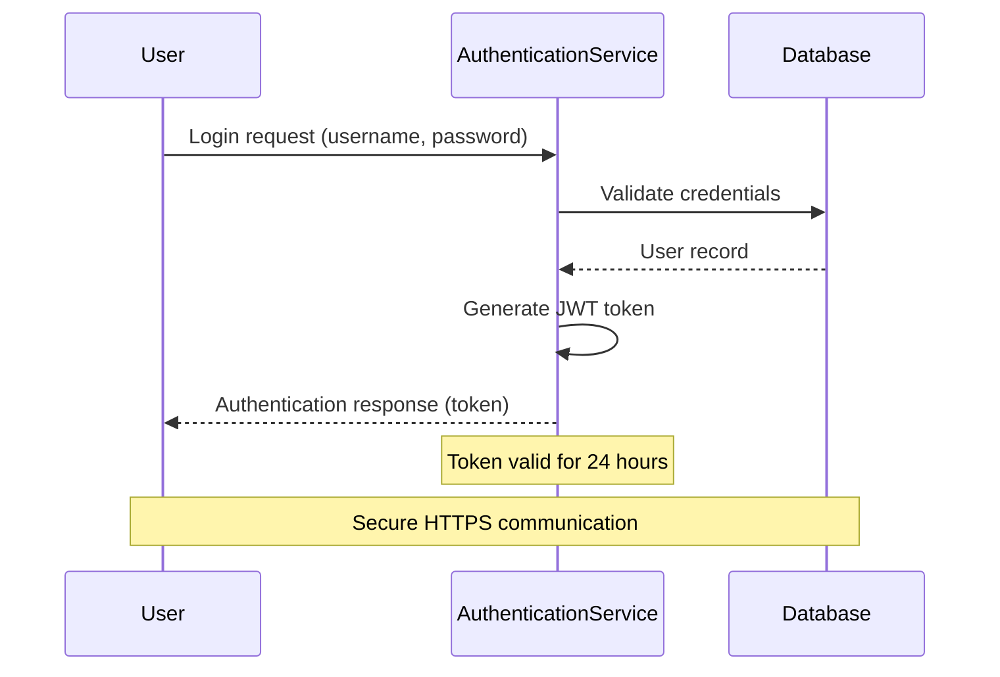
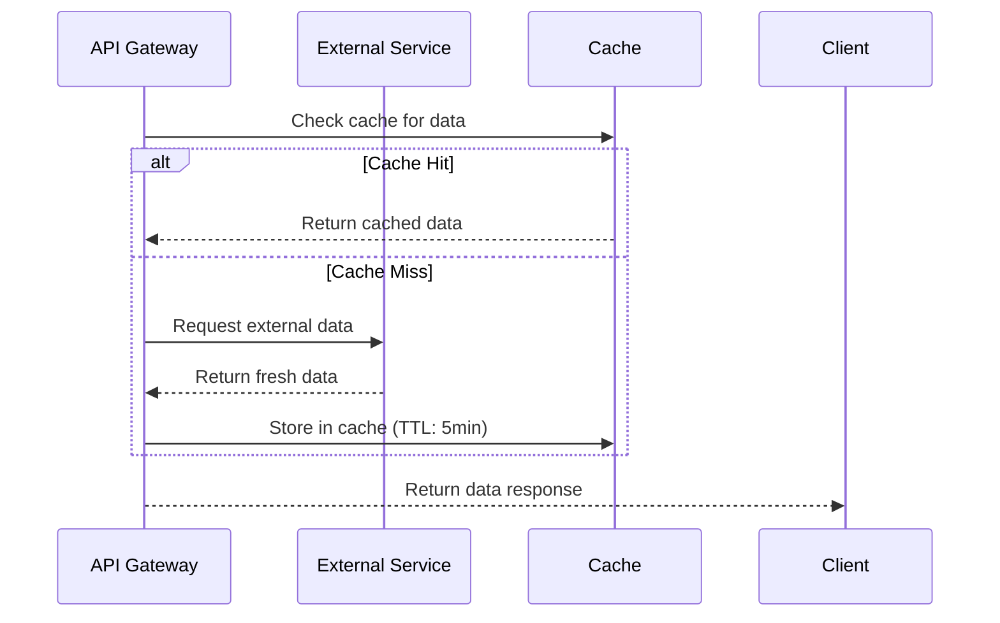

# Diagram Generate Collaboration

Generate visual collaboration diagrams from domain analysis to illustrate system interactions, user workflows, and entity relationships using Mermaid syntax embedded in markdown.

## Intent
Transform analyzed domain concepts and requirements into clear, actionable collaboration diagrams that visualize key system interactions, user journeys, and cross-system workflows. Focus on communicating complex relationships through standardized diagram patterns.

## Inputs
- **Primary**: `projects/[project-name]/artifacts/Analysis/domain-concepts.json` (from domain-extractconcepts skill)
- **Secondary**: `projects/[project-name]/artifacts/Analysis/requirements.json` (from requirements-ingest skill)
- **Optional**: `projects/[project-name]/artifacts/Analysis/goals.json` (from goals-extract skill)
- **Format**: Structured domain entities, relationships, and requirements data

## Outputs
**Files Generated:**
- `projects/[project-name]/artifacts/Analysis/collaboration-diagrams.md` - Markdown with embedded Mermaid diagrams
- `projects/[project-name]/artifacts/Analysis/collaboration-diagrams.json` - Structured diagram metadata

### Markdown Structure (`collaboration-diagrams.md`)
```markdown
# Collaboration Diagrams

**Project**: [project_id]  
**Generated**: [timestamp]  
**Source**: domain-concepts.json, requirements.json

## User-System Interactions

### Authentication Flow *(Diagram D-001)*
**Source Requirements**: [R-001], [R-003]  
**Entities Involved**: User, AuthenticationService, Database




### [Additional User-System Diagrams...]

## System-System Interactions

### API Integration Flow *(Diagram D-002)*
**Source Requirements**: [R-005], [R-007]  
**Entities Involved**: APIGateway, ExternalService, Cache



### [Additional System-System Diagrams...]

## Process Workflows

### [Business Process Diagrams...]
```

### JSON Structure (`collaboration-diagrams.json`)
```json
{
  "project_id": "string",
  "generation_metadata": {
    "generated_at": "ISO8601",
    "source_files": ["domain-concepts.json", "requirements.json"],
    "total_diagrams": "number",
    "diagram_types": ["sequence", "flowchart", "stateDiagram"]
  },
  "diagrams": [
    {
      "id": "D-001",
      "title": "Authentication Flow", 
      "type": "sequence",
      "category": "user-system",
      "description": "User authentication and JWT token generation",
      "entities": ["User", "AuthenticationService", "Database"],
      "source_requirements": ["R-001", "R-003"],
      "mermaid_code": "sequenceDiagram...",
      "complexity": "medium",
      "maintenance_priority": "high"
    }
  ]
}
```

## Processing Workflow

### 1. Input Analysis
**From `domain-concepts.json`:**
- Extract entities with their relationships
- Identify domain areas and key processes
- Map entity interactions and dependencies

**From `requirements.json`:**
- Find interaction patterns in requirement text
- Identify user journeys and system flows
- Extract temporal sequences and decision points

### 2. Diagram Type Selection
**User-System Interactions:**
- Use sequence diagrams for user workflows
- Include system responses and error paths
- Show authentication, authorization flows

**System-System Interactions:**
- Use sequence diagrams for API communications
- Include timeouts, retries, and failure scenarios
- Show data flow between services

**Business Process Workflows:**
- Use flowcharts for decision trees and branching logic
- Include parallel processes and synchronization points
- Show approval workflows and state transitions

### 3. Mermaid Generation Rules

**Sequence Diagrams:**
```
participant [ShortName] as [Full Entity Name]
[Actor]->>+[Target]: [Action description]
[Target]-->>-[Actor]: [Response description]
Note over [Entity]: [Important information]
alt [Condition]
    [Alternative flow]
else [Other condition]
    [Alternative flow]
end
```

**Naming Conventions:**
- Entity names: PascalCase (UserService, PaymentGateway)
- Messages: Action-oriented (Validate credentials, Process payment)
- Notes: Clarify business rules, timeouts, constraints
- Alt blocks: Show error handling and edge cases

### 4. Traceability Integration
**Requirement References:**
- Link each diagram to source requirements using `[R-XXX]` format
- Include entity references using `ENT-XXX` identifiers from domain concepts
- Maintain bidirectional traceability for change impact analysis

**Diagram Metadata:**
- Assign unique diagram IDs (`D-001`, `D-002`, etc.)
- Track complexity level (simple/medium/complex)
- Set maintenance priority based on business criticality

## Quality Guidelines

### Readability Standards
- Limit sequence diagrams to 8-10 participants maximum
- Use meaningful, business-friendly entity names
- Include notes for non-obvious business rules
- Show both happy path and key error scenarios

### Technical Standards  
- Valid Mermaid syntax that renders in VS Code
- Consistent participant naming across related diagrams
- Appropriate use of activation boxes for long-running operations
- Clear distinction between synchronous and asynchronous calls

### Business Value
- Focus on high-value interactions that need visualization
- Prioritize user-facing workflows and critical system integrations
- Include compliance and security-related flows
- Show cross-system dependencies that affect architecture decisions

## Usage Pattern
```
1. Call after domain-extractconcepts skill completion
2. Load domain-concepts.json and requirements.json
3. Generate collaboration diagrams for key interaction patterns
4. Output markdown file with embedded Mermaid diagrams and JSON metadata
5. Update project documentation with visual collaboration models
```

## Integration Notes
- Diagrams complement domain models and requirements documentation
- Generated diagrams can inform architecture and design decisions
- Supports iterative refinement as requirements evolve
- Compatible with VS Code Mermaid preview and documentation workflows