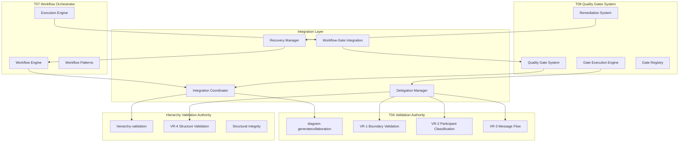

# EDPS Quality Gates Integration Layer

## Overview

The Quality Gates Integration Layer provides seamless coordination between the T08 Quality Gates System and the broader EDPS ecosystem, with particular emphasis on integration with the T07 Workflow Orchestrator. This layer ensures quality validation is embedded naturally within workflow execution while maintaining high performance and intelligent failure recovery.

## Architecture



## Integration Points

### 1. Workflow Orchestrator Integration (T07)

#### Workflow Execution Hooks
```javascript
// Integration hooks within T07 workflow execution
export class WorkflowGateIntegration {
    constructor(workflowOrchestrator, qualityGateSystem) {
        this.workflowOrchestrator = workflowOrchestrator;
        this.qualityGateSystem = qualityGateSystem;
        this.integrationRegistry = new GateWorkflowRegistry();
        
        this.setupIntegrationHooks();
    }

    setupIntegrationHooks() {
        // Post-step validation gates
        this.workflowOrchestrator.on('step_completed', async (stepResult) => {
            await this.processStepCompletionGates(stepResult);
        });

        // Pre-workflow validation gates
        this.workflowOrchestrator.on('workflow_starting', async (workflowContext) => {
            await this.processWorkflowPreparationGates(workflowContext);
        });

        // Stage completion validation gates
        this.workflowOrchestrator.on('workflow_stage_completed', async (stageResult) => {
            await this.processStageCompletionGates(stageResult);
        });

        // Workflow completion validation gates
        this.workflowOrchestrator.on('workflow_completed', async (workflowResult) => {
            await this.processWorkflowCompletionGates(workflowResult);
        });

        // Error and failure handling integration
        this.qualityGateSystem.on('gate_failure', async (gateFailure) => {
            await this.handleGateFailureInWorkflow(gateFailure);
        });

        // Recovery coordination
        this.qualityGateSystem.on('recovery_needed', async (recoveryRequest) => {
            await this.coordinateWorkflowRecovery(recoveryRequest);
        });
    }

    async processStepCompletionGates(stepResult) {
        const applicableGates = await this.identifyApplicableGates(
            stepResult.step.skill_id,
            stepResult.context,
            'step_completion'
        );

        const gatePromises = applicableGates.map(async (gateConfig) => {
            const gateExecutionContext = {
                stepResult: stepResult.result,
                step: stepResult.step,
                workflow_context: stepResult.context.workflow_metadata,
                execution_id: stepResult.context.execution_id,
                integration_mode: 'workflow_embedded'
            };

            const gateResult = await this.qualityGateSystem.executeGate(
                gateConfig.gate_id,
                gateExecutionContext
            );

            if (!gateResult.passed) {
                await this.handleWorkflowGateFailure(stepResult, gateResult, gateConfig);
            }

            return gateResult;
        });

        // Execute gates in parallel for performance optimization
        const gateResults = await Promise.allSettled(gatePromises);
        return this.aggregateGateResults(gateResults, stepResult);
    }

    async identifyApplicableGates(skillId, context, trigger) {
        // Gate selection logic based on:
        // 1. Skill-specific requirements
        // 2. Context and workflow requirements  
        // 3. Project quality standards
        // 4. EDPS methodology requirements

        const gateSelectionCriteria = {
            skill_id: skillId,
            trigger: trigger,
            context: context,
            quality_level: context.quality_requirements || 'standard',
            edps_compliance_level: context.edps_compliance || 'standard'
        };

        return await this.integrationRegistry.selectApplicableGates(gateSelectionCriteria);
    }
}
```

#### Failure Recovery Coordination
```javascript
export class WorkflowGateFailureHandler {
    constructor(workflowOrchestrator, qualityGateSystem) {
        this.workflowOrchestrator = workflowOrchestrator;
        this.qualityGateSystem = qualityGateSystem;
        this.recoveryStrategies = new Map();
        
        this.initializeRecoveryStrategies();
    }

    async handleWorkflowGateFailure(stepResult, gateResult, gateConfig) {
        const recoveryAction = await this.determineRecoveryAction(
            stepResult,
            gateResult,
            gateConfig
        );

        switch (recoveryAction.type) {
            case 'retry_step_with_guidance':
                return await this.retryStepWithRefinedParameters(stepResult, recoveryAction);
                
            case 'adapt_workflow_execution':
                return await this.adaptWorkflowExecution(stepResult, recoveryAction);
                
            case 'substitute_alternative_skill':
                return await this.substituteAlternativeSkill(stepResult, recoveryAction);
                
            case 'parallel_execution_optimization':
                return await this.optimizeParallelExecution(stepResult, recoveryAction);
                
            case 'escalate_for_manual_intervention':
                return await this.escalateForManualIntervention(stepResult, gateResult);
                
            case 'abort_workflow_branch':
                return await this.abortWorkflowBranch(stepResult, recoveryAction);
                
            default:
                throw new WorkflowGateIntegrationError(
                    `Unsupported recovery action: ${recoveryAction.type}`
                );
        }
    }

    async retryStepWithRefinedParameters(stepResult, recoveryAction) {
        // Apply remediation guidance to refine step parameters
        const refinedStep = {
            ...stepResult.step,
            parameters: {
                ...stepResult.step.parameters,
                ...recoveryAction.refined_parameters
            },
            retry_metadata: {
                original_execution: stepResult,
                gate_failure_reason: recoveryAction.gate_failure,
                remediation_applied: recoveryAction.remediation,
                retry_count: (stepResult.step.retry_count || 0) + 1
            }
        };

        // Request workflow orchestrator to retry with refined parameters
        return await this.workflowOrchestrator.retryStepWithRefinement(
            stepResult.context.execution_id,
            refinedStep
        );
    }

    async adaptWorkflowExecution(stepResult, recoveryAction) {
        // Coordinate with T07 for dynamic workflow adaptation
        const adaptationRequest = {
            trigger: 'quality_gate_failure',
            context: stepResult.context,
            failed_step: stepResult.step,
            recovery_action: recoveryAction,
            adaptation_preferences: {
                alternative_paths: true,
                parallel_optimization: true,
                quality_criteria_adjustment: false, // Maintain quality standards
                timeline_flexibility: true
            }
        };

        const adaptationResult = await this.workflowOrchestrator.requestAdaptation(adaptationRequest);
        
        return {
            action_type: 'workflow_adaptation',
            adaptation_applied: adaptationResult,
            original_failure: recoveryAction.gate_failure,
            workflow_changes: adaptationResult.changes_applied
        };
    }

    async substituteAlternativeSkill(stepResult, recoveryAction) {
        // Find alternative skills that can achieve the same outcome
        const alternativeSkills = await this.workflowOrchestrator.getAlternativeSkills(
            stepResult.step.skill_id,
            stepResult.step.objectives
        );

        if (alternativeSkills.length === 0) {
            throw new WorkflowAdaptationError('No alternative skills available for substitution');
        }

        // Select best alternative based on quality gate requirements
        const selectedAlternative = await this.selectOptimalAlternative(
            alternativeSkills,
            recoveryAction.gate_requirements
        );

        // Create substituted step
        const substitutedStep = {
            ...stepResult.step,
            skill_id: selectedAlternative.skill_id,
            parameters: {
                ...stepResult.step.parameters,
                ...selectedAlternative.parameter_adaptations
            },
            substitution_metadata: {
                original_skill: stepResult.step.skill_id,
                substitution_reason: 'quality_gate_failure',
                alternative_selected: selectedAlternative
            }
        };

        return await this.workflowOrchestrator.executeSubstitutedStep(substitutedStep);
    }
}
```

### 2. T04 Validation Delegation (diagram-generatecollaboration)

#### VR-1 through VR-3 Boundary Validation
```javascript
export class T04ValidationService {
    constructor(qualityGateSystem) {
        this.qualityGateSystem = qualityGateSystem;
        this.validationAccuracy = 0.97; // T04's documented accuracy rate
        this.validationCache = new Map();
        
        this.initializeValidationMethods();
    }

    async validateBoundaryCompliance(validationRequest) {
        const cacheKey = this.generateValidationCacheKey(validationRequest);
        
        // Check cache for recent validations
        if (this.validationCache.has(cacheKey)) {
            const cachedResult = this.validationCache.get(cacheKey);
            if (this.isCacheValid(cachedResult)) {
                return {
                    ...cachedResult.result,
                    cache_hit: true,
                    cache_timestamp: cachedResult.timestamp
                };
            }
        }

        // Execute T04 validation through diagram-generatecollaboration skill
        const validationResult = await this.executeT04Validation(validationRequest);
        
        // Cache result for performance optimization
        this.validationCache.set(cacheKey, {
            result: validationResult,
            timestamp: Date.now(),
            expiry: Date.now() + (5 * 60 * 1000) // 5 minutes
        });

        return validationResult;
    }

    async executeT04Validation(validationRequest) {
        const { validation_type, input_data, vr_rules, context } = validationRequest;

        try {
            // Prepare T04 validation context
            const t04Context = {
                input_data: input_data,
                validation_requirements: {
                    vr1_boundary_scope: vr_rules.vr1_enabled,
                    vr2_participant_classification: vr_rules.vr2_enabled,
                    vr3_message_flow: vr_rules.vr3_enabled,
                    accuracy_target: this.validationAccuracy
                },
                quality_context: context,
                delegation_source: 'quality_gates_system'
            };

            // Execute specific validation based on type
            let validationResult;
            
            if (vr_rules.vr1_enabled) {
                validationResult = await this.validateVR1Boundaries(input_data, t04Context);
            } else if (vr_rules.vr2_enabled) {
                validationResult = await this.validateVR2Participants(input_data, t04Context);
            } else if (vr_rules.vr3_enabled) {
                validationResult = await this.validateVR3MessageFlow(input_data, t04Context);
            } else {
                validationResult = await this.validateGeneralBoundaryCompliance(input_data, t04Context);
            }

            return {
                status: 'completed',
                validation_passed: validationResult.compliant,
                confidence: validationResult.confidence || this.validationAccuracy,
                details: validationResult.details,
                t04_specific_data: validationResult.t04_analysis,
                validation_metadata: {
                    validation_type: validation_type,
                    t04_version: '1.0.0',
                    execution_time: validationResult.execution_time,
                    delegation_successful: true
                }
            };

        } catch (error) {
            return {
                status: 'delegation_error',
                validation_passed: false,
                error: error.message,
                confidence: 0,
                details: {
                    error_type: error.name,
                    error_context: 'T04 validation delegation',
                    fallback_available: true
                }
            };
        }
    }

    async validateVR1Boundaries(inputData, context) {
        // Invoke T04's boundary validation capabilities
        // This leverages the 97% accuracy boundary detection from diagram-generatecollaboration
        
        const boundaryAnalysis = await this.invokeT04Skill({
            skill_function: 'validateBoundaryDefinition',
            input: inputData,
            parameters: {
                boundary_validation_level: 'comprehensive',
                vr1_compliance_check: true,
                scope_clarity_analysis: true,
                stakeholder_coverage_check: true
            },
            context: context
        });

        return {
            compliant: boundaryAnalysis.vr1_compliant,
            confidence: boundaryAnalysis.confidence || this.validationAccuracy, 
            details: {
                boundary_clarity: boundaryAnalysis.boundary_clarity,
                scope_definition: boundaryAnalysis.scope_definition,
                stakeholder_coverage: boundaryAnalysis.stakeholder_coverage,
                vr1_violations: boundaryAnalysis.violations || []
            },
            t04_analysis: boundaryAnalysis,
            execution_time: boundaryAnalysis.execution_time
        };
    }

    async validateVR2Participants(inputData, context) {
        // Leverage T04's participant classification accuracy
        
        const participantAnalysis = await this.invokeT04Skill({
            skill_function: 'validateParticipantClassification',
            input: inputData,
            parameters: {
                classification_accuracy_target: this.validationAccuracy,
                vr2_compliance_check: true,
                stereotype_validation: true,
                role_consistency_check: true
            },
            context: context
        });

        return {
            compliant: participantAnalysis.vr2_compliant,
            confidence: participantAnalysis.confidence || this.validationAccuracy,
            details: {
                participant_classifications: participantAnalysis.classifications,
                stereotype_accuracy: participantAnalysis.stereotype_accuracy,
                role_consistency: participantAnalysis.role_consistency,
                vr2_violations: participantAnalysis.violations || []
            },
            t04_analysis: participantAnalysis,
            execution_time: participantAnalysis.execution_time
        };
    }

    async validateVR3MessageFlow(inputData, context) {
        // Use T04's message flow validation capabilities
        
        const messageFlowAnalysis = await this.invokeT04Skill({
            skill_function: 'validateMessageFlowPatterns',
            input: inputData,
            parameters: {
                flow_completeness_check: true,
                vr3_compliance_check: true,
                interaction_consistency: true,
                sequence_validation: true
            },
            context: context
        });

        return {
            compliant: messageFlowAnalysis.vr3_compliant,
            confidence: messageFlowAnalysis.confidence || this.validationAccuracy,
            details: {
                message_flows: messageFlowAnalysis.flow_patterns,
                completeness_score: messageFlowAnalysis.completeness_score,
                interaction_consistency: messageFlowAnalysis.interaction_consistency,
                vr3_violations: messageFlowAnalysis.violations || []
            },
            t04_analysis: messageFlowAnalysis,
            execution_time: messageFlowAnalysis.execution_time
        };
    }

    async invokeT04Skill(skillRequest) {
        // Integration point with diagram-generatecollaboration skill
        // This would typically use the Copilot skill invocation mechanism
        
        try {
            // Simulated T04 skill invocation - in real implementation this would
            // call the actual diagram-generatecollaboration skill
            const skillResult = await this.executeSkillInvocation({
                skill_id: 'diagram-generatecollaboration',
                function: skillRequest.skill_function,
                parameters: skillRequest.parameters,
                input: skillRequest.input,
                context: skillRequest.context
            });

            return skillResult;

        } catch (error) {
            throw new T04ValidationError(`T04 skill invocation failed: ${error.message}`);
        }
    }
}
```

### 3. Hierarchy Validation Integration

#### VR-4 Structural Integrity Delegation
```javascript
export class HierarchyValidationService {
    constructor(qualityGateSystem) {
        this.qualityGateSystem = qualityGateSystem;
        this.structuralAuthorityLevel = 'comprehensive'; // As documented for hierarchy-validation
        this.validationCache = new Map();
    }

    async validateStructuralIntegrity(validationRequest) {
        const { target_hierarchy, validation_scope, structural_checks, context } = validationRequest;

        try {
            // Invoke hierarchy-validation skill as the authoritative structural checker
            const structuralAnalysis = await this.invokeHierarchyValidation({
                target: target_hierarchy,
                scope: validation_scope,
                checks: structural_checks,
                context: context
            });

            return {
                status: 'completed',
                structural_integrity_passed: structuralAnalysis.integrity_passed,
                confidence: structuralAnalysis.confidence || 0.95,
                details: structuralAnalysis.structural_details,
                hierarchy_specific_results: {
                    cross_level_consistency: structuralAnalysis.cross_level_consistency,
                    decomposition_completeness: structuralAnalysis.decomposition_completeness,
                    parent_child_relationships: structuralAnalysis.parent_child_relationships,
                    boundary_inheritance: structuralAnalysis.boundary_inheritance
                },
                validation_metadata: {
                    hierarchy_validation_version: '1.0.0',
                    authority_level: this.structuralAuthorityLevel,
                    execution_time: structuralAnalysis.execution_time
                }
            };

        } catch (error) {
            return {
                status: 'delegation_error',
                structural_integrity_passed: false,
                error: error.message,
                confidence: 0,
                details: {
                    error_type: error.name,
                    error_context: 'Hierarchy validation delegation',
                    fallback_required: true
                }
            };
        }
    }

    async invokeHierarchyValidation(validationRequest) {
        // Call hierarchy-validation skill as authoritative structural checker
        
        const skillResult = await this.executeSkillInvocation({
            skill_id: 'hierarchy-validation',
            function: 'validateStructuralIntegrity',
            parameters: {
                target_hierarchy: validationRequest.target,
                validation_scope: validationRequest.scope,
                structural_checks: validationRequest.checks,
                authority_mode: true, // Use full structural authority capabilities
                comprehensive_analysis: true
            },
            context: validationRequest.context
        });

        return {
            integrity_passed: skillResult.validation_passed,
            confidence: skillResult.confidence,
            structural_details: skillResult.analysis,
            cross_level_consistency: skillResult.cross_level_results,
            decomposition_completeness: skillResult.decomposition_analysis,
            parent_child_relationships: skillResult.relationship_verification,
            boundary_inheritance: skillResult.boundary_consistency,
            execution_time: skillResult.execution_time
        };
    }
}
```

### 4. Performance Optimization

#### Caching and Parallel Execution
```javascript
export class IntegrationPerformanceOptimizer {
    constructor(config = {}) {
        this.config = config;
        this.validationCache = new Map();
        this.delegationPool = new Map();
        this.performanceMetrics = new Map();
        
        this.initializeOptimizations();
    }

    initializeOptimizations() {
        // Cache management
        this.cacheCleanupInterval = setInterval(() => {
            this.cleanExpiredCacheEntries();
        }, 60000); // Clean every minute

        // Performance monitoring
        this.metricsCollectionInterval = setInterval(() => {
            this.collectPerformanceMetrics();
        }, 30000); // Collect every 30 seconds
    }

    async optimizeGateExecutionSequence(gates, context) {
        // Optimize gate execution order based on:
        // 1. Dependencies between gates
        // 2. Expected execution time
        // 3. Failure probability
        // 4. Delegation requirements

        const gateAnalysis = gates.map(gate => ({
            gate,
            estimated_time: this.estimateExecutionTime(gate),
            failure_probability: this.estimateFailureProbability(gate, context),
            delegation_required: this.requiresDelegation(gate),
            dependencies: this.analyzeDependencies(gate, gates)
        }));

        // Create optimized execution plan
        const executionPlan = this.createOptimalExecutionPlan(gateAnalysis);
        
        return executionPlan;
    }

    async executeOptimizedGates(executionPlan, context) {
        const results = new Map();
        const startTime = performance.now();

        // Execute gates according to optimized plan
        for (const stage of executionPlan.stages) {
            const stagePromises = stage.gates.map(async (gate) => {
                const gateStart = performance.now();
                
                try {
                    const result = await this.executeWithOptimizations(gate, context);
                    const executionTime = performance.now() - gateStart;
                    
                    this.recordGateMetrics(gate.gate_id, executionTime, 'success');
                    results.set(gate.gate_id, result);
                    
                    return result;
                } catch (error) {
                    const executionTime = performance.now() - gateStart;
                    this.recordGateMetrics(gate.gate_id, executionTime, 'failure');
                    
                    results.set(gate.gate_id, { error, gate_id: gate.gate_id });
                    throw error;
                }
            });

            // Wait for stage completion before proceeding
            await Promise.allSettled(stagePromises);
        }

        const totalTime = performance.now() - startTime;
        
        return {
            results,
            execution_plan: executionPlan,
            total_execution_time: totalTime,
            performance_metrics: this.getExecutionMetrics(executionPlan)
        };
    }

    async executeWithOptimizations(gate, context) {
        // Apply specific optimizations based on gate characteristics
        
        // Cache check for validation results
        if (this.isCacheable(gate)) {
            const cachedResult = this.getCachedResult(gate, context);
            if (cachedResult) {
                return { ...cachedResult, cache_hit: true };
            }
        }

        // Delegation optimization
        if (this.requiresDelegation(gate)) {
            return await this.executeWithDelegationOptimization(gate, context);
        }

        // Standard execution with monitoring
        const result = await this.qualityGateSystem.executeGate(gate.gate_id, context);
        
        // Cache successful results
        if (this.isCacheable(gate) && result.passed) {
            this.cacheResult(gate, context, result);
        }

        return result;
    }

    async executeWithDelegationOptimization(gate, context) {
        const delegationPartner = gate.validation_rules[0]?.parameters?.delegation_partner;
        
        // Pool delegation requests to the same skill for batch processing
        if (this.delegationPool.has(delegationPartner)) {
            return await this.addToDelegationBatch(delegationPartner, gate, context);
        } else {
            return await this.executeSingleDelegation(gate, context);
        }
    }
}
```

## Integration Patterns

### 1. Event-Driven Integration Pattern
```javascript
// Publisher-Subscriber pattern for loose coupling
export class IntegrationEventBus {
    constructor() {
        this.subscribers = new Map();
        this.eventQueue = [];
        this.processing = false;
    }

    subscribe(eventType, handler, options = {}) {
        if (!this.subscribers.has(eventType)) {
            this.subscribers.set(eventType, []);
        }
        
        this.subscribers.get(eventType).push({
            handler,
            priority: options.priority || 0,
            filter: options.filter || (() => true)
        });
    }

    async publish(eventType, eventData) {
        const event = {
            type: eventType,
            data: eventData,
            timestamp: new Date(),
            id: this.generateEventId()
        };

        this.eventQueue.push(event);
        
        if (!this.processing) {
            await this.processEventQueue();
        }
    }
}
```

### 2. Circuit Breaker Pattern for Delegation
```javascript
export class DelegationCircuitBreaker {
    constructor(config = {}) {
        this.failureThreshold = config.failureThreshold || 5;
        this.recoveryTimeout = config.recoveryTimeout || 60000;
        this.state = 'CLOSED'; // CLOSED, OPEN, HALF_OPEN
        this.failureCount = 0;
        this.lastFailureTime = null;
    }

    async execute(delegationFunction, fallbackFunction) {
        if (this.state === 'OPEN') {
            if (this.shouldAttemptReset()) {
                this.state = 'HALF_OPEN';
            } else {
                return await fallbackFunction();
            }
        }

        try {
            const result = await delegationFunction();
            this.onSuccess();
            return result;
        } catch (error) {
            this.onFailure();
            
            if (this.state === 'OPEN') {
                return await fallbackFunction();
            } else {
                throw error;
            }
        }
    }

    onSuccess() {
        this.failureCount = 0;
        this.state = 'CLOSED';
    }

    onFailure() {
        this.failureCount++;
        this.lastFailureTime = Date.now();
        
        if (this.failureCount >= this.failureThreshold) {
            this.state = 'OPEN';
        }
    }
}
```

## Configuration Examples

### Workflow-Specific Gate Configuration
```yaml
# Workflow configuration with embedded quality gates
workflows:
  comprehensive_analysis_workflow:
    name: "Comprehensive Requirements Analysis"
    description: "Full analysis workflow with comprehensive quality gates"
    
    quality_gates:
      # Pre-execution gates
      preparation_gates:
        - gate_id: "resource_availability_gate"
          trigger: "before_workflow_start"
          severity: "critical"
          
        - gate_id: "dependency_satisfaction_gate"
          trigger: "before_workflow_start"
          severity: "critical"
      
      # Step-by-step gates
      step_gates:
        requirements_ingest:
          - gate_id: "content_completeness_gate"
            trigger: "after_step_completion"
            severity: "high"
            
        diagram_generation:
          - gate_id: "vr1_boundary_compliance_gate"
            trigger: "after_step_completion"
            severity: "critical"
          - gate_id: "vr2_participant_classification_gate"
            trigger: "after_step_completion"
            severity: "critical"
            
        hierarchy_management:
          - gate_id: "vr4_hierarchy_structure_gate"
            trigger: "after_step_completion"
            severity: "critical"
      
      # Final validation gates
      completion_gates:
        - gate_id: "quality_threshold_gate"
          trigger: "before_workflow_completion"
          severity: "critical"
          parameters:
            minimum_quality_score: 0.85
            
        - gate_id: "stakeholder_approval_gate"
          trigger: "before_workflow_completion"
          severity: "critical"
          parameters:
            required_approvers: ["business_owner", "technical_architect"]

  rapid_development_workflow:
    name: "Rapid Development Workflow"
    description: "Streamlined workflow with essential gates only"
    
    quality_gates:
      preparation_gates:
        - gate_id: "resource_availability_gate"
          severity: "critical"
          
      step_gates:
        content_generation:
          - gate_id: "content_completeness_gate"
            severity: "moderate"
          - gate_id: "format_validation_gate"
            severity: "moderate"
      
      completion_gates:
        - gate_id: "quality_threshold_gate"
          parameters:
            minimum_quality_score: 0.7 # Lower threshold for rapid development
```

## Error Handling and Fallbacks

### Delegation Failure Handling
```javascript
export class DelegationFailureHandler {
    constructor() {
        this.fallbackStrategies = new Map();
        this.initializeFallbackStrategies();
    }

    initializeFallbackStrategies() {
        // T04 delegation fallbacks
        this.fallbackStrategies.set('diagram-generatecollaboration', {
            fallback_function: this.executeBuiltInBoundaryValidation.bind(this),
            confidence_adjustment: -0.15, // Reduce confidence due to fallback
            notification_required: true
        });

        // Hierarchy validation fallbacks
        this.fallbackStrategies.set('hierarchy-validation', {
            fallback_function: this.executeBasicStructuralChecks.bind(this),
            confidence_adjustment: -0.2,
            notification_required: true
        });
    }

    async handleDelegationFailure(delegationPartner, originalRequest, error) {
        const fallbackStrategy = this.fallbackStrategies.get(delegationPartner);
        
        if (!fallbackStrategy) {
            throw new DelegationFailureError(
                `No fallback available for delegation partner: ${delegationPartner}`
            );
        }

        console.warn(`Delegation to ${delegationPartner} failed, executing fallback strategy`);
        
        try {
            const fallbackResult = await fallbackStrategy.fallback_function(originalRequest);
            
            // Adjust confidence based on fallback usage
            fallbackResult.confidence = Math.max(0, 
                (fallbackResult.confidence || 0.8) + fallbackStrategy.confidence_adjustment
            );
            
            fallbackResult.fallback_used = true;
            fallbackResult.original_delegation_error = error.message;
            
            if (fallbackStrategy.notification_required) {
                this.notifyDelegationFailure(delegationPartner, error, fallbackResult);
            }
            
            return fallbackResult;
            
        } catch (fallbackError) {
            throw new FallbackExecutionError(
                `Both delegation and fallback failed for ${delegationPartner}: ${fallbackError.message}`
            );
        }
    }

    async executeBuiltInBoundaryValidation(request) {
        // Simplified boundary validation as fallback for T04
        const { input_data, vr_rules, context } = request;
        
        try {
            // Basic boundary checks that don't require T04's advanced capabilities
            const boundaryCheck = {
                has_defined_boundaries: this.checkForBoundaryDefinitions(input_data),
                participant_identification: this.identifyParticipants(input_data),
                basic_flow_validation: this.validateBasicFlows(input_data)
            };
            
            const compliance = boundaryCheck.has_defined_boundaries && 
                             boundaryCheck.participant_identification.length > 0 &&
                             boundaryCheck.basic_flow_validation;
            
            return {
                validation_passed: compliance,
                confidence: 0.65, // Lower confidence for built-in validation
                details: {
                    boundary_check: boundaryCheck,
                    validation_method: 'built_in_fallback',
                    limitations: 'This is a simplified validation fallback'
                }
            };
            
        } catch (error) {
            throw new BuiltInValidationError(`Built-in boundary validation failed: ${error.message}`);
        }
    }

    async executeBasicStructuralChecks(request) {
        // Basic structural validation as fallback for hierarchy-validation
        const { target_hierarchy, structural_checks, context } = request;
        
        try {
            const basicChecks = {
                hierarchy_structure_present: this.checkHierarchyStructure(target_hierarchy),
                basic_parent_child_relationships: this.validateBasicRelationships(target_hierarchy),
                structure_completeness: this.assessBasicCompleteness(target_hierarchy)
            };
            
            const integrity = Object.values(basicChecks).every(check => check);
            
            return {
                validation_passed: integrity,
                confidence: 0.60, // Lower confidence for basic checks
                details: {
                    basic_checks: basicChecks,
                    validation_method: 'basic_structural_fallback',
                    limitations: 'This is a simplified structural validation'
                }
            };
            
        } catch (error) {
            throw new BuiltInValidationError(`Basic structural validation failed: ${error.message}`);
        }
    }
}
```

## Performance Monitoring

### Integration Performance Metrics
```javascript
export class IntegrationPerformanceMonitor {
    constructor() {
        this.metrics = {
            delegation_performance: new Map(),
            gate_execution_times: new Map(),
            integration_overhead: new Map(),
            failure_rates: new Map()
        };
        
        this.startPerformanceCollection();
    }

    recordDelegationPerformance(partner, executionTime, success) {
        if (!this.metrics.delegation_performance.has(partner)) {
            this.metrics.delegation_performance.set(partner, {
                total_executions: 0,
                total_time: 0,
                successes: 0,
                failures: 0
            });
        }
        
        const partnerMetrics = this.metrics.delegation_performance.get(partner);
        partnerMetrics.total_executions++;
        partnerMetrics.total_time += executionTime;
        
        if (success) {
            partnerMetrics.successes++;
        } else {
            partnerMetrics.failures++;
        }
    }

    generatePerformanceReport() {
        const report = {
            timestamp: new Date(),
            delegation_summary: this.summarizeDelegationPerformance(),
            integration_overhead: this.calculateIntegrationOverhead(),
            optimization_recommendations: this.generateOptimizationRecommendations()
        };
        
        return report;
    }

    summarizeDelegationPerformance() {
        const summary = {};
        
        for (const [partner, metrics] of this.metrics.delegation_performance) {
            summary[partner] = {
                average_execution_time: metrics.total_time / metrics.total_executions,
                success_rate: metrics.successes / metrics.total_executions,
                total_executions: metrics.total_executions,
                reliability_score: this.calculateReliabilityScore(metrics)
            };
        }
        
        return summary;
    }
}
```

This integration layer provides the foundation for seamless coordination between T08 Quality Gates and the broader EDPS ecosystem, ensuring quality validation is naturally embedded within workflow execution while maintaining high performance and robust error handling.