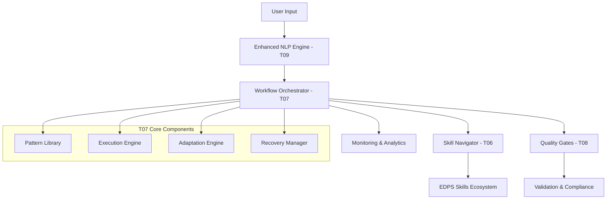

# EDPS Workflow Orchestrator - Integration Layer

This document details how the EDPS Workflow Orchestrator integrates with existing and planned EDPS skills, particularly the foundational edps-skill-navigator (T06) and the upcoming quality gates (T08) and enhanced NLP (T09) components.

## Integration Architecture

### Core Integration Points



## Integration with T06: Enhanced Skill Navigator

### Foundational Services Leveraged

#### 1. Skill Discovery and Registration
```javascript
// T07 leverages T06's skill registry for coordinated execution
class WorkflowOrchestrator {
    constructor() {
        this.skillNavigator = new EnhancedSkillNavigator(); // T06
        this.skillRegistry = this.skillNavigator.getSkillRegistry();
    }

    async coordinateSkillExecution(skillId, parameters, context) {
        // Leverage T06's enhanced coordination capabilities
        const skill = await this.skillRegistry.getSkill(skillId);
        const coordinationContext = await this.skillNavigator.prepareCoordinationContext(
            skill,
            parameters,
            context
        );
        
        return await this.skillNavigator.executeWithCoordination(
            skill,
            parameters,
            coordinationContext
        );
    }
}
```

#### 2. Natural Language Processing Foundation
```javascript
// T07 builds upon T06's NLP capabilities for workflow selection
async selectWorkflowFromIntent(userIntent, projectContext) {
    // Use T06's enhanced intent recognition as foundation
    const baseIntentAnalysis = await this.skillNavigator.analyzeIntent(userIntent);
    
    // Extend with workflow-specific analysis
    const workflowIntent = await this.enhanceIntentForWorkflow(
        baseIntentAnalysis,
        projectContext
    );
    
    return await this.selectOptimalWorkflow(workflowIntent, projectContext);
}
```

#### 3. Context Management and State Sharing
```javascript
// Shared context management between T06 and T07
class SharedContextManager {
    constructor() {
        this.navigatorContext = null; // T06 context
        this.workflowContext = null;  // T07 context
        this.contextSynchronizer = new ContextSynchronizer();
    }

    async synchronizeContexts(operation) {
        await this.contextSynchronizer.sync({
            navigator: this.navigatorContext,
            workflow: this.workflowContext,
            operation: operation
        });
    }

    async updateFromNavigation(navigationResult) {
        this.navigatorContext = navigationResult.context;
        await this.synchronizeContexts('navigation_update');
    }

    async updateFromWorkflow(workflowProgress) {
        this.workflowContext = workflowProgress.context;
        await this.synchronizeContexts('workflow_update');
    }
}
```

### Enhanced Capabilities Building on T06

#### 1. Advanced Workflow Orchestration
- **T06 Provides**: Basic skill sequencing and coordination
- **T07 Adds**: Sophisticated workflow pattern library, adaptive execution, and performance optimization

#### 2. Intelligent Skill Selection
- **T06 Provides**: Skill recommendation based on user intent
- **T07 Adds**: Context-aware workflow selection with multi-criteria optimization

#### 3. Execution Monitoring
- **T06 Provides**: Basic progress tracking
- **T07 Adds**: Comprehensive monitoring, analytics, and real-time adaptation

## Integration with T08: Quality Gates

### Quality Assurance Integration

#### 1. Gate Execution Coordination
```javascript
// T07 coordinates with T08 for quality validation during workflow execution
class QualityIntegratedExecution {
    constructor() {
        this.qualityGateSystem = new QualityGateSystem(); // T08
        this.gateExecutor = new GateExecutor();
    }

    async executeStepWithQualityGates(step, context, previousResults) {
        // Execute the skill step
        const stepResult = await this.executeSkillStep(step, context, previousResults);
        
        // Apply quality gates if defined for this step
        if (step.quality_gates) {
            for (const gateConfig of step.quality_gates) {
                const gateResult = await this.qualityGateSystem.executeGate(
                    gateConfig.gate_id,
                    {
                        stepResult,
                        context,
                        validationRules: gateConfig.validation_rules,
                        workflowMetadata: {
                            workflowId: context.workflowId,
                            stepIndex: step.order,
                            executionId: context.executionId
                        }
                    }
                );

                if (!gateResult.passed) {
                    return await this.handleQualityGateFailure(
                        step,
                        stepResult,
                        gateResult,
                        gateConfig
                    );
                }
            }
        }

        return stepResult;
    }

    async handleQualityGateFailure(step, result, gateResult, config) {
        switch (config.failure_action) {
            case 'retry_with_guidance':
                const refinedParams = await this.qualityGateSystem.generateRefinementGuidance(
                    gateResult,
                    step.parameters
                );
                step.parameters = { ...step.parameters, ...refinedParams };
                return await this.executeStepWithQualityGates(step, context, previousResults);
                
            case 'adaptive_workflow':
                const adaptation = await this.generateQualityBasedAdaptation(gateResult);
                return await this.applyAdaptation(adaptation);
                
            case 'escalate_to_manual':
                return await this.escalateToManualReview(step, result, gateResult);
        }
    }
}
```

#### 2. Dynamic Gate Configuration
```javascript
// T07 dynamically configures T08 gates based on workflow context
async configureGatesForWorkflow(workflow, executionContext) {
    const gateConfiguration = {
        workflow_id: workflow.id,
        execution_context: executionContext,
        gates: []
    };

    // Configure gates based on workflow complexity and quality requirements
    for (const step of workflow.steps) {
        if (step.quality_gates) {
            const gateConfigs = await this.adaptGateConfiguration(
                step.quality_gates,
                executionContext.qualityRequirements,
                workflow.complexity
            );
            
            gateConfiguration.gates.push(...gateConfigs);
        }
    }

    await this.qualityGateSystem.configureWorkflowGates(gateConfiguration);
}
```

### Quality-Driven Workflow Adaptation

#### 1. Quality Feedback Loop
```javascript
// Continuous quality feedback drives workflow adaptation
class QualityDrivenAdaptation {
    async analyzeQualityTrends(executionId) {
        const qualityMetrics = await this.qualityGateSystem.getExecutionQualityMetrics(executionId);
        const trends = await this.analyzeQualityTrends(qualityMetrics);
        
        if (trends.degrading) {
            const adaptations = await this.generateQualityImprovementAdaptations(trends);
            return await this.applyQualityAdaptations(adaptations);
        }
        
        return { status: 'quality_stable', trends };
    }

    async generateQualityImprovementAdaptations(trends) {
        return [
            {
                type: 'increase_validation_thoroughness',
                target_steps: trends.problematic_steps,
                configuration: {
                    validation_depth: 'comprehensive',
                    additional_checks: trends.recommended_checks
                }
            },
            {
                type: 'add_intermediate_gates',
                insertion_points: trends.gap_locations,
                gate_types: ['consistency_check', 'completeness_validation']
            }
        ];
    }
}
```

## Integration with T09: Enhanced NLP

### Advanced Intent Analysis Integration

#### 1. Workflow-Specific Intent Enhancement
```javascript
// T07 extends T09's intent analysis for sophisticated workflow selection
class WorkflowIntentAnalyzer {
    constructor() {
        this.enhancedNLP = new EnhancedNLPEngine(); // T09
        this.workflowPatternMatcher = new WorkflowPatternMatcher();
    }

    async analyzeWorkflowIntent(userInput, projectContext) {
        // Start with T09's comprehensive intent analysis
        const baseAnalysis = await this.enhancedNLP.parseUserIntent(userInput, projectContext);
        
        // Enhance with workflow-specific analysis
        const workflowAnalysis = await this.analyzeWorkflowRequirements(
            baseAnalysis,
            projectContext
        );
        
        // Generate workflow recommendations
        const workflowRecommendations = await this.generateWorkflowRecommendations(
            baseAnalysis,
            workflowAnalysis
        );
        
        return {
            ...baseAnalysis,
            workflowAnalysis,
            workflowRecommendations,
            confidence: this.calculateWorkflowConfidence(baseAnalysis, workflowAnalysis)
        };
    }

    async analyzeWorkflowRequirements(baseAnalysis, projectContext) {
        return {
            execution_pattern: await this.identifyExecutionPattern(baseAnalysis),
            time_constraints: await this.extractTimeConstraints(baseAnalysis),
            quality_requirements: await this.extractQualityRequirements(baseAnalysis),
            resource_preferences: await this.extractResourcePreferences(baseAnalysis),
            complexity_indicators: await this.assessComplexityRequirements(baseAnalysis, projectContext)
        };
    }
}
```

#### 2. Natural Language Workflow Specification
```javascript
// Enable natural language workflow creation and modification
class NaturalLanguageWorkflowBuilder {
    constructor() {
        this.nlpEngine = new EnhancedNLPEngine(); // T09
        this.workflowTemplates = new WorkflowTemplateLibrary();
    }

    async buildWorkflowFromDescription(description, projectContext) {
        // Parse natural language workflow description
        const workflowSpecs = await this.nlpEngine.parseWorkflowSpecification(description);
        
        // Map to workflow patterns
        const patternMatches = await this.workflowTemplates.findMatchingPatterns(
            workflowSpecs,
            projectContext
        );
        
        // Generate custom workflow if no perfect match
        if (patternMatches.length === 0 || patternMatches[0].confidence < 0.8) {
            return await this.generateCustomWorkflow(workflowSpecs, projectContext);
        }
        
        // Adapt existing pattern to specifications
        return await this.adaptWorkflowPattern(
            patternMatches[0].pattern,
            workflowSpecs,
            projectContext
        );
    }

    async modifyWorkflowFromDescription(workflowId, modification, context) {
        const currentWorkflow = await this.getWorkflow(workflowId);
        const modificationSpecs = await this.nlpEngine.parseWorkflowModification(modification);
        
        return await this.applyWorkflowModifications(
            currentWorkflow,
            modificationSpecs,
            context
        );
    }
}
```

### Context-Aware Execution

#### 1. Dynamic Context Updates from NLP
```javascript
// Real-time context updates during execution based on user feedback
class DynamicContextManager {
    async processUserFeedback(feedback, executionId) {
        // Use T09 to parse user feedback
        const feedbackAnalysis = await this.enhancedNLP.parseFeedback(feedback);
        
        // Determine if workflow adaptation is needed
        if (feedbackAnalysis.requires_adaptation) {
            const adaptations = await this.generateFeedbackAdaptations(
                feedbackAnalysis,
                executionId
            );
            
            return await this.applyRealTimeAdaptations(adaptations, executionId);
        }
        
        // Update execution context with feedback
        await this.updateExecutionContext(executionId, feedbackAnalysis);
    }
}
```

## Multi-Component Collaboration Scenarios

### Scenario 1: Intelligent Workflow Request Processing

```mermaid
sequenceDD
    participant User
    participant T09 as "Enhanced NLP"
    participant T07 as "Workflow Orchestrator"  
    participant T06 as "Skill Navigator"
    participant T08 as "Quality Gates"
    participant Skills as "EDPS Skills"

    User->>T09: "Create comprehensive organizational model"
    T09->>T09: Parse intent, extract entities
    T09->>T07: Enhanced intent analysis
    T07->>T07: Select optimal workflow pattern
    T07->>T06: Request skill coordination
    T06->>T06: Prepare execution context
    T07->>T08: Configure quality gates
    T08->>T08: Set up validation checkpoints
    T07->>Skills: Execute coordinated workflow
    T08->>T07: Quality validation results
    T07->>User: Workflow completion with analytics
```

### Scenario 2: Adaptive Quality-Driven Execution

```mermaid
sequenceDD
    participant T07 as "Workflow Orchestrator"
    participant T08 as "Quality Gates"
    participant Skills as "EDPS Skills"
    participant T06 as "Skill Navigator"

    T07->>Skills: Execute skill step
    Skills->>T08: Skill output for validation
    T08->>T08: Apply quality gates
    T08->>T07: Gate failure notification
    T07->>T07: Analyze failure pattern
    T07->>T06: Request alternative skill
    T06->>Skills: Execute alternative approach
    Skills->>T08: Retry validation
    T08->>T07: Validation success
    T07->>T07: Update workflow pattern
```

## Performance Optimization Through Integration

### Shared Resource Management
- **Coordinated resource allocation** between T06 skill execution and T07 workflow orchestration
- **Intelligent caching** of skill results and context data across components
- **Load balancing** for concurrent workflow and navigation operations

### Unified Monitoring
- **Consolidated metrics collection** across T06, T07, T08, and T09 operations
- **Cross-component performance correlation** to identify optimization opportunities  
- **Integrated alerting** for performance degradation across the ecosystem

### Adaptive Optimization
- **Dynamic configuration tuning** based on performance patterns across components
- **Predictive resource allocation** using historical execution data
- **Intelligent workflow selection** based on real-time system performance

## Configuration and Initialization

### Integrated Initialization Sequence
```javascript
class EDPSSystemInitializer {
    async initializeIntegratedSystem() {
        // Initialize components in dependency order
        const skillNavigator = await this.initializeSkillNavigator(); // T06
        const qualityGates = await this.initializeQualityGates();     // T08
        const enhancedNLP = await this.initializeEnhancedNLP();       // T09
        const workflowOrchestrator = await this.initializeWorkflowOrchestrator(); // T07
        
        // Establish integration connections
        await this.wireIntegrations(skillNavigator, qualityGates, enhancedNLP, workflowOrchestrator);
        
        // Validate integrated system
        await this.validateIntegratedSystem();
        
        return new IntegratedEDPSSystem(skillNavigator, qualityGates, enhancedNLP, workflowOrchestrator);
    }
}
```

This integration layer ensures that T07 (Workflow Orchestrator) seamlessly coordinates with the existing T06 foundation while providing integration points for the upcoming T08 and T09 enhancements, creating a cohesive and powerful EDPS skill ecosystem.