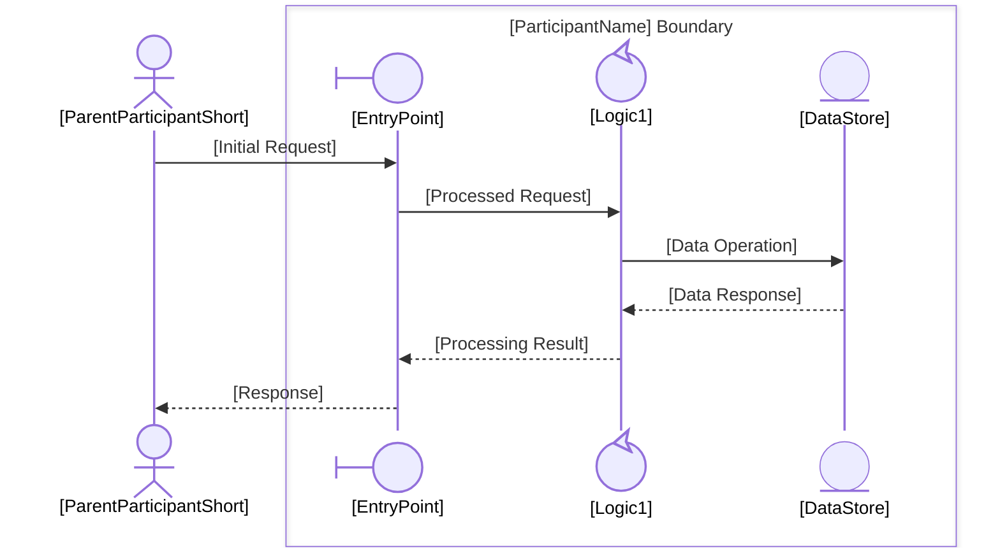
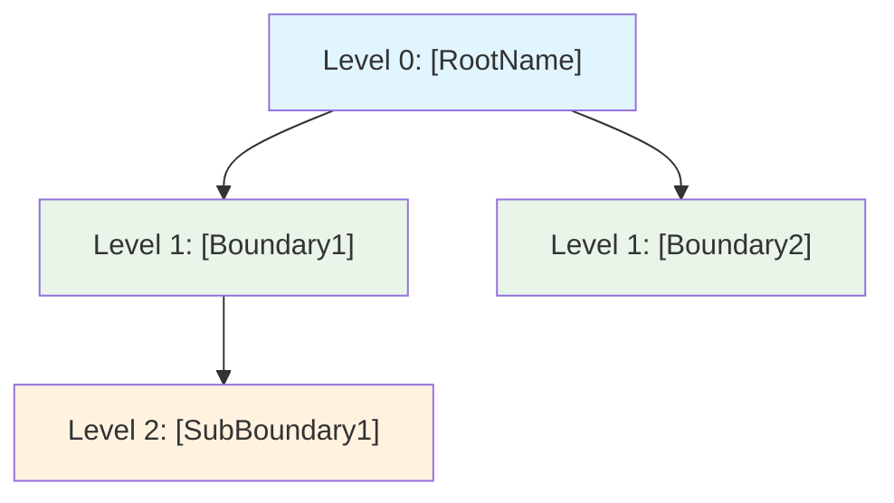

````skill
---
name: hierarchy-management
description: Manage hierarchical process decomposition in EDPS collaboration diagrams. Decomposes control-type participants into Level N+1 sub-processes with their own collaboration diagrams, tracks parent-child relationships across unlimited hierarchy depth, manages the folder structure, and maintains hierarchy metadata. Use when a user wants to decompose a participant into a sub-process, navigate a process hierarchy, roll back a decomposition, view hierarchy statistics, or generate a hierarchy tree visualization.
---

# Hierarchy Management

Decompose control-type participants into sub-process diagrams and manage the full hierarchy tree across EDPS collaboration models.

## Inputs

- **Parent diagram**: `[process-folder]/collaboration.md` — the diagram containing the participant to decompose
- **Target participant**: name of the control-type participant to decompose
- **Optional**: `[process-folder]/hierarchy-metadata.json` — existing hierarchy metadata

## Outputs

- `[process-folder]/[NN]-[ParticipantName]Boundary/collaboration.md` — new Level N+1 diagram
- `[process-folder]/[NN]-[ParticipantName]Boundary/main.md` — sub-process overview with parent/child navigation links
- `[process-folder]/[NN]-[ParticipantName]Boundary/process.md` — activity/workflow diagram for the sub-process
- `[process-folder]/[NN]-[ParticipantName]Boundary/domain-model.md` — class diagram with entities and relationships
- `[process-folder]/hierarchy-metadata.json` — updated hierarchy metadata (created if absent)
- `[process-folder]/folder-creation.log` — audit log appended with each sub-folder created
- Updated navigation links in parent `main.md` and `collaboration.md`

## Workflow

### 1. Validate Decomposition Eligibility

Before creating anything:

1. Read the parent `collaboration.md`
2. Identify the target participant's `@{ "type": "..." }` annotation
3. **If type ≠ `control`** → stop and return:

```json
{
  "error": "control-only-decomposition",
  "participant": "[Name]",
  "type": "[actual-type]",
  "message": "Only control-type participants can be decomposed into sub-processes.",
  "suggestion": "If this participant requires internal detail, consider reclassifying it as 'control', or model its internals as a separate diagram rather than a process decomposition."
}
```

4. Check whether a sub-folder for this participant already exists (decomposition already performed) → warn the user and offer to update instead

### 2. Determine Level and Folder Name

- Detect the current level by inspecting `hierarchy-metadata.json` at the parent level (or counting parent folder depth)
- Assign a two-digit ordinal prefix: count existing sub-folders in the parent directory and increment (e.g., `01`, `02`, `03`)
- Folder name pattern: `[NN]-[ParticipantNamePascalCase]Boundary`

Example: decomposing `OrderService` at Level 1 → `01-OrderServiceBoundary/`

#### 2a. Special Character Sanitization

Before building the folder name, sanitize the participant name:

| Rule | Input Example | Sanitized Output |
|------|--------------|-----------------|
| Remove spaces (PascalCase join) | `Order Service` | `OrderService` |
| Remove or replace `/` `\` `:` `*` `?` `"` `<` `>` `\|` | `Order/Service` | `OrderService` |
| Remove leading/trailing hyphens and dots | `.OrderService.` | `OrderService` |
| Collapse consecutive non-alphanumeric sequences to single hyphen | `Order--Service` | `OrderService` |
| Preserve existing PascalCase casing | `OrderServiceBoundary` | `OrderServiceBoundary` |

The final folder name must match the regex `^\d{2}-[A-Za-z][A-Za-z0-9]*Boundary$`.

#### 2b. Naming Collision Resolution

Before creating the folder, check whether `[NN]-[ParticipantName]Boundary/` already exists **in the same parent directory**:

1. **Exact match exists** (same ordinal + same name): the decomposition was already performed.
   - Stop and ask the user: "Sub-folder `[NN]-[ParticipantName]Boundary/` already exists. Do you want to (a) skip creation and reuse the existing folder, (b) overwrite its generated files, or (c) cancel?"
2. **Name match but different ordinal** (e.g., user renamed the folder): treat as a new decomposition — assign the next available ordinal.
3. **Ordinal conflict only** (different name, same number): increment the proposed ordinal until a free slot is found.

### 3. Generate the Level N+1 Collaboration Diagram

Apply the following structural rules (aligned with `diagram-generatecollaboration`):

- **Parent participant becomes the external actor**: the decomposed participant's parent context is represented as an `actor`-type participant *outside* all boxes
- **New boundary-type participant is first recipient**: introduce a new `boundary`-type entry point inside the sub-process box
- **Add control and entity participants** that represent the internal logic of the decomposed component
- **Apply EDPS boundary rules**: VR-1 (single external interface), VR-2 (boundary-first reception), VR-3 (control-only decomposition)

**Template for the new `collaboration.md`:**

```markdown
# [ParticipantName] Boundary — Level [N+1]

**Parent Process**: [[ParentProcessName]](../collaboration.md)  
**Hierarchy Level**: [N+1]  
**Decomposed From**: `[ParticipantName]` ([parent folder name])


```

Infer participant names, labels, and interactions from:
- The parent diagram's message exchanges involving the decomposed participant
- The participant's name (use naming heuristics from `diagram-generatecollaboration` stereotype classification)
- Domain context from project requirements or `domain-concepts.json` if available

### 4. Generate `main.md` for the Sub-Process

```markdown
# [ParticipantName] Boundary

**Level**: [N+1]  
**Parent Process**: [[ParentProcessName]](../main.md)  
**Status**: Active

## Overview

[One-sentence description of this boundary's responsibility.]

## Collaboration Diagram

See [collaboration.md](collaboration.md)

## Process Flow

See [process.md](process.md)

## Domain Model

See [domain-model.md](domain-model.md)

## Sub-Processes

_None yet — decompose a control-type participant to create a sub-process._

## Decomposable Participants

| Participant | Type | Status |
|------------|------|--------|
| [ControlParticipant1] | control | Available |
```

### 4b. Generate `process.md` for the Sub-Process

Infer the primary activities from the message exchanges in the new `collaboration.md`. Map each message send/receive pair to a step in the activity diagram.

**Template:**

```markdown
<!-- Identifier: P-[NN] -->

# [ParticipantName] Boundary — Process Flow

**Parent Process**: [[ParentProcessName]](../process.md)  
**Hierarchy Level**: [N+1]

```mermaid
flowchart TD
    A[Receive [InitialRequest] from [ParentParticipant]] --> B[[EntryPoint]: Validate Request]
    B --> C{Valid?}
    C -->|Yes| D[[Logic1]: Process Request]
    C -->|No| E[Return Error to [ParentParticipant]]
    D --> F[[DataStore]: Persist Data]
    F --> G[[Logic1]: Build Response]
    G --> H[[EntryPoint]: Return Result]
    H --> I[Send Response to [ParentParticipant]]
```

## Process Description

### 1. Receive Request
- [ParentParticipant] sends [InitialRequest] to [EntryPoint]
- [EntryPoint] validates the incoming request

### 2. Process
- [Logic1] executes the core logic
- [DataStore] is queried or updated as required

### 3. Respond
- Result is assembled and returned to [ParentParticipant]

## Boundary Rules Applied

- **VR-1** (Single External Interface): All external interaction passes through `[EntryPoint]`
- **VR-2** (Boundary-first Reception): First message recipient inside the box is the boundary participant
```

Populate `[InitialRequest]`, `[EntryPoint]`, `[Logic1]`, `[DataStore]`, and `[ParentParticipant]` from the generated `collaboration.md`.

### 4c. Generate `domain-model.md` for the Sub-Process

Infer entities from control and entity participants in the `collaboration.md`. Each entity-type participant becomes a class; each control-type participant also becomes a class representing its behavioral contract.

**Template:**

```markdown
<!-- Identifier: D-[NN] -->

# [ParticipantName] Boundary — Domain Model

**Parent Process**: [[ParentProcessName]](../domain-model.md)  
**Hierarchy Level**: [N+1]

## Domain Class Diagram

```mermaid
classDiagram
    %% Actors
    class [ParentParticipantShort]:::actor {
        +[key_attribute]: String
        +[primary_operation]()
    }

    %% Boundary
    class [EntryPoint]:::boundary {
        +[request_type]: String
        +receive[RequestName]()
        +return[ResponseName]()
    }

    %% Controls
    class [Logic1]:::control {
        +[state_attribute]: String
        +process[RequestName]()
    }

    %% Entities
    class [DataStore]:::entity {
        +[id_attribute]: String
        +[data_attribute]: String
        +persist()
        +retrieve()
    }

    %% Relationships
    [ParentParticipantShort] --> [EntryPoint] : sends [InitialRequest]
    [EntryPoint] --> [Logic1] : delegates processing
    [Logic1] --> [DataStore] : reads/writes data
    [Logic1] --> [EntryPoint] : returns result
    [EntryPoint] --> [ParentParticipantShort] : responds
```

## Key Domain Concepts

| Term | Type | Description |
|------|------|-------------|
| [EntryPoint] | boundary | Entry point for [ParticipantName] boundary |
| [Logic1] | control | Core processing logic |
| [DataStore] | entity | Persistent data store |

## Relationships to Parent Domain

- Inherits context from [[ParentProcessName] Domain Model](../domain-model.md)
- `[ParentParticipantShort]` maps to the decomposed participant in the parent diagram
```

Populate class names, attributes, and relationships using participant names and message labels from `collaboration.md`.

### 4d. Folder Creation Audit Log

After all files are written, **append** a log entry to `[process-folder]/folder-creation.log` (create if absent):

```
[ISO-8601 timestamp] CREATED  [NN]-[ParticipantName]Boundary/
  Level:      [N+1]
  Parent:     [ParentProcessName] ([process-folder]/)
  Files:      collaboration.md, main.md, process.md, domain-model.md
  Decomposed: [ParticipantName] (type: control)
  Ordinal:    [NN] (sibling count before: [count])
```

If a collision was resolved (see §2b), also append:
```
  Collision:  resolved — [description of resolution]
```

### 5. Update Parent Navigation

Add a **Sub-Processes** section (or entry) to:

1. Parent `main.md` — add a link to the new sub-folder's `main.md` (including process and domain-model links):

```markdown
## Sub-Processes

| Sub-Process | Collaboration | Process Flow | Domain Model |
|-------------|--------------|--------------|-------------|
| [[NN]-[ParticipantName]Boundary]([NN]-[ParticipantName]Boundary/main.md) | [diagram]([NN]-[ParticipantName]Boundary/collaboration.md) | [flow]([NN]-[ParticipantName]Boundary/process.md) | [model]([NN]-[ParticipantName]Boundary/domain-model.md) |
```

2. Parent `collaboration.md` — add a `decomposition` comment after the participant declaration:

```
%% Decomposition: [ParticipantName] → [NN]-[ParticipantName]Boundary/collaboration.md
```

### 6. Update `hierarchy-metadata.json`

Read existing metadata (create if absent) and add an entry for the new sub-process.  
See [references/hierarchy-metadata-schema.md](references/hierarchy-metadata-schema.md) for schema details.

Key fields to set/update:
- `nodes.[id].status` of the parent participant → `"decomposed"`
- Add a new node entry for the new sub-process
- Update `hierarchy_statistics` (depth, breadth, leaf count)

## Hierarchy Tree Visualization

When the user requests a tree view, generate a Mermaid `flowchart TD` diagram from `hierarchy-metadata.json`:

```markdown

```

Node colors by level:
- Level 0: `#e1f5fe` (light blue)
- Level 1: `#e8f5e8` (light green)
- Level 2: `#fff3e0` (light amber)
- Level 3+: `#f3e5f5` (light lavender)

## Decomposition Rollback

When the user requests a rollback of a decomposition:

1. Remove the sub-folder and its contents (`collaboration.md`, `main.md`, `process.md`, `domain-model.md`, `hierarchy-metadata.json`) (ask for confirmation first)
2. Revert parent participant's `status` in `hierarchy-metadata.json` to `"available"`
3. Remove the `%% Decomposition:` comment from parent `collaboration.md`
4. Remove the sub-process navigation link row from parent `main.md`'s Sub-Processes table
5. Remove the node from `hierarchy-metadata.json`
6. Append a `REMOVED` entry to `folder-creation.log`:
   ```
   [ISO-8601 timestamp] REMOVED  [NN]-[ParticipantName]Boundary/
     Reason:   user-requested rollback
     Restored: [ParticipantName] status → available
   ```
7. Report: participant name, folder removed, parent updated

## Hierarchy Statistics

When the user asks for statistics, compute from `hierarchy-metadata.json` and report:

| Metric | Value |
|--------|-------|
| Max Depth | Deepest level in the tree |
| Total Nodes | All process nodes (all levels) |
| Leaf Nodes | Nodes with no children |
| Decomposed Nodes | Nodes with `status: "decomposed"` |
| Available to Decompose | Nodes with `status: "available"` and `type: "control"` |
| Breadth at Deepest Level | Count of nodes at max depth |

## Multi-Level Deep Decomposition

When decomposing a participant that is already at Level 2 or deeper, apply the same workflow — there is no maximum depth. Each level's folder nests inside the parent folder:

```
[ProcessRoot]/
├── main.md
├── collaboration.md
├── process.md
├── domain-model.md
├── hierarchy-metadata.json
├── folder-creation.log
└── 01-ServiceABoundary/
    ├── main.md
    ├── collaboration.md
    ├── process.md
    ├── domain-model.md
    ├── hierarchy-metadata.json
    └── 01-LogicEngineBoundary/
        ├── main.md
        ├── collaboration.md
        ├── process.md
        ├── domain-model.md
        └── hierarchy-metadata.json
```

Each folder maintains its **own** `hierarchy-metadata.json` scoped to that sub-tree, while the root's metadata covers the full tree.

## References

- **[Hierarchy Metadata Schema](references/hierarchy-metadata-schema.md)** — JSON schema for `hierarchy-metadata.json`, field definitions, and example document
- **[Decomposition Patterns](references/decomposition-patterns.md)** — Participant inference heuristics, multi-boundary patterns, and worked examples at each hierarchy level
````
