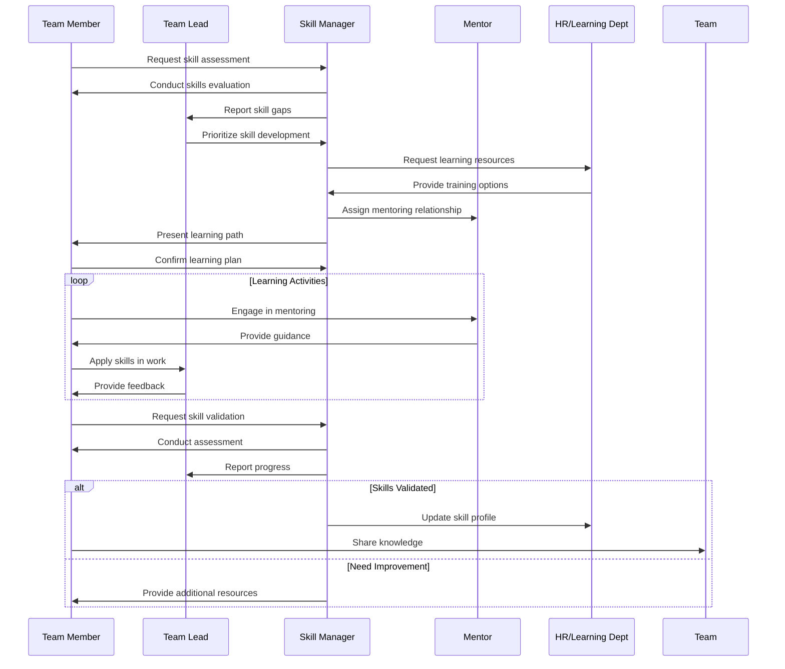

<!-- Identifier: C-01 -->

# Skill Development Process Collaborations

## Key Interactions

### Team Member - Skill Manager
- Initial skill assessment request
- Learning plan agreement
- Progress updates and validation

### Skill Manager - Team Lead
- Skill gap reporting
- Progress tracking
- Resource allocation coordination

### Team Member - Mentor
- Regular mentoring sessions
- Practical skill application guidance
- Performance feedback

### Skill Manager - HR/Learning Department
- Resource identification and allocation
- Training coordination
- Documentation and compliance

### Team Member - Team
- Knowledge sharing sessions
- Peer learning activities
- Community of practice participation