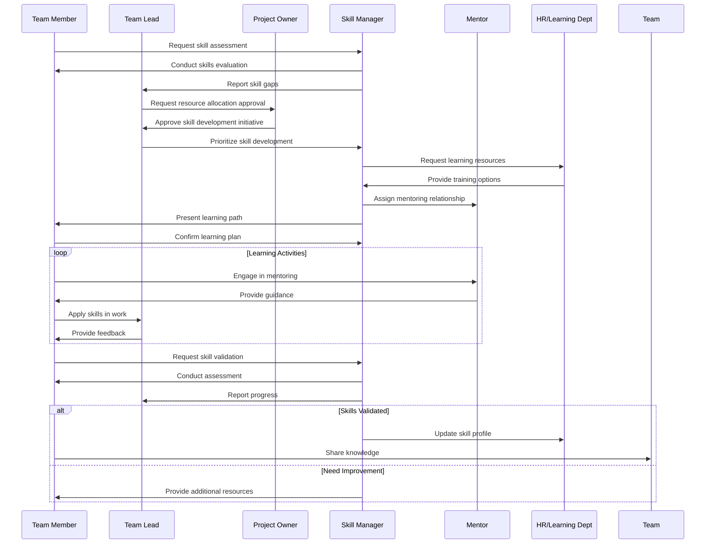
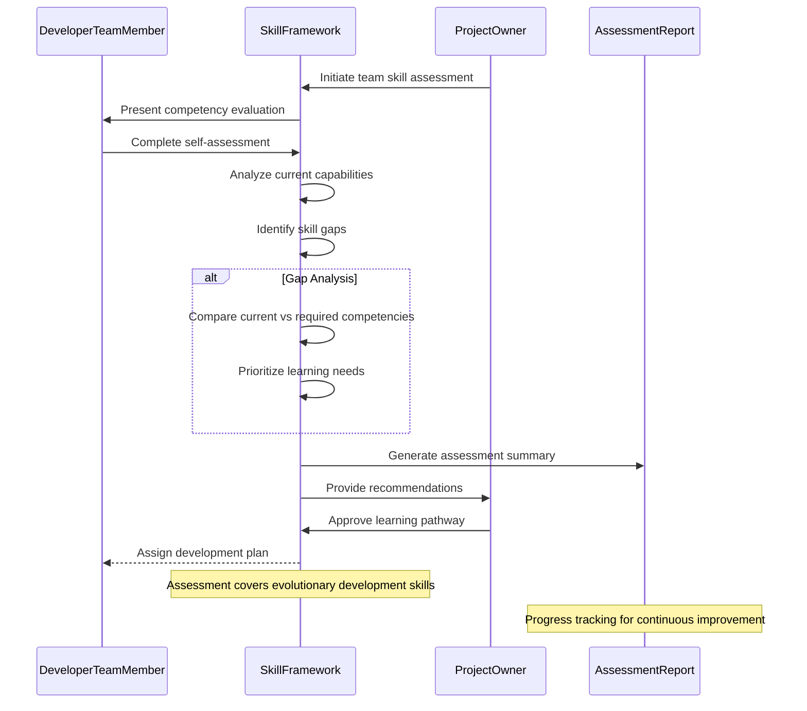
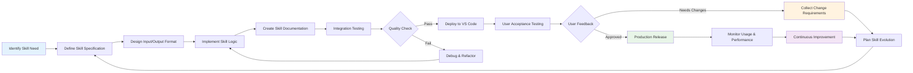

<!-- Identifier: C-01 -->

# Skill Development Process Collaborations

## Core Skill Development Flow

## AI Skills Assessment Workflow

## AI Skills Development Pipeline

## Key Interactions

### Team Member - Skill Manager
- Initial skill assessment request
- Learning plan agreement
- Progress updates and validation

### Skill Manager - Team Lead
- Skill gap reporting
- Progress tracking
- Resource allocation coordination

### Project Owner - Team Lead
- Resource allocation approval for skill development initiatives
- Major skill development decisions and strategic direction

### Project Owner - Skill Framework
- Strategic skill assessment initiation
- Learning pathway approvals for organizational alignment

### Team Member - Mentor
- Regular mentoring sessions
- Practical skill application guidance
- Performance feedback

### Skill Manager - HR/Learning Department
- Resource identification and allocation
- Training coordination
- Documentation and compliance

### Skill Framework - Assessment Report
- Competency gap analysis and documentation
- Progress tracking and continuous improvement metrics

### Team Member - Team
- Knowledge sharing sessions
- Peer learning activities
- Community of practice participation

### AI Skill Development Process
- Structured approach to creating new AI-enabled capabilities
- Quality assurance and user acceptance testing
- Continuous improvement and evolution cycles