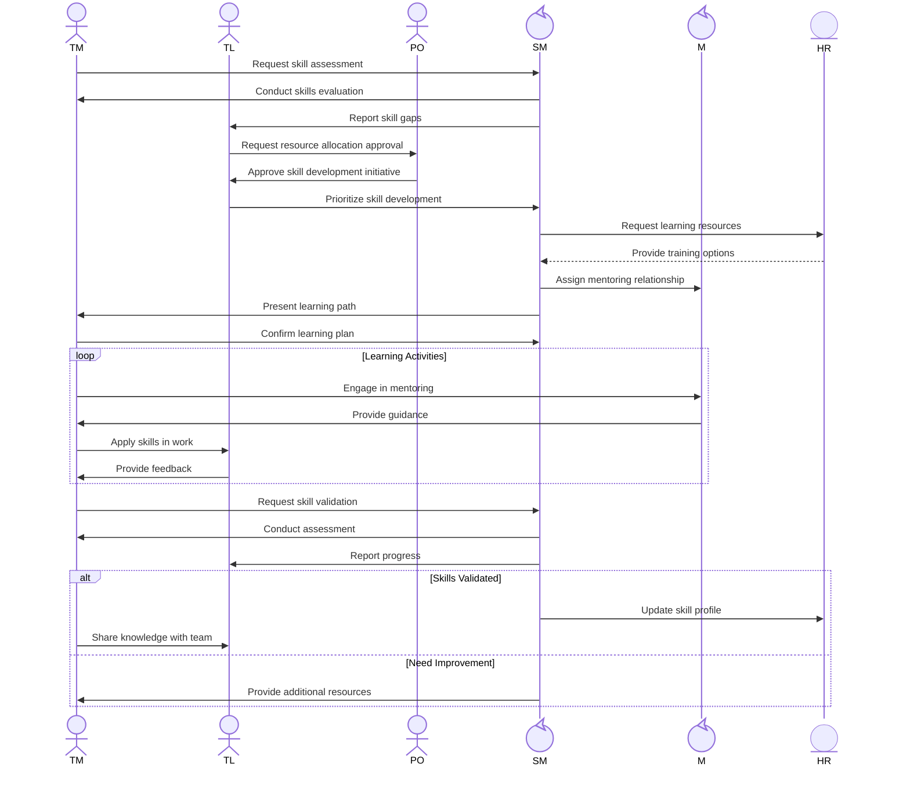
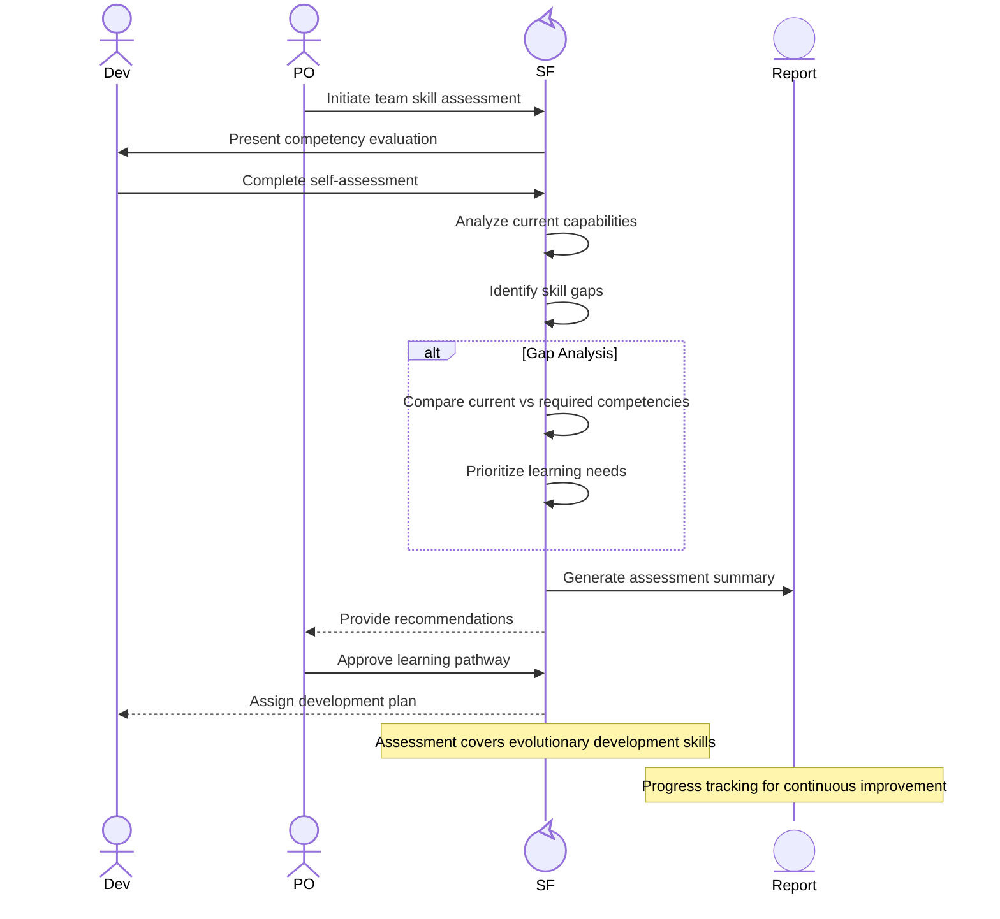
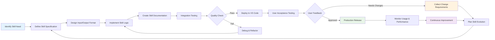
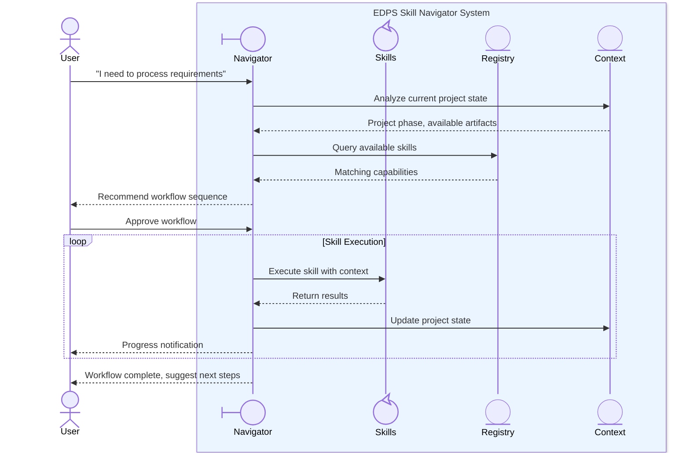
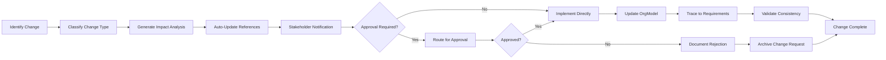
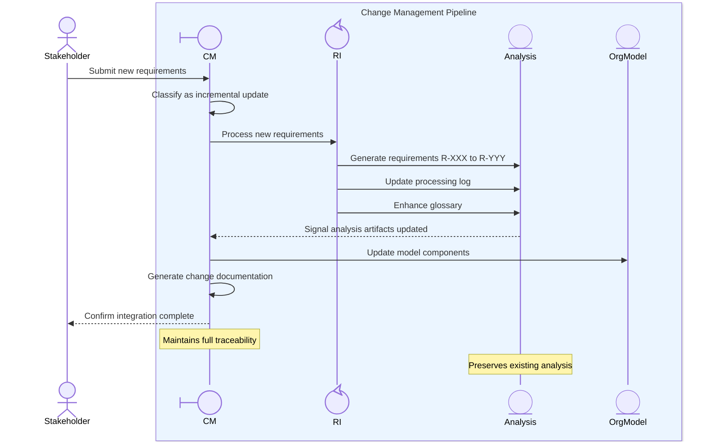
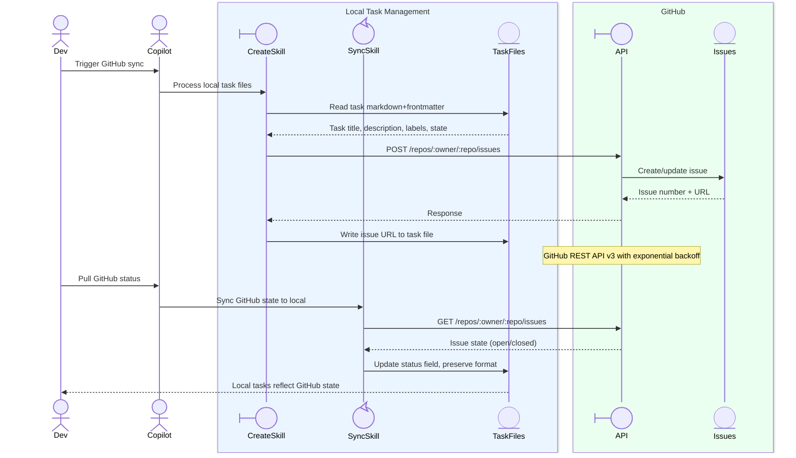
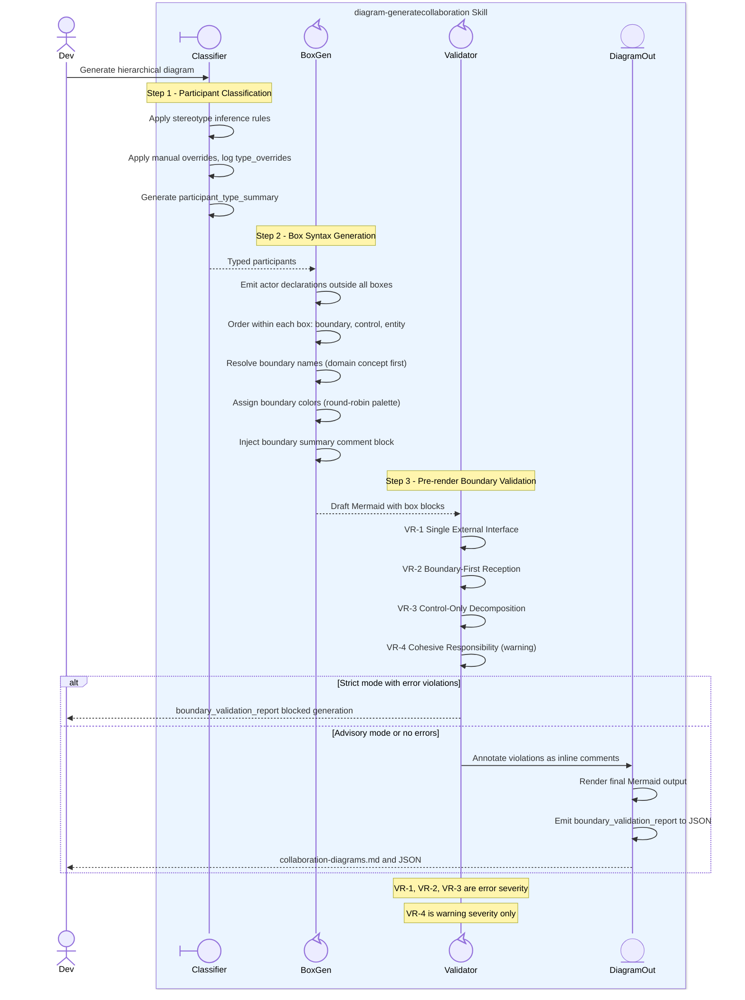
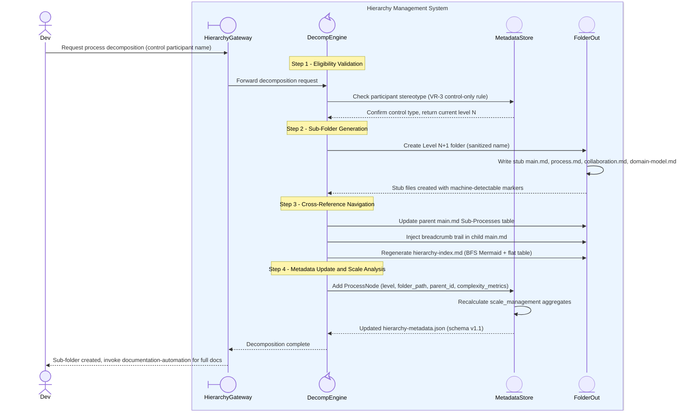
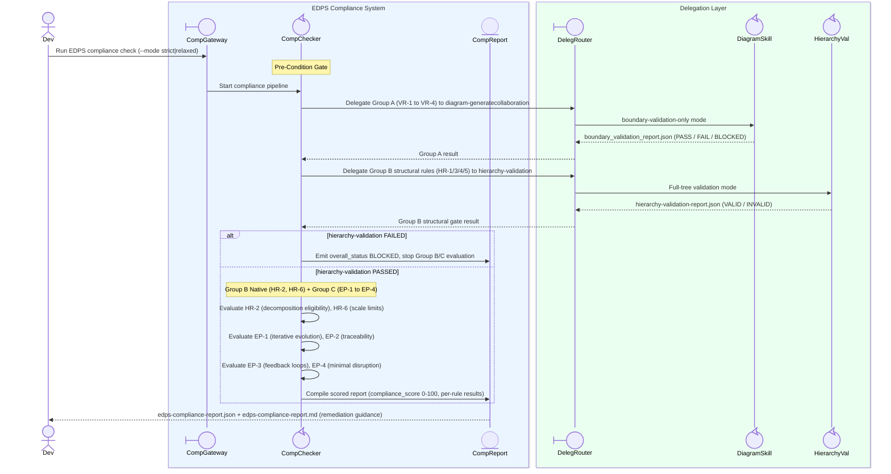

<!-- Identifier: C-01 -->

# Skill Development Process Collaborations

## Core Skill Development Flow

```mermaid
sequenceDiagram
    %% ─────────────────────────────────────────────────────
    %% Participant Classification (human workflow — no system box boundaries)
    %% TM, TL, PO : external human actors
    %% SM, M      : process coordinators (control)
    %% HR         : resource / data provider (entity)
    %% ─────────────────────────────────────────────────────

    participant TM@{ "type": "actor", "label": "Team Member" }
    participant TL@{ "type": "actor", "label": "Team Lead" }
    participant PO@{ "type": "actor", "label": "Project Owner" }
    participant SM@{ "type": "control", "label": "Skill Manager" }
    participant M@{ "type": "control", "label": "Mentor" }
    participant HR@{ "type": "entity", "label": "HR / Learning Dept" }

    TM->>SM: Request skill assessment
    SM->>TM: Conduct skills evaluation
    SM->>TL: Report skill gaps
    TL->>PO: Request resource allocation approval
    PO->>TL: Approve skill development initiative
    TL->>SM: Prioritize skill development

    SM->>HR: Request learning resources
    HR-->>SM: Provide training options
    SM->>M: Assign mentoring relationship

    SM->>TM: Present learning path
    TM->>SM: Confirm learning plan

    loop Learning Activities
        TM->>M: Engage in mentoring
        M->>TM: Provide guidance
        TM->>TL: Apply skills in work
        TL->>TM: Provide feedback
    end

    TM->>SM: Request skill validation
    SM->>TM: Conduct assessment
    SM->>TL: Report progress

    alt Skills Validated
        SM->>HR: Update skill profile
        TM->>TL: Share knowledge with team
    else Need Improvement
        SM->>TM: Provide additional resources
    end
```

## AI Skills Assessment Workflow

```mermaid
sequenceDiagram
    %% ─────────────────────────────────────────────────────
    %% Participant Classification (assessment workflow — no system box boundaries)
    %% Dev, PO  : external human actors
    %% SF       : orchestrating coordinator (control) — drives assessment logic
    %% Report   : data output artifact (entity)
    %% ─────────────────────────────────────────────────────

    participant Dev@{ "type": "actor", "label": "Developer Team Member" }
    participant PO@{ "type": "actor", "label": "Project Owner" }
    participant SF@{ "type": "control", "label": "Skill Framework" }
    participant Report@{ "type": "entity", "label": "Assessment Report" }

    PO->>SF: Initiate team skill assessment
    SF->>Dev: Present competency evaluation
    Dev->>SF: Complete self-assessment
    SF->>SF: Analyze current capabilities
    SF->>SF: Identify skill gaps

    alt Gap Analysis
        SF->>SF: Compare current vs required competencies
        SF->>SF: Prioritize learning needs
    end

    SF->>Report: Generate assessment summary
    SF-->>PO: Provide recommendations
    PO->>SF: Approve learning pathway
    SF-->>Dev: Assign development plan

    Note over SF: Assessment covers evolutionary development skills
    Note over Report: Progress tracking for continuous improvement
```

## AI Skills Development Pipeline

```mermaid
flowchart LR
    A[Identify Skill Need] --> B[Define Skill Specification]
    B --> C[Design Input/Output Format]
    C --> D[Implement Skill Logic]
    D --> E[Create Skill Documentation]
    E --> F[Integration Testing]
    
    F --> G{Quality Check}
    G -->|Pass| H[Deploy to VS Code]
    G -->|Fail| I[Debug & Refactor]
    I --> D
    
    H --> J[User Acceptance Testing]
    J --> K{User Feedback}
    K -->|Approved| L[Production Release]
    K -->|Needs Changes| M[Collect Change Requirements]
    
    M --> N[Plan Skill Evolution]
    N --> B
    
    L --> O[Monitor Usage & Performance]
    O --> P[Continuous Improvement]
    P --> N
    
    style A fill:#e3f2fd
    style L fill:#e8f5e8
    style M fill:#fff3e0
    style P fill:#f3e5f5
```

## EDPS Skill Navigator Orchestration

```mermaid
sequenceDiagram
    %% ─────────────────────────────────────────────────────
    %% BOUNDARY SUMMARY
    %% ─────────────────────────────────────────────────────
    %% [B-1] EDPS Skill Navigator System
    %%         Participants: SkillNavigator (boundary), AIAgentSkills (control),
    %%                       SkillRegistry (entity), ProjectContext (entity)
    %%         Decomposable: AIAgentSkills
    %%         External actor: Developer
    %% ─────────────────────────────────────────────────────

    participant User@{ "type": "actor", "label": "Developer" }

    %% [B-1] EDPS Skill Navigator System
    box rgb(235, 245, 255) EDPS Skill Navigator System
        participant Navigator@{ "type": "boundary", "label": "Skill Navigator" }
        participant Skills@{ "type": "control", "label": "AI Agent Skills" }
        participant Registry@{ "type": "entity", "label": "Skill Registry" }
        participant Context@{ "type": "entity", "label": "Project Context" }
    end

    User->>Navigator: "I need to process requirements"
    Navigator->>Context: Analyze current project state
    Context-->>Navigator: Project phase, available artifacts

    Navigator->>Registry: Query available skills
    Registry-->>Navigator: Matching capabilities

    Navigator-->>User: Recommend workflow sequence
    User->>Navigator: Approve workflow

    loop Skill Execution
        Navigator->>Skills: Execute skill with context
        Skills-->>Navigator: Return results
        Navigator->>Context: Update project state
        Navigator-->>User: Progress notification
    end

    Navigator-->>User: Workflow complete, suggest next steps
```

## Change Management Integration

```mermaid
flowchart LR
    A[Identify Change] --> B[Classify Change Type]
    B --> C[Generate Impact Analysis]
    C --> D[Auto-Update References]
    D --> E[Stakeholder Notification]
    
    E --> F{Approval Required?}
    F -->|Yes| G[Route for Approval]
    F -->|No| H[Implement Directly]
    
    G --> I{Approved?}
    I -->|Yes| H
    I -->|No| J[Document Rejection]
    
    H --> K[Update OrgModel]
    K --> L[Trace to Requirements]
    L --> M[Validate Consistency]
    
    J --> N[Archive Change Request]
    M --> O[Change Complete]
    N --> O
```

## Incremental Requirements Integration

```mermaid
sequenceDiagram
    %% ─────────────────────────────────────────────────────
    %% BOUNDARY SUMMARY
    %% ─────────────────────────────────────────────────────
    %% [B-1] Change Management Pipeline
    %%         Participants: ChangeManagement (boundary), RequirementsIngest (control),
    %%                       AnalysisArtifacts (entity), OrgModel (entity)
    %%         Decomposable: RequirementsIngest
    %%         External actor: Requirement Source
    %% ─────────────────────────────────────────────────────

    participant Stakeholder@{ "type": "actor", "label": "Requirement Source" }

    %% [B-1] Change Management Pipeline
    box rgb(235, 245, 255) Change Management Pipeline
        participant CM@{ "type": "boundary", "label": "Change Management" }
        participant RI@{ "type": "control", "label": "Requirements Ingest" }
        participant Analysis@{ "type": "entity", "label": "Analysis Artifacts" }
        participant OrgModel@{ "type": "entity", "label": "Org Model" }
    end

    Stakeholder->>CM: Submit new requirements
    CM->>CM: Classify as incremental update
    CM->>RI: Process new requirements

    RI->>Analysis: Generate requirements R-XXX to R-YYY
    RI->>Analysis: Update processing log
    RI->>Analysis: Enhance glossary

    Analysis-->>CM: Signal analysis artifacts updated
    CM->>OrgModel: Update model components
    CM->>CM: Generate change documentation

    CM-->>Stakeholder: Confirm integration complete

    Note over CM: Maintains full traceability
    Note over Analysis: Preserves existing analysis
```

## GitHub Integration Workflow

```mermaid
sequenceDiagram
    participant Dev@{ "type": "actor", "label": "Developer" }
    participant Copilot@{ "type": "actor", "label": "GitHub Copilot" }

    %% Boundary: Local Task Management
    box rgb(235, 245, 255) Local Task Management
        participant CreateSkill@{ "type": "boundary", "label": "github-issue-create-update" }
        participant SyncSkill@{ "type": "control", "label": "github-issue-sync-status" }
        participant TaskFiles@{ "type": "entity", "label": "Local Task Files" }
    end

    %% Boundary: GitHub
    box rgb(235, 255, 240) GitHub
        participant API@{ "type": "boundary", "label": "GitHub REST API" }
        participant Issues@{ "type": "entity", "label": "GitHub Issues" }
    end

    Dev->>Copilot: Trigger GitHub sync
    Copilot->>CreateSkill: Process local task files
    CreateSkill->>TaskFiles: Read task markdown+frontmatter
    TaskFiles-->>CreateSkill: Task title, description, labels, state
    CreateSkill->>API: POST /repos/:owner/:repo/issues
    API->>Issues: Create/update issue
    Issues-->>API: Issue number + URL
    API-->>CreateSkill: Response
    CreateSkill->>TaskFiles: Write issue URL to task file

    Note over API: GitHub REST API v3 with exponential backoff

    Dev->>Copilot: Pull GitHub status
    Copilot->>SyncSkill: Sync GitHub state to local
    SyncSkill->>API: GET /repos/:owner/:repo/issues
    API-->>SyncSkill: Issue state (open/closed)
    SyncSkill->>TaskFiles: Update status field, preserve format
    TaskFiles-->>Dev: Local tasks reflect GitHub state
```

## Hierarchical Diagram Generation with Boundary Support

```mermaid
sequenceDiagram
    %% ─────────────────────────────────────────────────────
    %% BOUNDARY SUMMARY
    %% ─────────────────────────────────────────────────────
    %% [B-1] diagram-generatecollaboration Skill
    %%         Participants: Participant Classifier (boundary),
    %%                       Box Syntax Generator (control), Boundary Validator (control),
    %%                       Diagram Output (entity)
    %%         Decomposable: Box Syntax Generator, Boundary Validator
    %%         External actor: Developer
    %% ─────────────────────────────────────────────────────

    participant Dev@{ "type": "actor", "label": "Developer" }

    box rgb(235, 245, 255) diagram-generatecollaboration Skill
        participant Classifier@{ "type": "boundary", "label": "Participant Classifier" }
        participant BoxGen@{ "type": "control", "label": "Box Syntax Generator" }
        participant Validator@{ "type": "control", "label": "Boundary Validator" }
        participant DiagramOut@{ "type": "entity", "label": "Diagram Output" }
    end

    Dev->>Classifier: Generate hierarchical diagram

    Note over Classifier: Step 1 - Participant Classification
    Classifier->>Classifier: Apply stereotype inference rules
    Classifier->>Classifier: Apply manual overrides, log type_overrides
    Classifier->>Classifier: Generate participant_type_summary

    Note over BoxGen: Step 2 - Box Syntax Generation
    Classifier-->>BoxGen: Typed participants
    BoxGen->>BoxGen: Emit actor declarations outside all boxes
    BoxGen->>BoxGen: Order within each box: boundary, control, entity
    BoxGen->>BoxGen: Resolve boundary names (domain concept first)
    BoxGen->>BoxGen: Assign boundary colors (round-robin palette)
    BoxGen->>BoxGen: Inject boundary summary comment block

    Note over Validator: Step 3 - Pre-render Boundary Validation
    BoxGen-->>Validator: Draft Mermaid with box blocks
    Validator->>Validator: VR-1 Single External Interface
    Validator->>Validator: VR-2 Boundary-First Reception
    Validator->>Validator: VR-3 Control-Only Decomposition
    Validator->>Validator: VR-4 Cohesive Responsibility (warning)

    alt Strict mode with error violations
        Validator-->>Dev: boundary_validation_report blocked generation
    else Advisory mode or no errors
        Validator->>DiagramOut: Annotate violations as inline comments
        DiagramOut->>DiagramOut: Render final Mermaid output
        DiagramOut->>DiagramOut: Emit boundary_validation_report to JSON
        DiagramOut-->>Dev: collaboration-diagrams.md and JSON
    end

    Note over Validator: VR-1, VR-2, VR-3 are error severity
    Note over Validator: VR-4 is warning severity only
```

## Hierarchical Process Decomposition Workflow

```mermaid
sequenceDiagram
    %% ─────────────────────────────────────────────────────
    %% BOUNDARY SUMMARY
    %% ─────────────────────────────────────────────────────
    %% [B-1] Hierarchy Management System
    %%         Participants: HierarchyGateway (boundary), DecompositionEngine (control),
    %%                       MetadataStore (entity), FolderOutput (entity)
    %%         Decomposable: DecompositionEngine
    %%         External actor: Developer
    %% ─────────────────────────────────────────────────────

    participant Dev@{ "type": "actor", "label": "Developer" }

    box rgb(235, 245, 255) Hierarchy Management System
        participant HierarchyGateway@{ "type": "boundary", "label": "Hierarchy Gateway" }
        participant DecompEngine@{ "type": "control", "label": "Decomposition Engine" }
        participant MetadataStore@{ "type": "entity", "label": "Hierarchy Metadata" }
        participant FolderOut@{ "type": "entity", "label": "Sub-Folder Output" }
    end

    Dev->>HierarchyGateway: Request process decomposition (control participant name)

    Note over DecompEngine: Step 1 - Eligibility Validation
    HierarchyGateway->>DecompEngine: Forward decomposition request
    DecompEngine->>MetadataStore: Check participant stereotype (VR-3 control-only rule)
    MetadataStore-->>DecompEngine: Confirm control type, return current level N

    Note over DecompEngine: Step 2 - Sub-Folder Generation
    DecompEngine->>FolderOut: Create Level N+1 folder (sanitized name)
    FolderOut->>FolderOut: Write stub main.md, process.md, collaboration.md, domain-model.md
    FolderOut-->>DecompEngine: Stub files created with machine-detectable markers

    Note over DecompEngine: Step 3 - Cross-Reference Navigation
    DecompEngine->>FolderOut: Update parent main.md Sub-Processes table
    DecompEngine->>FolderOut: Inject breadcrumb trail in child main.md
    DecompEngine->>FolderOut: Regenerate hierarchy-index.md (BFS Mermaid + flat table)

    Note over DecompEngine: Step 4 - Metadata Update and Scale Analysis
    DecompEngine->>MetadataStore: Add ProcessNode (level, folder_path, parent_id, complexity_metrics)
    MetadataStore->>MetadataStore: Recalculate scale_management aggregates
    MetadataStore-->>DecompEngine: Updated hierarchy-metadata.json (schema v1.1)

    DecompEngine-->>HierarchyGateway: Decomposition complete
    HierarchyGateway-->>Dev: Sub-folder created, invoke documentation-automation for full docs
```

## EDPS Compliance and Hierarchy Validation Workflow

```mermaid
sequenceDiagram
    %% ─────────────────────────────────────────────────────
    %% BOUNDARY SUMMARY
    %% ─────────────────────────────────────────────────────
    %% [B-1] EDPS Compliance System
    %%         Participants: ComplianceGateway (boundary), ComplianceChecker (control),
    %%                       ComplianceReport (entity)
    %%         Decomposable: ComplianceChecker
    %%         External actors: Developer, DiagramGenerateSkill, HierarchyValidationSkill
    %% [B-2] Delegation Layer
    %%         Participants: DelegationRouter (boundary), DiagramGenerateSkill (control),
    %%                       HierarchyValidationSkill (control)
    %%         Decomposable: DiagramGenerateSkill, HierarchyValidationSkill
    %%         External actor: Developer
    %% ─────────────────────────────────────────────────────

    participant Dev@{ "type": "actor", "label": "Developer" }

    box rgb(235, 245, 255) EDPS Compliance System
        participant CompGateway@{ "type": "boundary", "label": "Compliance Gateway" }
        participant CompChecker@{ "type": "control", "label": "Compliance Checker" }
        participant CompReport@{ "type": "entity", "label": "Compliance Report" }
    end

    box rgb(235, 255, 240) Delegation Layer
        participant DelegRouter@{ "type": "boundary", "label": "Delegation Router" }
        participant DiagramSkill@{ "type": "control", "label": "diagram-generatecollaboration" }
        participant HierarchyVal@{ "type": "control", "label": "hierarchy-validation" }
    end

    Dev->>CompGateway: Run EDPS compliance check (--mode strict|relaxed)

    Note over CompChecker: Pre-Condition Gate
    CompGateway->>CompChecker: Start compliance pipeline
    CompChecker->>DelegRouter: Delegate Group A (VR-1 to VR-4) to diagram-generatecollaboration
    DelegRouter->>DiagramSkill: boundary-validation-only mode
    DiagramSkill-->>DelegRouter: boundary_validation_report.json (PASS / FAIL / BLOCKED)
    DelegRouter-->>CompChecker: Group A result

    CompChecker->>DelegRouter: Delegate Group B structural rules (HR-1/3/4/5) to hierarchy-validation
    DelegRouter->>HierarchyVal: Full-tree validation mode
    HierarchyVal-->>DelegRouter: hierarchy-validation-report.json (VALID / INVALID)
    DelegRouter-->>CompChecker: Group B structural gate result

    alt hierarchy-validation FAILED
        CompChecker->>CompReport: Emit overall_status BLOCKED, stop Group B/C evaluation
    else hierarchy-validation PASSED
        Note over CompChecker: Group B Native (HR-2, HR-6) + Group C (EP-1 to EP-4)
        CompChecker->>CompChecker: Evaluate HR-2 (decomposition eligibility), HR-6 (scale limits)
        CompChecker->>CompChecker: Evaluate EP-1 (iterative evolution), EP-2 (traceability)
        CompChecker->>CompChecker: Evaluate EP-3 (feedback loops), EP-4 (minimal disruption)
        CompChecker->>CompReport: Compile scored report (compliance_score 0-100, per-rule results)
    end

    CompReport-->>Dev: edps-compliance-report.json + edps-compliance-report.md (remediation guidance)
```

## Key Interactions

### Team Member - Skill Manager
- Initial skill assessment request
- Learning plan agreement
- Progress updates and validation

### Skill Manager - Team Lead
- Skill gap reporting
- Progress tracking
- Resource allocation coordination

### Project Owner - Team Lead
- Resource allocation approval for skill development initiatives
- Major skill development decisions and strategic direction

### Project Owner - Skill Framework
- Strategic skill assessment initiation
- Learning pathway approvals for organizational alignment

### Team Member - Mentor
- Regular mentoring sessions
- Practical skill application guidance
- Performance feedback

### Skill Manager - HR/Learning Department
- Resource identification and allocation
- Training coordination
- Documentation and compliance

### Skill Framework - Assessment Report
- Competency gap analysis and documentation
- Progress tracking and continuous improvement metrics

### Team Member - Team
- Knowledge sharing sessions
- Peer learning activities
- Community of practice participation

### AI Skill Development Process
- Structured approach to creating new AI-enabled capabilities
- Quality assurance and user acceptance testing
- Continuous improvement and evolution cycles

### EDPS Skill Navigator Interactions
- **Intelligent Orchestration**: Navigator coordinates multiple AI skills for complex workflows
- **Context-Aware Recommendations**: Provides personalized skill suggestions based on project state
- **Workflow Automation**: Executes predefined skill sequences with minimal user intervention
- **Progress Monitoring**: Tracks skill execution and provides real-time feedback

### Change Management Process Interactions
- **Automated Change Detection**: AI conversation analysis identifies requirement changes
- **Impact Assessment Generation**: Systematic evaluation of change effects on stakeholders
- **Reference Management**: Automated consistency maintenance across organizational documents
- **Approval Workflow Coordination**: Routes significant changes through appropriate stakeholders

### Incremental Requirements Processing
- **Dynamic Integration**: Seamlessly incorporates new requirements without disrupting existing analysis
- **Traceability Preservation**: Maintains links between changes and source requirements
- **Artifact Synchronization**: Updates all related analysis documents consistently
- **Progressive Enhancement**: Builds organizational understanding incrementally

### GitHub Integration Process
- **Issue Lifecycle Management**: `github-issue-create-update` creates new GitHub Issues from local task files and updates existing issues on change
- **Bidirectional State Sync**: `github-issue-sync-status` pulls GitHub Issue open/closed state back to local task markdown files
- **Format Preservation**: Local task frontmatter structure is maintained during all sync operations
- **Authentication**: Personal Access Token with `repo` scope for GitHub REST API v3

### Hierarchical Diagram Generation
- **Stereotype Inference**: Automatic classification of participants as actor, boundary, control, or entity based on naming heuristics; manual overrides always take precedence; a `participant_type_summary` is emitted in JSON metadata
- **Box Boundary Grouping**: System boundaries rendered with `box [name] ... end` Mermaid syntax; actors declared outside all boxes; participants ordered boundary → control(s) → entity within each box
- **Boundary Naming**: Auto-derived from domain concept names (priority: manual → domain concept → dominant participant → functional role → generic ordinal); Title Case with `" Boundary"` suffix appended to system/component names
- **Boundary Colors**: Optional round-robin color palette (1st=light blue `rgb(235,245,255)`, 2nd=light green, 3rd=light amber, 4th=light lavender, 5th+=light grey); disabled by default
- **Boundary Summary Comments**: Structured `%% BOUNDARY SUMMARY` block injected at top of Mermaid output listing participants, decomposable controls, and external actors per boundary
- **Validation Rules (pre-render)**:
  - VR-1 Single External Interface (error) — each boundary may have exactly one external actor communicating directly into it
  - VR-2 Boundary-First Reception (error) — first inbound message from an external actor must be received by a `boundary`-type participant
  - VR-3 Control-Only Decomposition (error) — only `control`-type participants are eligible for sub-process diagram decomposition
  - VR-4 Cohesive Responsibility (warning) — all participants inside a boundary should share related functional concerns; flagged when cohesion score < 0.3
- **Validation Modes**: Strict mode blocks generation on VR-1/VR-2/VR-3 errors; Advisory mode (default) generates diagram and injects violation comments inline as `%% [VR-n ERROR]`
- **Validation Report**: Machine-readable `boundary_validation_report` emitted to JSON with `overall_status` (PASS / PASS_WITH_WARNINGS / FAIL / BLOCKED) and a markdown summary table in `collaboration-diagrams.md`
- **Decomposition Traceability**: Sub-process diagrams linked to parent `control` participants through `decomposable_participants` field in `box_syntax_metadata`

### Requirements Merging Process
- **Multi-Source Consolidation**: `requirements-merge` combines overlapping requirement documents into a single coherent specification
- **Conflict Detection**: Identifies redundant and contradictory requirements across sources
- **Source Traceability**: Every requirement in the merged output retains links to its origin document

### Project Management Skills Integration
- **Documentation Initialization**: `project-document-management` creates consistent folder trees for new projects
- **Milestone Management**: `project-planning-tracking` tracks phases, milestones, and task status
- **Dashboard Generation**: `project-status-reporting` auto-aggregates data for executive and stakeholder reports

### Hierarchical Process Decomposition
- **Eligibility Validation**: `hierarchy-management` enforces control-only decomposition (VR-3) before creating any sub-process; non-control participants are rejected with an error
- **Sub-Folder and Stub Generation**: Level N+1 folder created with machine-detectable stub files; practitioners invoke `documentation-automation` for full content (T20 ownership contract)
- **Cross-Reference Maintenance**: Breadcrumb trails injected in child `main.md`, parent Sub-Processes table updated, and `hierarchy-index.md` regenerated breadth-first after every decomposition and rollback
- **Scale Management**: Complexity metrics (`interaction_count`, `participant_count`, `nesting_depth`) computed per node; advisory and critical warnings emitted when thresholds exceeded; decomposition candidates identified for control-type participants

### EDPS Compliance Checking
- **Group A Delegation**: VR-1–VR-4 boundary diagram rules are authoritative in `diagram-generatecollaboration`; `edps-compliance` delegates by invoking boundary-validation-only mode and consuming the existing report
- **Group B Pre-Condition Gate**: `hierarchy-validation` must PASS before Group B/C evaluation proceeds; on FAIL, overall status is BLOCKED and remediation references hierarchy-validation report
- **Group C Evolutionary Principles**: EP-1 (iterative evolution), EP-2 (traceability), EP-3 (feedback loops), EP-4 (minimal disruption) evaluated natively by `edps-compliance`
- **Scored Reporting**: Compliance score 0–100 with status classification (COMPLIANT / MOSTLY_COMPLIANT / NEEDS_IMPROVEMENT / NON_COMPLIANT), per-rule results, trend delta, and prioritized remediation guidance

### Hierarchy Structural Validation
- **Cross-Level Type Consistency (Group HV)**: Validates participant stereotypes are consistent across decomposition levels; only control-type participants may have child diagrams
- **Cross-Reference Integrity (Group HX)**: Validates breadcrumb links, Sub-Processes table links, hierarchy-index entries, and hierarchy-metadata.json node references; auto-fix available for path-reconstruction issues
- **Naming and Structure (Group HN)**: Validates folder naming conventions, file presence requirements, and SKILL.md format compliance; structural errors require human review

### Change Impact Analysis
- **Artifact-Level Impact Tracing (Group CI)**: Traces change effects through diagram participants, sub-folder hierarchies, cross-references, and documentation stubs
- **Requirement Change Tracing (Group CR)**: Identifies requirement traceability gaps and propagates change notifications to all dependent hierarchy nodes
- **Risk Classification**: Five-level risk (NONE/LOW/MEDIUM/HIGH/CRITICAL) with `normalized_risk_level` and `critical_flag` for `change-management` skill compatibility
- **What-if and Apply Modes**: Default what-if mode previews impact without modification; apply mode auto-repairs navigational artifacts

### Documentation Automation
- **Level-Calibrated Content**: Level Content Guide calibrates scope, overview tone, and process detail depth across Level 0 (system overview) through Level 3+ (detailed subprocess)
- **Participant Inventory**: Extracts aliases, stereotypes, labels, box assignments, and involvement counts from parent collaboration diagram
- **Content Guard**: 10-line threshold check prevents silent overwrites of manually-authored content; `--force` flag bypasses when intentional overwrite is confirmed
- **Template Customization**: `doc-templates/` directory with `{{variable_name}}` placeholder syntax for org-specific overrides of all four generated file types

### Legacy Migration
- **Non-Destructive Migration**: `migration-tools` leaves original diagrams unchanged; preview mode shows changes before apply mode writes enhanced output
- **Stereotype Inference**: 6-priority rule chain delegates to `diagram-generatecollaboration` inference logic; boundary coloring aligned with box syntax palette
- **Traceability Preservation**: Requirement trace IDs embedded in original diagrams preserved verbatim in enhanced output JSON