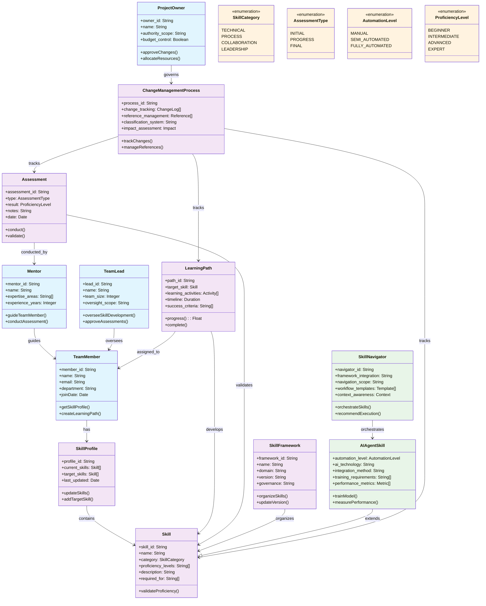

<!-- Identifier: D-01 -->

# Skill Development Process Domain Model

## Domain Class Diagram

## Actors

### Primary Actors
- **Team Member**: Individual seeking to develop skills
- **Team Lead**: Manager responsible for team capability
- **Project Owner**: Primary decision maker and change approver for the project, with broader authority scope than Team Lead
- **Skill Manager**: Specialist in organizational skill development
- **Mentor**: Experienced practitioner providing guidance

### Supporting Actors
- **HR/Learning Department**: Provides training resources and administration
- **Subject Matter Expert**: Domain specialist for specific skills
- **External Trainer**: Outside expertise for specialized training

## Core Entities

### Skill
- **Skill ID**: Unique identifier
- **Name**: Skill designation
- **Category**: Technical, Process, Collaboration, etc.
- **Proficiency Levels**: Beginner, Intermediate, Advanced, Expert
- **Description**: Detailed skill definition
- **Required For**: Roles or activities requiring this skill

### Skill Profile
- **Profile ID**: Unique identifier
- **Team Member**: Associated individual
- **Current Skills**: List of validated skills and levels
- **Target Skills**: Desired skill development goals
- **Last Updated**: Profile modification date

### Learning Path
- **Path ID**: Unique identifier
- **Target Skill**: Skill being developed
- **Learning Activities**: Sequence of development activities
- **Timeline**: Expected duration and milestones
- **Resources**: Required materials and support
- **Success Criteria**: Validation requirements

### Assessment
- **Assessment ID**: Unique identifier
- **Type**: Initial, Progress, Final
- **Skill**: Skill being assessed
- **Result**: Proficiency level achieved
- **Notes**: Detailed feedback and observations
- **Date**: Assessment completion date

### SkillFramework
- **Framework ID**: Unique identifier
- **Name**: Framework designation
- **Domain**: Business domain or area of focus
- **Skills Collection**: Related skills organized together
- **Competency Model**: Structured representation of capabilities
- **Version**: Framework iteration and update management
- **Governance**: Authority and change management process

### AIAgentSkill
- **Skill ID**: Unique identifier (extends Skill)
- **Name**: AI skill designation
- **Category**: AI Automation, Intelligence, Enhancement
- **Automation Level**: Manual, Semi-automated, Fully automated
- **AI Technology**: Machine learning, NLP, computer vision, etc.
- **Integration Method**: API, plugin, embedded system
- **Training Requirements**: Data, model setup, configuration
- **Performance Metrics**: Accuracy, efficiency, reliability measures

### SkillNavigator
- **Navigator ID**: Unique identifier
- **Framework Integration**: Copilot, VS Code, CLI
- **Navigation Scope**: Available skills registry and orchestration capabilities
- **Workflow Templates**: Predefined skill execution sequences
- **Context Awareness**: Project state, available artifacts, user preferences
- **Orchestration Intelligence**: Pattern recognition, dependency resolution, optimization
- **Learning Capability**: Adaptive recommendations, usage pattern analysis

### ChangeManagementProcess
- **Process ID**: Unique identifier
- **Change Tracking**: Systematic documentation and impact analysis
- **Reference Management**: Automated cross-reference updates and consistency
- **Classification System**: Change type identification and categorization
- **Impact Assessment**: Stakeholder analysis, effort estimation, risk evaluation
- **Integration Points**: OrgModel updates, task dependencies, requirement traceability

## Key Relationships

- Team Member **has** Skill Profile
- Skill Profile **contains** multiple Skills
- Learning Path **develops** specific Skill
- Assessment **validates** Skill acquisition
- Mentor **guides** Team Member through Learning Path
- Team Lead **oversees** skill development for team
- Project Owner **approves** major skill development changes and resource allocation
- Skill Manager **coordinates** organizational skill development
- SkillFramework **organizes** related Skills into coherent competency models
- AIAgentSkill **extends** Skill with AI-specific capabilities and requirements
- Assessment **validates** AIAgentSkill through automated testing and performance metrics
- SkillNavigator **orchestrates** multiple AIAgentSkills in coordinated workflows
- SkillNavigator **provides** intelligent recommendations for skill execution sequences
- ChangeManagementProcess **tracks** all modifications to Skills, Learning Paths, and Assessments
- ChangeManagementProcess **integrates** with SkillFramework for systematic capability evolution
- Project Owner **governs** ChangeManagementProcess through approval workflows

## Business Rules

1. Each team member must have a current skill profile
2. Skill assessments must be conducted by qualified evaluators
3. Learning paths must align with organizational priorities
4. Mentors must have expert-level proficiency in skills they guide
5. Skill validation requires practical demonstration, not just theoretical knowledge
6. Project Owner approval required for significant skill development initiatives involving resource allocation
7. SkillFrameworks must be governed by designated authority with clear versioning and change control
8. AIAgentSkills require additional validation including performance metrics and integration testing
9. Team Lead authority is focused on team capability, while Project Owner has broader project-level authority
10. SkillNavigator must maintain registry of all available skills with current capability status
11. ChangeManagementProcess requires approval workflow for changes affecting multiple stakeholder groups
12. All AIAgentSkill integrations must support SkillNavigator orchestration patterns
13. Requirements incremental updates must maintain traceability through ChangeManagementProcess
14. SkillNavigator recommendations must consider organizational constraints and priorities