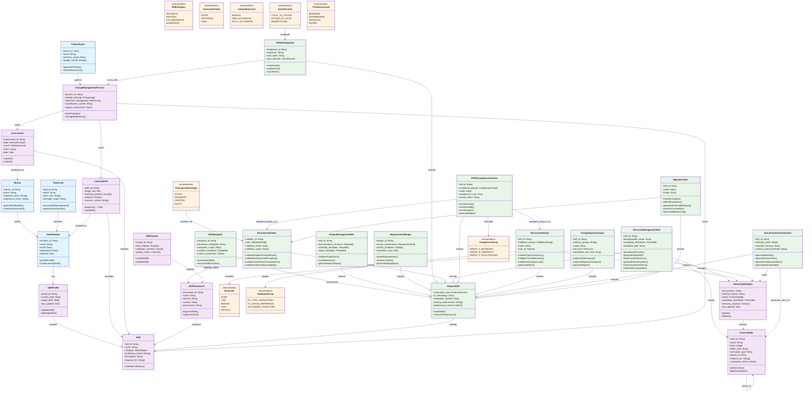

<!-- Identifier: D-01 -->

# Skill Development Process Domain Model

## Domain Class Diagram

```mermaid
classDiagram
    %% Primary Actors
    class TeamMember:::actor {
        +member_id: String
        +name: String
        +email: String
        +department: String
        +joinDate: Date
        +getSkillProfile()
        +createLearningPath()
    }

    class TeamLead:::actor {
        +lead_id: String
        +name: String
        +team_size: Integer
        +oversight_scope: String
        +overseeSkillDevelopment()
        +approveAssessments()
    }

    class ProjectOwner:::actor {
        +owner_id: String
        +name: String
        +authority_scope: String
        +budget_control: Boolean
        +approveChanges()
        +allocateResources()
    }

    class Mentor:::actor {
        +mentor_id: String
        +name: String
        +expertise_areas: String[]
        +experience_years: Integer
        +guideTeamMember()
        +conductAssessment()
    }

    %% Core Entities
    class Skill:::entity {
        +skill_id: String
        +name: String
        +category: SkillCategory
        +proficiency_levels: String[]
        +description: String
        +required_for: String[]
        +validateProficiency()
    }

    class SkillProfile:::entity {
        +profile_id: String
        +current_skills: Skill[]
        +target_skills: Skill[]
        +last_updated: Date
        +updateSkills()
        +addTargetSkill()
    }

    class LearningPath:::entity {
        +path_id: String
        +target_skill: Skill
        +learning_activities: Activity[]
        +timeline: Duration
        +success_criteria: String[]
        +progress(): Float
        +complete()
    }

    class Assessment:::entity {
        +assessment_id: String
        +type: AssessmentType
        +result: ProficiencyLevel
        +notes: String
        +date: Date
        +conduct()
        +validate()
    }

    class SkillFramework:::entity {
        +framework_id: String
        +name: String
        +domain: String
        +version: String
        +governance: String
        +organizeSkills()
        +updateVersion()
    }

    class AIAgentSkill:::ai {
        +automation_level: AutomationLevel
        +ai_technology: String
        +integration_method: String
        +training_requirements: String[]
        +performance_metrics: Metric[]
        +trainModel()
        +measurePerformance()
    }

    class SkillNavigator:::ai {
        +navigator_id: String
        +framework_integration: String
        +navigation_scope: String
        +workflow_templates: Template[]
        +context_awareness: Context
        +orchestrateSkills()
        +recommendExecution()
    }

    class ChangeManagementProcess:::entity {
        +process_id: String
        +change_tracking: ChangeLog[]
        +reference_management: Reference[]
        +classification_system: String
        +impact_assessment: Impact
        +trackChanges()
        +manageReferences()
    }

    class GitHubIntegration:::ai {
        +integration_id: String
        +repository: String
        +auth_token: String
        +sync_direction: SyncDirection
        +createIssue()
        +updateIssue()
        +syncStatus()
    }

    class BoundaryValidator:::ai {
        +validator_id: String
        +rules: ValidationRule[]
        +validation_mode: String
        +validation_report: Report
        +validateSingleExternalInterface()
        +validateBoundaryFirstReception()
        +validateControlOnlyDecomposition()
        +validateCohesiveResponsibility()
    }

    class ProjectManagementSkill:::ai {
        +skill_id: String
        +documentation_structure: Template[]
        +schedule_templates: Template[]
        +report_templates: Template[]
        +initializeProjectDocs()
        +trackMilestones()
        +generateStatusReport()
    }

    class RequirementsMerger:::ai {
        +merger_id: String
        +source_requirements: RequirementSet[]
        +conflict_resolution: Strategy
        +traceability_map: Map
        +mergeRequirements()
        +resolveConflicts()
        +generateMergedSpec()
    }

    class SkillCreator:::entity {
        +creator_id: String
        +skill_template: Template
        +validation_checklist: Check[]
        +quality_criteria: Criterion[]
        +scaffoldSkill()
        +validateSkill()
    }

    class HierarchyManagementSkill:::ai {
        +skill_id: String
        +decomposition_mode: String
        +complexity_thresholds: Thresholds
        +metadata_path: String
        +decomposeProcess()
        +generateSubFolder()
        +buildCrossReferences()
        +generateHierarchyIndex()
        +trackComplexityMetrics()
        +rollbackDecomposition()
    }

    class EDPSComplianceChecker:::ai {
        +skill_id: String
        +compliance_groups: ComplianceGroup[]
        +mode: String
        +compliance_score: Float
        +overall_status: String
        +checkGroupA()
        +checkGroupB()
        +checkGroupC()
        +generateReport()
    }

    class HierarchyValidator:::ai {
        +skill_id: String
        +validation_groups: ValidationGroup[]
        +mode: String
        +auto_fix: Boolean
        +validateTypeConsistency()
        +validateCrossReferences()
        +validateNamingStructure()
        +generateReport()
    }

    class ChangeImpactAnalyzer:::ai {
        +skill_id: String
        +analysis_groups: String[]
        +mode: String
        +risk_level: RiskLevel
        +normalized_risk_level: String
        +analyzeArtifactImpact()
        +analyzeRequirementImpact()
        +generateReport()
    }

    class DocumentationAutomation:::ai {
        +skill_id: String
        +hierarchy_level: Integer
        +template_directory: String
        +content_guard_threshold: Integer
        +generateMainDoc()
        +generateProcessDoc()
        +generateCollaborationDoc()
        +generateDomainModel()
    }

    class MigrationTools:::ai {
        +skill_id: String
        +mode: String
        +scope: String
        +inferStereotypes()
        +detectBoundaries()
        +generateEnhancedDiagram()
        +preserveTraceability()
        +generateMigrationLog()
    }

    class HierarchyMetadata:::entity {
        +root_process: String
        +schema_version: String
        +nodes: ProcessNode[]
        +complexity_thresholds: Thresholds
        +hierarchy_statistics: Statistics
        +last_updated: Date
        +update()
        +rollback()
    }

    class ProcessNode:::entity {
        +node_id: String
        +name: String
        +level: Integer
        +folder_path: String
        +participant_type: String
        +parent_id: String
        +children_ids: String[]
        +complexity_metrics: Metrics
        +getAncestors()
        +getDescendants()
    }

    %% Enums
    class SkillCategory:::enum {
        <<enumeration>>
        TECHNICAL
        PROCESS
        COLLABORATION
        LEADERSHIP
    }

    class AssessmentType:::enum {
        <<enumeration>>
        INITIAL
        PROGRESS
        FINAL
    }

    class AutomationLevel:::enum {
        <<enumeration>>
        MANUAL
        SEMI_AUTOMATED
        FULLY_AUTOMATED
    }

    class ParticipantStereotype:::enum {
        <<enumeration>>
        ACTOR
        BOUNDARY
        CONTROL
        ENTITY
    }

    class SyncDirection:::enum {
        <<enumeration>>
        LOCAL_TO_GITHUB
        GITHUB_TO_LOCAL
        BIDIRECTIONAL
    }

    class ComplianceGroup:::enum {
        <<enumeration>>
        GROUP_A_BOUNDARY
        GROUP_B_HIERARCHY
        GROUP_C_EVOLUTIONARY
    }

    class RiskLevel:::enum {
        <<enumeration>>
        NONE
        LOW
        MEDIUM
        HIGH
        CRITICAL
    }

    class ValidationGroup:::enum {
        <<enumeration>>
        HV_TYPE_CONSISTENCY
        HX_CROSS_REFERENCE
        HN_NAMING_STRUCTURE
    }

    class ProficiencyLevel:::enum {
        <<enumeration>>
        BEGINNER
        INTERMEDIATE
        ADVANCED
        EXPERT
    }

    %% Relationships
    TeamMember --> SkillProfile : has
    SkillProfile --> Skill : contains
    LearningPath --> Skill : develops
    Assessment --> Skill : validates
    Mentor --> TeamMember : guides
    TeamLead --> TeamMember : oversees
    ProjectOwner --> ChangeManagementProcess : governs
    SkillFramework --> Skill : organizes
    AIAgentSkill --|> Skill : extends
    SkillNavigator --> AIAgentSkill : orchestrates
    ChangeManagementProcess --> Skill : tracks
    ChangeManagementProcess --> LearningPath : tracks
    ChangeManagementProcess --> Assessment : tracks
    Assessment --> Mentor : conducted_by
    LearningPath --> TeamMember : assigned_to
    GitHubIntegration --> ChangeManagementProcess : syncs_with
    BoundaryValidator --> SkillFramework : validates_within
    ProjectManagementSkill --|> AIAgentSkill : extends
    RequirementsMerger --|> AIAgentSkill : extends
    GitHubIntegration --|> AIAgentSkill : extends
    BoundaryValidator --|> AIAgentSkill : extends
    SkillCreator --> SkillFramework : supports
    ParticipantStereotype --> BoundaryValidator : classifies_for
    SyncDirection --> GitHubIntegration : configures
    HierarchyManagementSkill --|> AIAgentSkill : extends
    HierarchyManagementSkill --> HierarchyMetadata : manages
    HierarchyManagementSkill --> ProcessNode : creates
    HierarchyMetadata --> ProcessNode : contains
    ProcessNode --> ProcessNode : parent_of
    EDPSComplianceChecker --|> AIAgentSkill : extends
    EDPSComplianceChecker --> BoundaryValidator : delegates_group_a_to
    EDPSComplianceChecker --> HierarchyValidator : delegates_group_b_to
    EDPSComplianceChecker --> ComplianceGroup : evaluates
    HierarchyValidator --|> AIAgentSkill : extends
    HierarchyValidator --> HierarchyMetadata : reads
    HierarchyValidator --> ValidationGroup : applies
    ChangeImpactAnalyzer --|> AIAgentSkill : extends
    ChangeImpactAnalyzer --> HierarchyMetadata : analyzes
    ChangeImpactAnalyzer --> RiskLevel : classifies
    DocumentationAutomation --|> AIAgentSkill : extends
    DocumentationAutomation --> HierarchyMetadata : reads
    DocumentationAutomation --> ProcessNode : generates_docs_for
    MigrationTools --|> AIAgentSkill : extends
    MigrationTools --> BoundaryValidator : invokes_for_inference

    %% Styling
    classDef actor fill:#e1f5fe
    classDef entity fill:#f3e5f5
    classDef enum fill:#fff3e0
    classDef ai fill:#e8f5e8

```

## Actors

### Primary Actors
- **Team Member**: Individual seeking to develop skills
- **Team Lead**: Manager responsible for team capability
- **Project Owner**: Primary decision maker and change approver for the project, with broader authority scope than Team Lead
- **Skill Manager**: Specialist in organizational skill development
- **Mentor**: Experienced practitioner providing guidance

### Supporting Actors
- **HR/Learning Department**: Provides training resources and administration
- **Subject Matter Expert**: Domain specialist for specific skills
- **External Trainer**: Outside expertise for specialized training

## Core Entities

### Skill
- **Skill ID**: Unique identifier
- **Name**: Skill designation
- **Category**: Technical, Process, Collaboration, etc.
- **Proficiency Levels**: Beginner, Intermediate, Advanced, Expert
- **Description**: Detailed skill definition
- **Required For**: Roles or activities requiring this skill

### Skill Profile
- **Profile ID**: Unique identifier
- **Team Member**: Associated individual
- **Current Skills**: List of validated skills and levels
- **Target Skills**: Desired skill development goals
- **Last Updated**: Profile modification date

### Learning Path
- **Path ID**: Unique identifier
- **Target Skill**: Skill being developed
- **Learning Activities**: Sequence of development activities
- **Timeline**: Expected duration and milestones
- **Resources**: Required materials and support
- **Success Criteria**: Validation requirements

### Assessment
- **Assessment ID**: Unique identifier
- **Type**: Initial, Progress, Final
- **Skill**: Skill being assessed
- **Result**: Proficiency level achieved
- **Notes**: Detailed feedback and observations
- **Date**: Assessment completion date

### SkillFramework
- **Framework ID**: Unique identifier
- **Name**: Framework designation
- **Domain**: Business domain or area of focus
- **Skills Collection**: Related skills organized together
- **Competency Model**: Structured representation of capabilities
- **Version**: Framework iteration and update management
- **Governance**: Authority and change management process

### AIAgentSkill
- **Skill ID**: Unique identifier (extends Skill)
- **Name**: AI skill designation
- **Category**: AI Automation, Intelligence, Enhancement
- **Automation Level**: Manual, Semi-automated, Fully automated
- **AI Technology**: Machine learning, NLP, computer vision, etc.
- **Integration Method**: API, plugin, embedded system
- **Training Requirements**: Data, model setup, configuration
- **Performance Metrics**: Accuracy, efficiency, reliability measures

### SkillNavigator
- **Navigator ID**: Unique identifier
- **Framework Integration**: Copilot, VS Code, CLI
- **Navigation Scope**: Available skills registry and orchestration capabilities
- **Workflow Templates**: Predefined skill execution sequences
- **Context Awareness**: Project state, available artifacts, user preferences
- **Orchestration Intelligence**: Pattern recognition, dependency resolution, optimization
- **Learning Capability**: Adaptive recommendations, usage pattern analysis

### ChangeManagementProcess
- **Process ID**: Unique identifier
- **Change Tracking**: Systematic documentation and impact analysis
- **Reference Management**: Automated cross-reference updates and consistency
- **Classification System**: Change type identification and categorization
- **Impact Assessment**: Stakeholder analysis, effort estimation, risk evaluation
- **Integration Points**: OrgModel updates, task dependencies, requirement traceability

### GitHubIntegration
- **Integration ID**: Unique identifier
- **Repository**: Target GitHub repository (owner/repo)
- **Auth Token**: Personal Access Token for authentication
- **Sync Direction**: Local-to-GitHub, GitHub-to-local, or bidirectional
- **Skills**: `github-issue-create-update` (create/update issues from local tasks), `github-issue-sync-status` (sync issue state back to local tasks)
- **API Version**: GitHub REST API v3 with exponential backoff rate limiting
- **Format**: Extracts title, description, labels, and state from task markdown frontmatter

### BoundaryValidator
- **Validator ID**: Unique identifier
- **Rules**: Four validation rules — VR-1: Single External Interface (one actor per boundary, error), VR-2: Boundary-First Reception (actor hits boundary type first, error), VR-3: Control-Only Decomposition (only control eligible for decomposition, error), VR-4: Cohesive Responsibility (participants share functional domain, warning)
- **Strict Mode**: Errors block diagram generation; advisory mode (default) annotates output with inline `%% [VR-n ERROR]` comments and continues generation
- **Validation Report**: Machine-readable `boundary_validation_report` JSON with `overall_status` (PASS / PASS_WITH_WARNINGS / FAIL / BLOCKED) and per-rule results; markdown summary table embedded in `collaboration-diagrams.md`
- **Skill**: Part of `diagram-generatecollaboration` skill (Iteration 2 T4 — Boundary Validation Rules)
- **Pipeline position**: Runs as pre-render check after Participant Classification and Box Syntax Generation

### ProjectManagementSkill
- **Skill ID**: Unique identifier (extends AIAgentSkill)
- **Skills Included**: `project-document-management`, `project-planning-tracking`, `project-status-reporting`
- **Documentation Structure**: Hierarchical folder guidelines and consistent project trees
- **Schedule Templates**: Gantt representations, critical path analysis, milestone tracking
- **Report Templates**: Executive dashboards, automatic data aggregation from project docs

### RequirementsMerger
- **Merger ID**: Unique identifier (extends AIAgentSkill)
- **Skill**: `requirements-merge`
- **Source Requirements**: Multiple requirement documents to be combined
- **Conflict Resolution**: Identifies and resolves redundancies and contradictions
- **Traceability Map**: Maintains source traceability for all merged requirements
- **Output**: Single coherent specification with stakeholder review workflow support

### SkillCreator
- **Creator ID**: Unique identifier
- **Skill**: `skill-creator`
- **Skill Template**: Standardized SKILL.md scaffold with required sections
- **Validation Checklist**: Quality gates for skill completeness and correctness
- **Quality Criteria**: Intent, inputs, outputs, processing workflow, usage examples

### HierarchyManagementSkill
- **Skill ID**: Unique identifier (extends AIAgentSkill)
- **Skill**: `hierarchy-management`
- **Decomposition Mode**: Eligibility validation (control-only VR-3 enforcement) before creating sub-process
- **Complexity Thresholds**: Level 0 max interactions (7), Level N max interactions (12); advisory at 80% of threshold
- **Sub-Folder Generation**: Creates Level N+1 folder with sanitized name; writes stub `main.md`, `process.md`, `collaboration.md`, `domain-model.md` with machine-detectable `[TO BE GENERATED - invoke documentation-automation]` markers
- **Cross-Reference Navigation**: Breadcrumb trail in child `main.md`; Sub-Processes table in parent; `hierarchy-index.md` regenerated breadth-first with Mermaid `flowchart TD` and click directives
- **Metadata Management**: `hierarchy-metadata.json` (schema v1.1) per node: `complexity_metrics`, `scale_management`, `hierarchy_statistics`; supports rollback with full cleanup

### EDPSComplianceChecker
- **Skill ID**: Unique identifier (extends AIAgentSkill)
- **Skill**: `edps-compliance`
- **Group A**: VR-1–VR-4 boundary diagram rules; fully delegated to `diagram-generatecollaboration` via boundary-validation-only mode; consumes existing `boundary_validation_report.json`
- **Group B**: HR-2 (decomposition eligibility only from control-type participants), HR-6 (hierarchy depth/scale limits) evaluated natively; HR-1/3/4/5 delegated to `hierarchy-validation`; pre-condition gate blocks Group B/C evaluation if `hierarchy-validation` FAILS
- **Group C**: EP-1 (iterative evolution), EP-2 (artifact traceability), EP-3 (feedback loops), EP-4 (minimal disruption); evaluated natively
- **Scoring**: 0–100 compliance score; statuses COMPLIANT / MOSTLY_COMPLIANT / NEEDS_IMPROVEMENT / NON_COMPLIANT; trend delta comparison; remediation priority guidance

### HierarchyValidator
- **Skill ID**: Unique identifier (extends AIAgentSkill)
- **Skill**: `hierarchy-validation`
- **Group HV (5 rules)**: Cross-level stereotype type consistency; structural ERRORs require human review
- **Group HX (5 rules)**: Cross-reference integrity — breadcrumb links, Sub-Processes table, hierarchy-index entries, metadata node references; auto-fix available for path-reconstruction
- **Group HN (4 rules)**: Naming conventions, required file presence, SKILL.md format compliance; HN-4 (metadata consistency) auto-fixable
- **Modes**: Full-tree (default) and incremental (`--mode incremental`) single-branch validation
- **Overall Status**: VALID / MOSTLY_VALID / NEEDS_ATTENTION / INVALID with scored report

### ChangeImpactAnalyzer
- **Skill ID**: Unique identifier (extends AIAgentSkill)
- **Skill**: `change-impact-analysis`
- **Group CI (5 rules)**: Artifact-level impact tracing through diagram participants, sub-folder hierarchies, cross-references, and documentation stubs
- **Group CR (3 rules)**: Requirement change tracing — identifies traceability gaps, propagates notifications to dependent hierarchy nodes
- **Risk Classification**: Five levels NONE/LOW/MEDIUM/HIGH/CRITICAL; includes `normalized_risk_level` (HIGH/MEDIUM/LOW) and `critical_flag` for `change-management` compatibility; `summary.critical_count` field
- **Modes**: `--mode what-if` (default, preview-only) and `--mode apply` (auto-repair navigational artifacts)

### DocumentationAutomation
- **Skill ID**: Unique identifier (extends AIAgentSkill)
- **Skill**: `documentation-automation`
- **Level Detection**: From `hierarchy-metadata.json` or folder depth; PascalCase expansion with acronym-aware rule (consecutive uppercase preserved as single word unit)
- **Content Guard**: 10-line threshold check prevents overwrite of manually-authored content; `--force` flag for intentional overwrite
- **Level Content Guide**: Level 0 (system overview), Level 1 (subsystem detail), Level 2 (component flow), Level 3+ (operation-level detail)
- **Template Customization**: `doc-templates/` directory with `{{variable_name}}` placeholder syntax for organization-specific overrides

### MigrationTools
- **Skill ID**: Unique identifier (extends AIAgentSkill)
- **Skill**: `migration-tools`
- **Migration Workflow**: 7-step non-destructive process: source loading → stereotype inference → boundary detection → enhanced diagram generation → traceability preservation → enhanced JSON generation → migration log
- **Stereotype Inference**: 6-priority rule chain; delegates to `diagram-generatecollaboration` inference logic; boundary color palette aligned with box syntax palette
- **Modes**: `--mode preview` (show changes without writing) and `--mode apply` (write enhanced output); `--scope batch|diagram=<id>`
- **Traceability**: Requirement trace IDs from original diagrams preserved verbatim in enhanced JSON output

### HierarchyMetadata
- **Root Process**: Top-level process name for the hierarchy tree
- **Schema Version**: Metadata schema version (current: 1.1)
- **Nodes**: Collection of ProcessNode objects representing each decomposed process
- **Complexity Thresholds**: Configurable thresholds for level 0 and level N warning/critical levels
- **Hierarchy Statistics**: Aggregated counts — `decomposed_count`, `boundary_count`, `nodes_by_level`, `scale_management` with advisory/critical warnings
- **File**: `hierarchy-metadata.json` co-located at hierarchy root; updated after every decomposition and rollback

### ProcessNode
- **Node ID**: Unique identifier within hierarchy
- **Name**: Process name (PascalCase; acronym-expanded)
- **Level**: Hierarchy depth (0 = root)
- **Folder Path**: Relative path from hierarchy root
- **Participant Type**: Stereotype of the parent diagram participant that was decomposed (always `control`)
- **Complexity Metrics**: Per-node `interaction_count`, `participant_count`, `nesting_depth`; `complexity_warning` (none/advisory/critical)
- **Relationships**: `parent_id` links to parent node; `children_ids` lists all direct child node IDs

## Key Relationships

- Team Member **has** Skill Profile
- Skill Profile **contains** multiple Skills
- Learning Path **develops** specific Skill
- Assessment **validates** Skill acquisition
- Mentor **guides** Team Member through Learning Path
- Team Lead **oversees** skill development for team
- Project Owner **approves** major skill development changes and resource allocation
- Skill Manager **coordinates** organizational skill development
- SkillFramework **organizes** related Skills into coherent competency models
- AIAgentSkill **extends** Skill with AI-specific capabilities and requirements
- Assessment **validates** AIAgentSkill through automated testing and performance metrics
- SkillNavigator **orchestrates** multiple AIAgentSkills in coordinated workflows
- SkillNavigator **provides** intelligent recommendations for skill execution sequences
- ChangeManagementProcess **tracks** all modifications to Skills, Learning Paths, and Assessments
- ChangeManagementProcess **integrates** with SkillFramework for systematic capability evolution
- Project Owner **governs** ChangeManagementProcess through approval workflows
- GitHubIntegration **syncs** local task state with remote GitHub Issues bidirectionally
- BoundaryValidator **classifies** diagram participants using ParticipantStereotype rules and **validates** hierarchy integrity
- ProjectManagementSkill **extends** AIAgentSkill with project documentation, schedule, and reporting capabilities
- RequirementsMerger **combines** multiple requirement sources into a unified specification with conflict resolution
- SkillCreator **supports** consistent new skill development through templates and quality checklists
- BoundaryValidator **enforces** decomposition rules: only control-type participants may generate sub-process diagrams
- HierarchyManagementSkill **manages** HierarchyMetadata and **creates** ProcessNodes during decomposition
- HierarchyMetadata **contains** ProcessNode objects forming the complete process hierarchy tree
- ProcessNode **is parent of** child ProcessNodes through hierarchical decomposition
- EDPSComplianceChecker **delegates Group A** to BoundaryValidator (diagram-generatecollaboration) and **delegates Group B structural rules** to HierarchyValidator
- HierarchyValidator **validates structural integrity** of process hierarchies across 14 rules in three groups
- ChangeImpactAnalyzer **analyzes** HierarchyMetadata and **classifies** risk using RiskLevel enumeration
- DocumentationAutomation **reads** HierarchyMetadata and **generates level-calibrated docs** for ProcessNodes
- MigrationTools **invokes** BoundaryValidator for stereotype inference and boundary detection

## Business Rules

1. Each team member must have a current skill profile
2. Skill assessments must be conducted by qualified evaluators
3. Learning paths must align with organizational priorities
4. Mentors must have expert-level proficiency in skills they guide
5. Skill validation requires practical demonstration, not just theoretical knowledge
6. Project Owner approval required for significant skill development initiatives involving resource allocation
7. SkillFrameworks must be governed by designated authority with clear versioning and change control
8. AIAgentSkills require additional validation including performance metrics and integration testing
9. Team Lead authority is focused on team capability, while Project Owner has broader project-level authority
10. SkillNavigator must maintain registry of all available skills with current capability status
11. ChangeManagementProcess requires approval workflow for changes affecting multiple stakeholder groups
12. All AIAgentSkill integrations must support SkillNavigator orchestration patterns
13. Requirements incremental updates must maintain traceability through ChangeManagementProcess
14. SkillNavigator recommendations must consider organizational constraints and priorities
15. GitHubIntegration must preserve local task file format when syncing state from GitHub Issues
16. BoundaryValidator VR-1 requires exactly one external actor communicating directly into each boundary; multiple actors must be routed through a shared gateway
17. BoundaryValidator VR-2 mandates boundary-type participants as first recipients of actor messages within any box boundary; actors must not bypass the boundary entry point
18. BoundaryValidator VR-3 prohibits decomposition of actor, boundary, and entity stereotypes; only control-type participants may be decomposed into sub-process diagrams
19. ProjectManagementSkill outputs must be compatible with the hierarchical project documentation folder structure
20. RequirementsMerger must maintain source traceability for all requirements in the merged specification
21. SkillCreator templates must enforce the standard EDPS SKILL.md schema across all new skills
22. HierarchyManagementSkill may only decompose control-type participants; attempts to decompose actor, boundary, or entity stereotypes must be rejected with a structured error response
23. ProcessNode hierarchy depth must not exceed the configured scale limit (HR-6); advisory warnings emitted at 80% of threshold before critical threshold is reached
24. HierarchyMetadata (hierarchy-metadata.json) must be updated atomically after every decomposition and rollback; no partial state permitted
25. Sub-folder stub files must include the machine-detectable marker `[TO BE GENERATED - invoke documentation-automation]`; `documentation-automation` must check for this marker before overwriting
26. EDPSComplianceChecker must run `diagram-generatecollaboration --mode boundary-validation-only` for Group A if no pre-existing `boundary_validation_report.json` is available; consuming a stale report is not permitted
27. EDPSComplianceChecker Group B/C evaluation is blocked if `hierarchy-validation` overall status is INVALID; `overall_status` must be set to BLOCKED in this case
28. HierarchyValidator auto-fix is permitted only for safe path-reconstruction and metadata issues (Groups HX, HN-4); structural ERRORs (Groups HV, HN-1/2/3) require human review and must never be auto-fixed
29. ChangeImpactAnalyzer must emit both the native five-level `risk_level` and the normalized three-level `normalized_risk_level` with `critical_flag` to ensure compatibility with `change-management` skill's `affected_documents` format
30. MigrationTools must never modify original diagram files; `--mode preview` is the safe default and `--mode apply` writes only to new enhanced output files