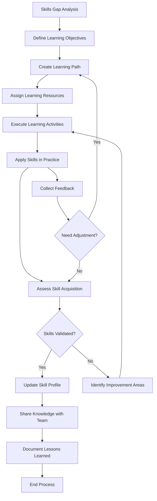

<!-- Identifier: P-01 -->

# Skill Development Process Flow

## Process Description

### 1. Skills Gap Analysis
- Assess current team capabilities
- Identify required skills for evolutionary development
- Map skill gaps and priorities

### 2. Define Learning Objectives
- Set specific, measurable skill targets
- Define success criteria
- Establish timeline and milestones

### 3. Create Learning Path
- Design structured learning approach
- Select appropriate learning methods
- Sequence learning activities

### 4. Assign Learning Resources
- Identify training materials
- Assign mentors or coaches
- Allocate time and budget

### 5. Execute Learning Activities
- Participate in training sessions
- Complete practical exercises
- Engage in peer learning

### 6. Apply Skills in Practice
- Use new skills in real projects
- Practice in safe environments
- Document experiences

### 7. Assess Skill Acquisition
- Evaluate skill demonstration
- Collect performance feedback
- Measure against objectives

### 8. Continuous Improvement
- Adjust learning approaches based on feedback
- Refine skill development process
- Share learnings across organization