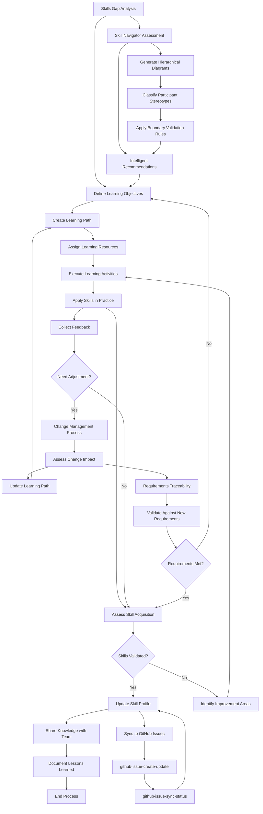

<!-- Identifier: P-01 -->

# Skill Development Process Flow

```mermaid
flowchart TD
    A[Skills Gap Analysis] --> B[Define Learning Objectives]
    B --> C[Create Learning Path]
    C --> D[Assign Learning Resources]
    D --> E[Execute Learning Activities]
    E --> F[Apply Skills in Practice]
    F --> G[Assess Skill Acquisition]
    G --> H{Skills Validated?}
    H -->|Yes| I[Update Skill Profile]
    H -->|No| J[Identify Improvement Areas]
    J --> E
    I --> K[Share Knowledge with Team]
    K --> L[Document Lessons Learned]
    L --> M[End Process]
    
    %% Enhanced feedback loops
    F --> N[Collect Feedback]
    N --> O{Need Adjustment?}
    O -->|Yes| P[Change Management Process]
    O -->|No| G
    
    P --> Q[Assess Change Impact]
    Q --> R[Update Learning Path]
    R --> C
    
    %% Skill Navigator integration
    A --> S[Skill Navigator Assessment]
    S --> T[Intelligent Recommendations]
    T --> B
    
    %% Incremental requirements integration  
    Q --> U[Requirements Traceability]
    U --> V[Validate Against New Requirements]
    V --> W{Requirements Met?}
    W -->|Yes| G
    W -->|No| B

    %% GitHub integration
    I --> X[Sync to GitHub Issues]
    X --> Y[github-issue-create-update]
    Y --> Z[github-issue-sync-status]
    Z --> I

    %% Hierarchical diagram generation
    S --> AA[Generate Hierarchical Diagrams]
    AA --> AB[Classify Participant Stereotypes]
    AB --> AC[Apply Boundary Validation Rules]
    AC --> T
```

## Process Description

### 1. Skills Gap Analysis
- Assess current team capabilities
- Identify required skills for evolutionary development
- Map skill gaps and priorities

### 2. Define Learning Objectives
- Set specific, measurable skill targets
- Define success criteria
- Establish timeline and milestones

### 3. Create Learning Path
- Design structured learning approach
- Select appropriate learning methods
- Sequence learning activities

### 4. Assign Learning Resources
- Identify training materials
- Assign mentors or coaches
- Allocate time and budget

### 5. Execute Learning Activities
- Participate in training sessions
- Complete practical exercises
- Engage in peer learning

### 6. Apply Skills in Practice
- Use new skills in real projects
- Practice in safe environments
- Document experiences

### 7. Assess Skill Acquisition
- Evaluate skill demonstration
- Collect performance feedback
- Measure against objectives

### 8. Continuous Improvement
- Adjust learning approaches based on feedback
- Refine skill development process
- Share learnings across organization

### 9. Change Management Integration
- **Change Detection**: Monitor for requirements changes during skill development
- **Impact Assessment**: Analyze how changes affect learning paths and skill priorities
- **Process Adaptation**: Adjust skill development based on evolving needs
- **Reference Updates**: Maintain consistency between skill development and organizational changes

### 10. Skill Navigator Orchestration
- **Intelligent Workflow**: Use AI navigation to optimize skill development sequences
- **Context Awareness**: Consider project needs and individual capabilities
- **Automated Recommendation**: Provide personalized learning path suggestions
- **Progress Tracking**: Monitor advancement through automated assessment integration

### 11. Incremental Requirements Processing
- **Dynamic Skill Requirements**: Identify new skill needs from updated requirements
- **Traceability Maintenance**: Connect skill development to specific requirement sources
- **Progressive Enhancement**: Build skills incrementally as requirements evolve
- **Validation Cycles**: Verify skill adequacy against changing requirements

### 12. GitHub Integration Workflow
- **Task Synchronization**: Create and update GitHub Issues from local task markdown files using `github-issue-create-update` skill
- **Status Synchronization**: Pull GitHub Issue state changes back to local task files using `github-issue-sync-status` skill
- **Format Preservation**: Maintain existing local task file format and frontmatter metadata during sync
- **Authentication**: Personal Access Token with `repo` scope for GitHub REST API v3

### 13. Requirements Merging
- **Multi-Source Ingestion**: Combine multiple requirement documents using `requirements-merge` skill
- **Conflict Resolution**: Identify and resolve redundancies and contradictions across sources
- **Traceability Preservation**: Maintain source-requirement mapping in merged specification
- **Stakeholder Review**: Route merged specification for stakeholder review and approval

### 14. Hierarchical Diagram Generation
- **Stereotype Classification**: Classify all diagram participants as actor, boundary, control, or entity using inference rules; manual overrides take precedence; a `participant_type_summary` is generated
- **Boundary Naming & Coloring**: Auto-derive boundary names from domain concepts (manual → domain concept → participant name → functional role → generic ordinal); optional round-robin color palette
- **Boundary Summary Comments**: Inject structured `%% BOUNDARY SUMMARY` header into Mermaid output listing participants, decomposable controls, and external actors per boundary
- **EDPS Boundary Validation (pre-render)**: Four rules applied before diagram output — VR-1 Single External Interface (error), VR-2 Boundary-First Reception (error), VR-3 Control-Only Decomposition (error), VR-4 Cohesive Responsibility (warning)
- **Validation Mode**: Strict mode blocks generation on VR-1/VR-2/VR-3 errors; advisory mode (default) generates diagram with inline violation comments
- **Multi-Level Diagrams**: Generate Level 0 (high-level) and Level N (detailed) diagrams; only `control`-type participants may produce sub-process child diagrams

### 15. Project Documentation Management
- **Structure Initialization**: Use `project-document-management` skill to initialize consistent documentation folder trees
- **Milestone Tracking**: Apply `project-planning-tracking` skill to plan phases and track progress
- **Status Reporting**: Generate executive dashboards and stakeholder reports with `project-status-reporting` skill