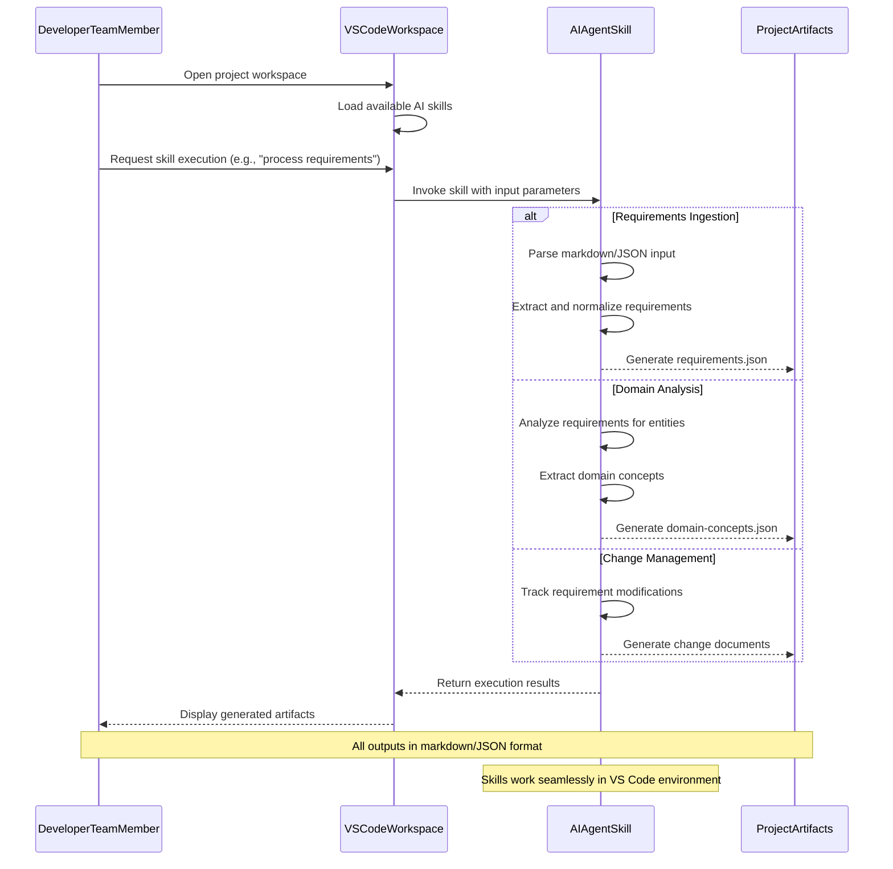
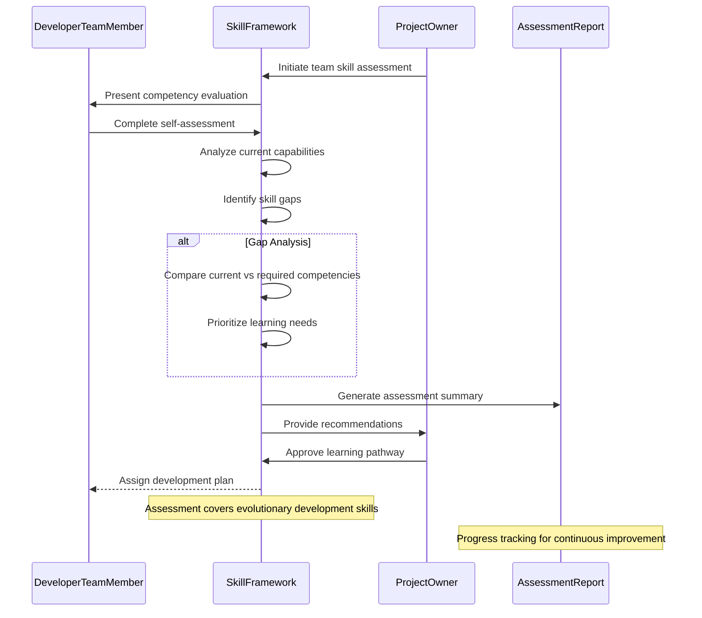
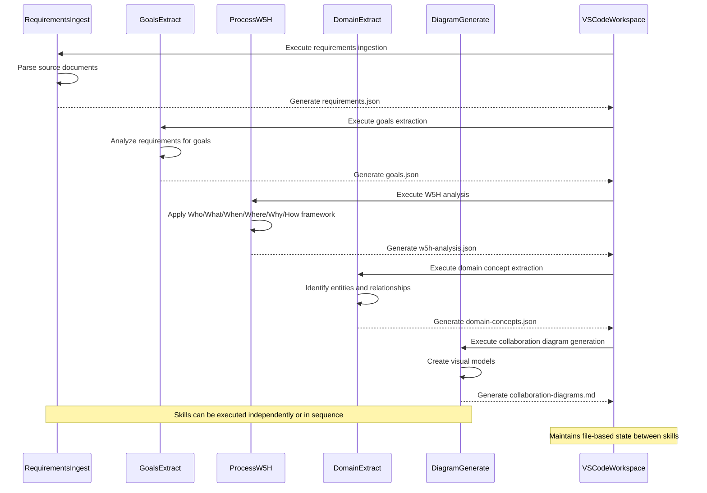
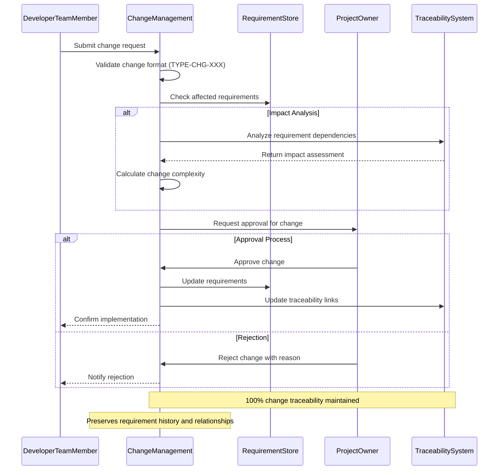
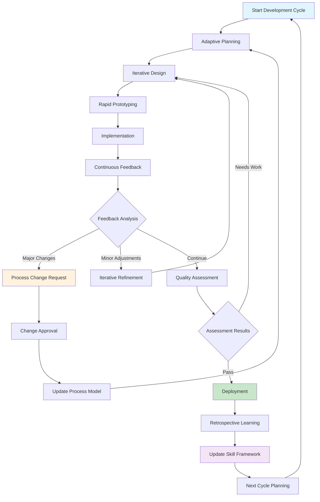

# Collaboration Diagrams

**Project**: 01-Building-Skills  
**Generated**: 2026-02-10T00:00:00Z  
**Source**: domain-concepts.json, requirements.json, goals.json

## User-System Interactions

### AI Skills Invocation Flow *(Diagram D-001)*
**Source Requirements**: [R-019], [R-021], [R-023]  
**Entities Involved**: DeveloperTeamMember, VSCodeWorkspace, AIAgentSkill

### Skill Assessment Workflow *(Diagram D-002)*
**Source Requirements**: [R-002], [R-017], [R-018]  
**Entities Involved**: DeveloperTeamMember, SkillFramework, ProjectOwner

## System-System Interactions

### Skills Orchestration Pipeline *(Diagram D-003)*
**Source Requirements**: [R-024], [R-025], [R-026], [R-027]  
**Entities Involved**: AIAgentSkill (multiple), VSCodeWorkspace

### Change Management Integration *(Diagram D-004)*
**Source Requirements**: [R-036], [R-037], [R-040], [R-045]  
**Entities Involved**: ChangeRequest, Requirement, ProjectOwner, AIAgentSkill

## Process Workflows

### Evolutionary Development Cycle *(Diagram D-005)*
**Source Requirements**: [R-004], [R-005], [R-006], [R-007]  
**Entities Involved**: DeveloperTeamMember, ProcessModel, LearningPathway

### Skills Development Pipeline *(Diagram D-006)*
**Source Requirements**: [R-001], [R-003], [R-019]  
**Entities Involved**: AIAgentSkill, LearningPathway, SkillFramework

```mermaid
flowchart LR
    A[Identify Skill Need] --> B[Define Skill Specification]
    B --> C[Design Input/Output Format]
    C --> D[Implement Skill Logic]
    D --> E[Create Skill Documentation]
    E --> F[Integration Testing]
    
    F --> G{Quality Check}
    G -->|Pass| H[Deploy to VS Code]
    G -->|Fail| I[Debug & Refactor]
    I --> D
    
    H --> J[User Acceptance Testing]
    J --> K{User Feedback}
    K -->|Approved| L[Production Release]
    K -->|Needs Changes| M[Collect Change Requirements]
    
    M --> N[Plan Skill Evolution]
    N --> B
    
    L --> O[Monitor Usage & Performance]
    O --> P[Continuous Improvement]
    P --> N
    
    subgraph "Skill Categories"
        Q[Requirements Processing]
        R[Domain Analysis] 
        S[Planning & Tracking]
        T[Change Management]
    end
    
    style A fill:#e3f2fd
    style L fill:#e8f5e8
    style M fill:#fff3e0
    style P fill:#f3e5f5
```

## Requirements Traceability Map

### Diagram to Requirement Mapping
- **D-001**: R-019 (High-Level Architecture), R-021 (Workspace Integration), R-023 (Requirements.Ingest)
- **D-002**: R-002 (Skill Gaps), R-017 (Assessment Methodologies), R-018 (Progress Tracking)
- **D-003**: R-024 (Goals.Extract), R-025 (Process.W5H), R-026 (Domain.ExtractConcepts), R-027 (Domain.AlignEntities)
- **D-004**: R-036 (Change Management), R-037 (Change Management), R-040 (Requirement Modifications), R-045 (Change Management)
- **D-005**: R-004 (Adaptive Planning), R-005 (Iterative Design), R-006 (Continuous Feedback), R-007 (Rapid Prototyping)
- **D-006**: R-001 (Skill Framework Development), R-003 (Learning Pathways), R-019 (High-Level Architecture)

### Entity Coverage Analysis
- **Primary Entities**: All 9 core domain entities covered across diagrams
- **Interaction Patterns**: User-to-system, system-to-system, and process workflows represented
- **Business Value Focus**: Emphasizes skill development, change management, and evolutionary practices

### Maintenance Priority
- **High**: D-001 (Core user workflow), D-003 (Skills pipeline), D-004 (Change management)
- **Medium**: D-002 (Assessment process), D-005 (Development cycle)
- **Low**: D-006 (Skills development - more stable process)