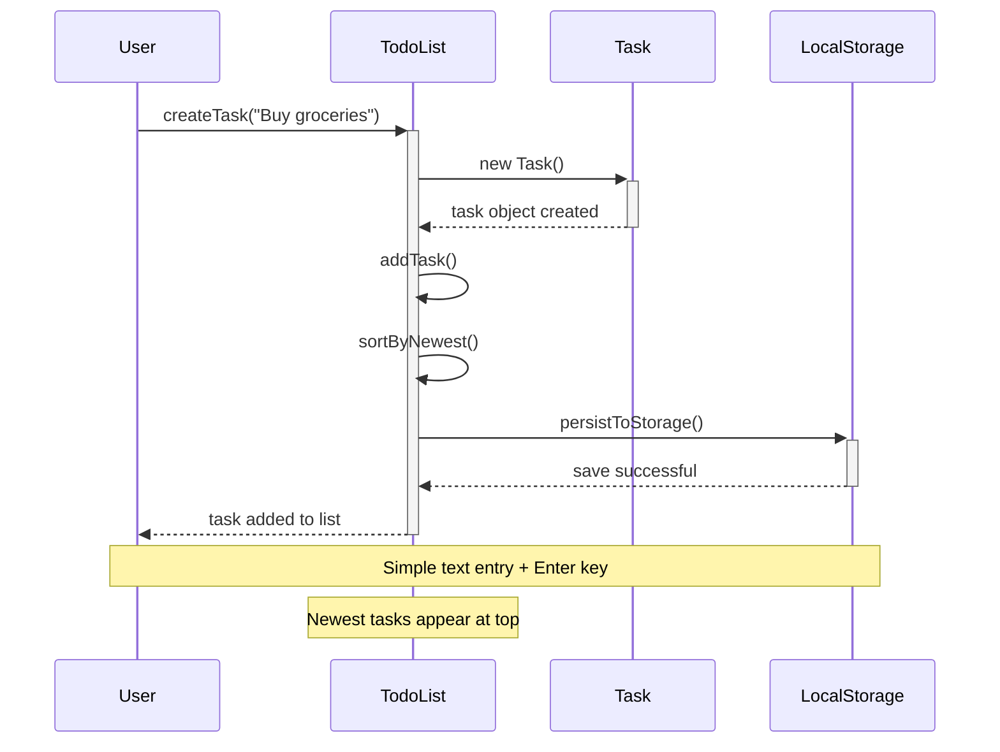
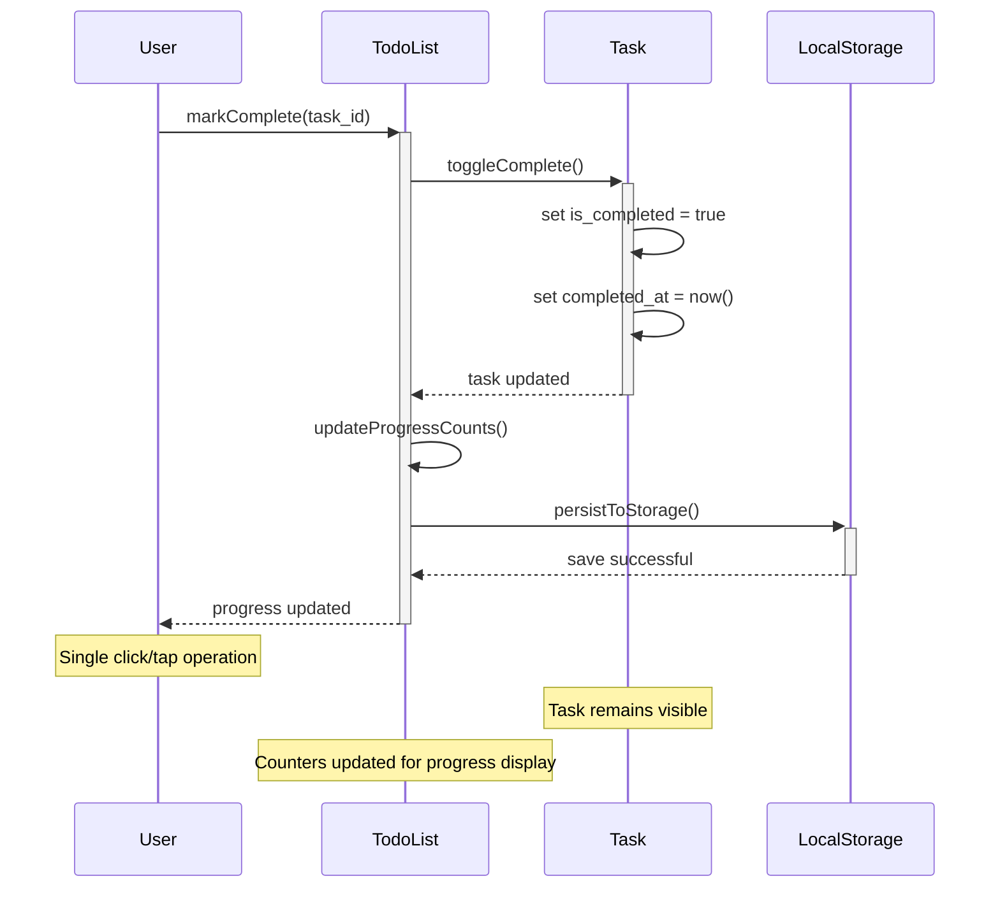
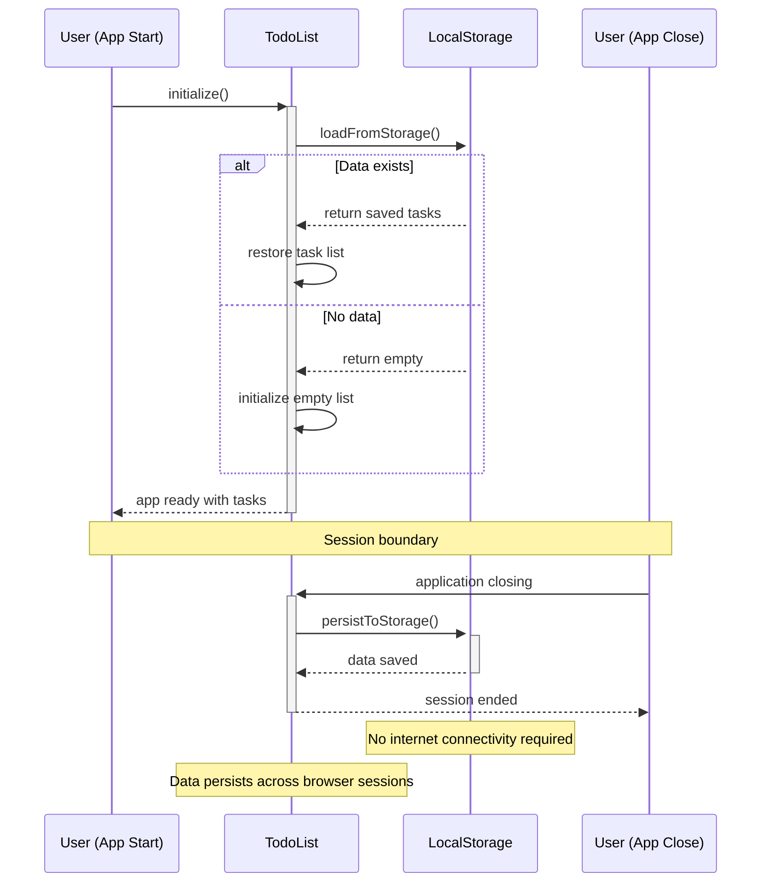
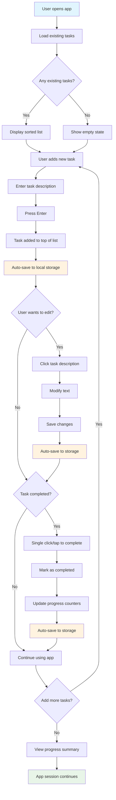
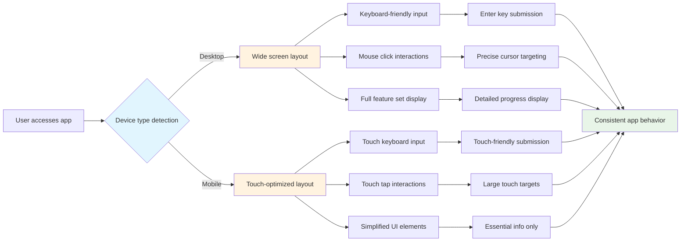

# Collaboration Diagrams

**Project**: simple-todo-app  
**Generated**: 2026-02-20T18:45:20Z  
**Source**: domain-concepts.json, requirements.json

## Domain Class Model

### Entity Relationship Overview *(Diagram D-001)*
**Source Requirements**: [R-001], [R-002], [R-003], [R-004], [R-005], [R-006]  
**Domain Entities**: User, Task, TodoList

```mermaid
classDiagram
    class User:::actor {
        -session_id: String
        -preferences: Object
        +createTask(description): Task
        +editTask(id, description): void
        +markComplete(id): void
        +viewTasks(): Task[]
    }
    
    class Task:::entity {
        +task_id: String
        +description: String
        +is_completed: Boolean
        +created_at: DateTime
        +completed_at: DateTime
        +updateDescription(text): void
        +toggleComplete(): void
    }
    
    class TodoList:::entity {
        -tasks: Array~Task~
        +total_count: Number
        +completed_count: Number  
        +remaining_count: Number
        +addTask(task): void
        +removeTask(id): Boolean
        +sortByNewest(): void
        -persistToStorage(): Boolean
        -loadFromStorage(): Boolean
        +getProgressSummary(): Object
    }
    
    User -->|interacts with| TodoList : manages
    TodoList *-->|contains| Task : composition
    User -->|operates on| Task : direct manipulation
```

## User-System Interactions

### Task Creation Flow *(Diagram D-002)*
**Source Requirements**: [R-001], [R-008]  
**Entities Involved**: User, TodoList, Task



### Task Completion Flow *(Diagram D-003)*
**Source Requirements**: [R-003], [R-005], [R-009]  
**Entities Involved**: User, TodoList, Task



### Session Persistence Flow *(Diagram D-004)*
**Source Requirements**: [R-006], [R-012]  
**Entities Involved**: TodoList, LocalStorage



## System Workflows

### Task Management Process *(Diagram D-005)*
**Source Requirements**: [R-001], [R-002], [R-003], [R-004], [R-005]  
**Business Process**: Complete task lifecycle



### Responsive Interface Adaptation *(Diagram D-006)*
**Source Requirements**: [R-010], [R-007]  
**Cross-Platform Behavior**: Desktop/Mobile adaptation



---

**Diagram Summary**:
- **D-001**: Domain model showing core entities and relationships
- **D-002**: Task creation user workflow with persistence
- **D-003**: Task completion workflow with progress tracking  
- **D-004**: Session management and browser storage integration
- **D-005**: Complete business process flow for task lifecycle
- **D-006**: Responsive design adaptation for cross-platform usage

**Traceability**: Generated from domain entities [ENT-001, ENT-002, ENT-003] and requirements [R-001 through R-012]  
**Maintenance Priority**: All workflows are high priority for this core functionality  
**Generated**: 2026-02-20T18:45:20Z