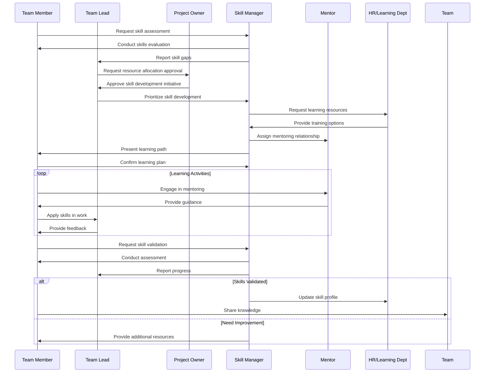
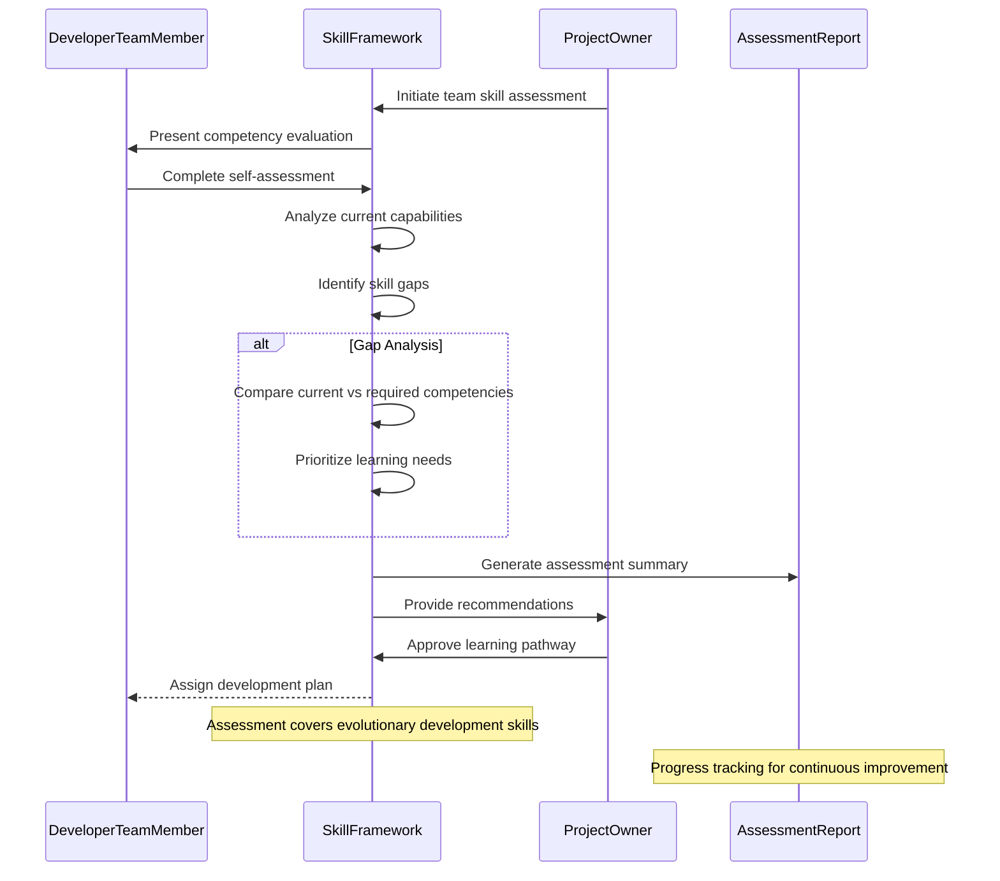
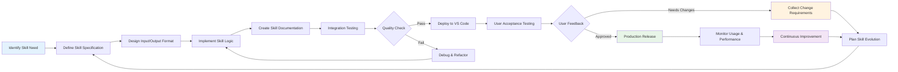
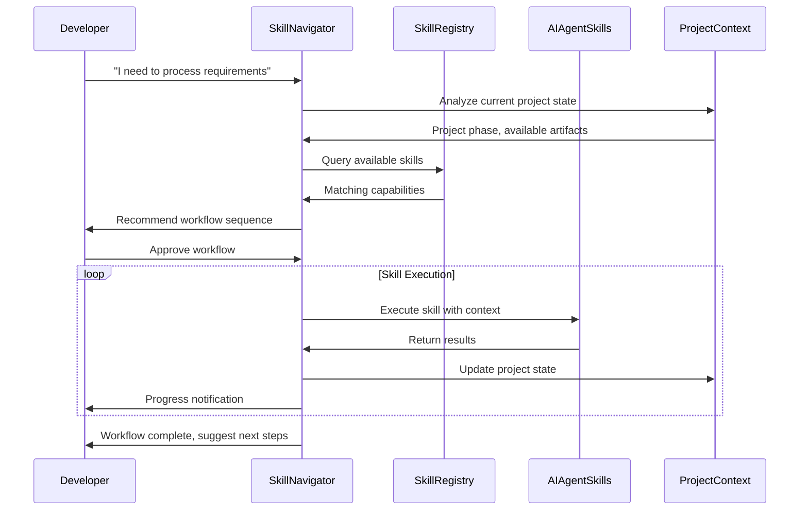
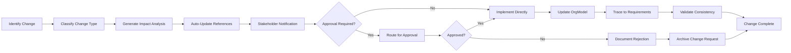
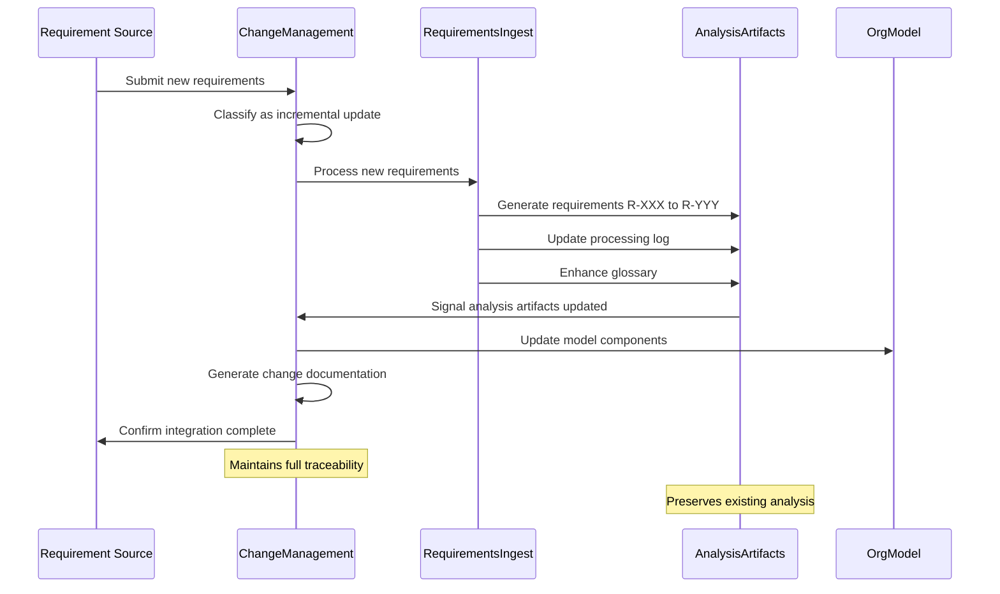

<!-- Identifier: C-01 -->

# Skill Development Process Collaborations

## Core Skill Development Flow

## AI Skills Assessment Workflow

## AI Skills Development Pipeline

## EDPS Skill Navigator Orchestration

## Change Management Integration

## Incremental Requirements Integration

## Key Interactions

### Team Member - Skill Manager
- Initial skill assessment request
- Learning plan agreement
- Progress updates and validation

### Skill Manager - Team Lead
- Skill gap reporting
- Progress tracking
- Resource allocation coordination

### Project Owner - Team Lead
- Resource allocation approval for skill development initiatives
- Major skill development decisions and strategic direction

### Project Owner - Skill Framework
- Strategic skill assessment initiation
- Learning pathway approvals for organizational alignment

### Team Member - Mentor
- Regular mentoring sessions
- Practical skill application guidance
- Performance feedback

### Skill Manager - HR/Learning Department
- Resource identification and allocation
- Training coordination
- Documentation and compliance

### Skill Framework - Assessment Report
- Competency gap analysis and documentation
- Progress tracking and continuous improvement metrics

### Team Member - Team
- Knowledge sharing sessions
- Peer learning activities
- Community of practice participation

### AI Skill Development Process
- Structured approach to creating new AI-enabled capabilities
- Quality assurance and user acceptance testing
- Continuous improvement and evolution cycles

### EDPS Skill Navigator Interactions
- **Intelligent Orchestration**: Navigator coordinates multiple AI skills for complex workflows
- **Context-Aware Recommendations**: Provides personalized skill suggestions based on project state
- **Workflow Automation**: Executes predefined skill sequences with minimal user intervention
- **Progress Monitoring**: Tracks skill execution and provides real-time feedback

### Change Management Process Interactions
- **Automated Change Detection**: AI conversation analysis identifies requirement changes
- **Impact Assessment Generation**: Systematic evaluation of change effects on stakeholders
- **Reference Management**: Automated consistency maintenance across organizational documents
- **Approval Workflow Coordination**: Routes significant changes through appropriate stakeholders

### Incremental Requirements Processing
- **Dynamic Integration**: Seamlessly incorporates new requirements without disrupting existing analysis
- **Traceability Preservation**: Maintains links between changes and source requirements
- **Artifact Synchronization**: Updates all related analysis documents consistently
- **Progressive Enhancement**: Builds organizational understanding incrementally