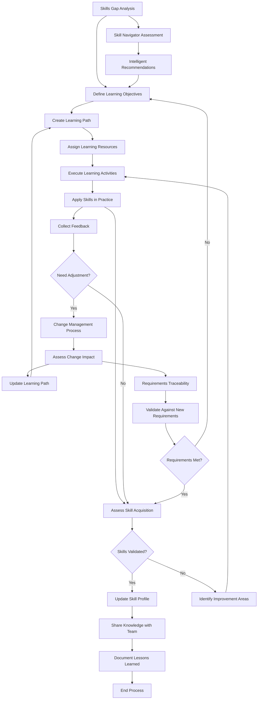

<!-- Identifier: P-01 -->

# Skill Development Process Flow

## Process Description

### 1. Skills Gap Analysis
- Assess current team capabilities
- Identify required skills for evolutionary development
- Map skill gaps and priorities

### 2. Define Learning Objectives
- Set specific, measurable skill targets
- Define success criteria
- Establish timeline and milestones

### 3. Create Learning Path
- Design structured learning approach
- Select appropriate learning methods
- Sequence learning activities

### 4. Assign Learning Resources
- Identify training materials
- Assign mentors or coaches
- Allocate time and budget

### 5. Execute Learning Activities
- Participate in training sessions
- Complete practical exercises
- Engage in peer learning

### 6. Apply Skills in Practice
- Use new skills in real projects
- Practice in safe environments
- Document experiences

### 7. Assess Skill Acquisition
- Evaluate skill demonstration
- Collect performance feedback
- Measure against objectives

### 8. Continuous Improvement
- Adjust learning approaches based on feedback
- Refine skill development process
- Share learnings across organization

### 9. Change Management Integration
- **Change Detection**: Monitor for requirements changes during skill development
- **Impact Assessment**: Analyze how changes affect learning paths and skill priorities
- **Process Adaptation**: Adjust skill development based on evolving needs
- **Reference Updates**: Maintain consistency between skill development and organizational changes

### 10. Skill Navigator Orchestration
- **Intelligent Workflow**: Use AI navigation to optimize skill development sequences
- **Context Awareness**: Consider project needs and individual capabilities
- **Automated Recommendation**: Provide personalized learning path suggestions
- **Progress Tracking**: Monitor advancement through automated assessment integration

### 11. Incremental Requirements Processing
- **Dynamic Skill Requirements**: Identify new skill needs from updated requirements
- **Traceability Maintenance**: Connect skill development to specific requirement sources
- **Progressive Enhancement**: Build skills incrementally as requirements evolve
- **Validation Cycles**: Verify skill adequacy against changing requirements