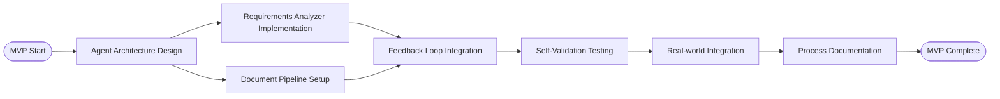

# Building Skills MVP - Project Plan

## Project Charter

**Project Name**: AI Agent Skills MVP
**Project Manager**: Self-Organizing AI System
**Duration**: 4 Phases (Discovery-driven timeline)
**Type**: Meta-Development Project

### Project Vision
Create the first working AI Agent that can analyze requirements and improve itself through feedback loops, establishing the foundation for building comprehensive development procedures.

## MVP Work Breakdown Structure (WBS)

### Phase 1: Foundation Setup (Current)
- [x] Requirements analysis completed
- [x] MVP scope defined
- [ ] First AI Agent skill architecture designed
- [ ] Document management templates created

### Phase 2: Core Agent Development
- [ ] Implement requirements analysis AI agent
- [ ] Create feedback integration mechanism
- [ ] Establish document transformation pipeline
- [ ] Build basic self-validation capability

### Phase 3: Integration & Testing
- [ ] Test complete feedback loop
- [ ] Validate document traceability
- [ ] Verify self-improvement process
- [ ] Refine based on real usage

### Phase 4: Evolution Framework
- [ ] Document the meta-process
- [ ] Create templates for additional agent skills
- [ ] Establish scaling methodology
- [ ] Prepare for next development cycle

## PERT Analysis

### Task Network

### Task Estimates

| Task | Description | Optimistic | Most Likely | Pessimistic | Expected |
|------|-------------|------------|-------------|-------------|----------|
| T1 | Agent Architecture Design | 1 day | 2 days | 4 days | 2.2 days |
| T2 | Requirements Analyzer Implementation | 2 days | 4 days | 8 days | 4.3 days |
| T3 | Document Pipeline Setup | 1 day | 2 days | 3 days | 2.0 days |
| T4 | Feedback Loop Integration | 2 days | 3 days | 6 days | 3.3 days |
| T5 | Self-Validation Testing | 1 day | 3 days | 5 days | 3.0 days |
| T6 | Real-world Integration | 1 day | 2 days | 4 days | 2.2 days |
| T7 | Process Documentation | 1 day | 2 days | 3 days | 2.0 days |

**Critical Path**: T1 → T2 → T4 → T5 → T6 → T7 = 17 days
**Total Project Duration**: ~3 weeks with buffer

## Success Metrics

### Functional Metrics
- [ ] AI Agent can process requirements input and generate structured analysis
- [ ] Feedback cycle completes in < 5 minutes per iteration
- [ ] Document traceability maintained with 100% accuracy
- [ ] Self-validation identifies improvement opportunities in 80%+ of cases

### Process Metrics
- [ ] Development procedure is documented and repeatable
- [ ] Time-to-insight decreases with each iteration
- [ ] System demonstrates measurable self-improvement

## Risk Management

### High Priority Risks
1. **AI Agent Complexity**: Risk that first agent is too complex to implement quickly
   - **Mitigation**: Start with simplest possible working version
2. **Feedback Loop Inefficiency**: Human feedback doesn't translate to improvements
   - **Mitigation**: Design clear feedback capture and processing mechanisms
3. **Document Management Overhead**: System becomes too manual to be practical
   - **Mitigation**: Automate document generation and updates

### Medium Priority Risks
1. **Scope Creep**: Adding features beyond MVP requirements
   - **Mitigation**: Strict adherence to MVP scope, document future features separately
2. **Technical Integration**: Difficulty integrating with existing tools
   - **Mitigation**: Design for loose coupling and standard interfaces

## Next Actions
1. **Immediate**: Design first AI Agent skill architecture
2. **Week 1**: Implement basic requirements analyzer
3. **Week 2**: Integrate feedback loops and test
4. **Week 3**: Document process and prepare scaling framework

## Notes
- This is a discovery-driven project - timeline will adjust based on learnings
- Each deliverable will inform and potentially modify subsequent phases
- Success builds the foundation for scaling to full development procedure automation