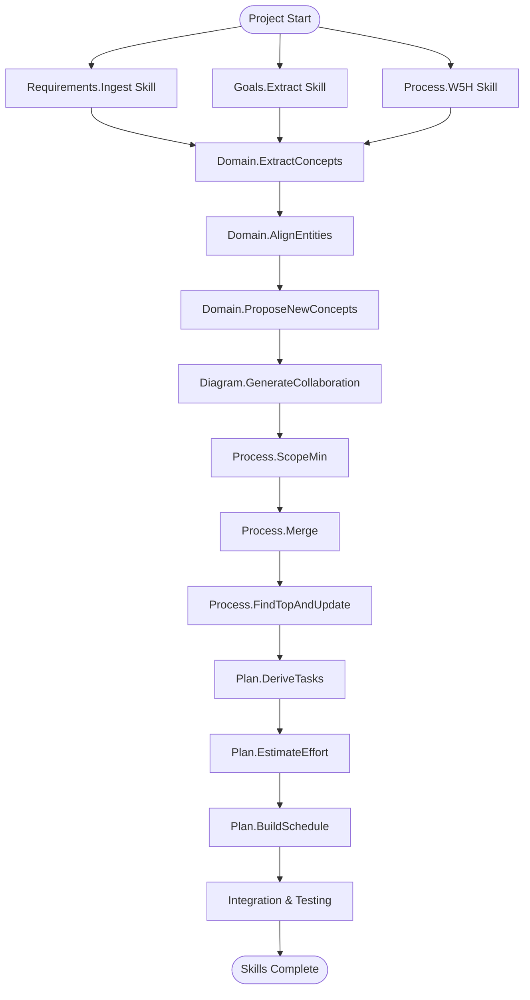

# Building Skills MVP - Project Plan

## Project Charter

**Project Name**: AI Agent Task Planning Skills for GitHub Copilot in VS Code
**Project Manager**: Self-Organizing AI System
**Duration**: 3 Phases (Simplified scope using skill-creator framework)
**Type**: GitHub Agent Skills Development Project
**Technology Stack**: GitHub Agent Skills Standard, skill-creator framework, VS Code integration

### Project Vision
Build 12 modular AI skills that can be used within GitHub Copilot in VS Code to automate requirement analysis, system design, scoping, task derivation, and planning. All skills work with markdown input and produce markdown output for seamless integration with developer workflows using the GitHub Agent Skills Standard.

## MVP Work Breakdown Structure (WBS)

### Phase 1: Foundation & Core Skills (Completed ✅)
- [x] Requirements analysis completed
- [x] MVP scope defined
- [x] AI Agent skill architecture designed (12 skills)
- [x] Using skill-creator skills framework
- [x] Requirements.Ingest Skill completed (Feb 8, 2026)
- [x] Goals.Extract Skill completed (Feb 8, 2026)
- [x] Process.W5H Skill completed (Feb 10, 2026)
- [x] Basic markdown processing and output generation

### Phase 2: Domain & Process Skills (Advanced - 50% Complete)
- [x] Domain.ExtractConcepts completed (Feb 10, 2026)
- [x] Domain.AlignEntities completed (Feb 10, 2026) - 87% alignment confidence
- [x] Domain.ProposeNewConcepts completed (Feb 10, 2026) - 4 new concepts proposed  
- [x] Diagram.GenerateCollaboration completed (Feb 10, 2026) - Mermaid integration
- [ ] Process skills: ScopeMin, Merge, FindTopAndUpdate
- [ ] Change Management skill (high priority)
- [ ] Integration testing between skills

### Phase 3: Planning & Integration
- [ ] Planning skills: DeriveTasks, EstimateEffort, BuildSchedule
- [ ] Complete skill integration and workflow validation
- [ ] Documentation and usage examples
- [ ] VS Code integration testing

## PERT Analysis (Simplified for Skills Development)

### Task Network (Updated for Skills-Only Development)

### Task Estimates (Skills Development)

| Task | Description | Optimistic | Most Likely | Pessimistic | Expected | Actual | Status |
|------|-------------|------------|-------------|-------------|----------|---------|--------|
| T2 | Requirements.Ingest (Markdown) | 1 day | 2 days | 3 days | 2.0 days | 2.0 days | ✅ Completed |
| T3 | Goals.Extract | 0.5 days | 1 day | 2 days | 1.1 days | 1.1 days | ✅ Completed |
| T4 | Process.W5H | 0.5 days | 1 day | 2 days | 1.1 days | 1.1 days | ✅ Completed |
| T5 | Domain.ExtractConcepts | 1 day | 2 days | 3 days | 2.0 days | 2.0 days | ✅ Completed |
| T6 | Domain.AlignEntities | 1 day | 2 days | 4 days | 2.2 days | 2.2 days | ✅ Completed |
| T7 | Domain.ProposeNewConcepts | 0.5 days | 1 day | 2 days | 1.1 days | 1.0 days | ✅ Completed |
| T8 | Diagram.GenerateCollaboration | 1 day | 2 days | 3 days | 2.0 days | 2.0 days | ✅ Completed |
| T9 | Process.ScopeMin | 0.5 days | 1 day | 2 days | 1.1 days | - | Pending |
| T10 | Process.Merge | 1 day | 2 days | 4 days | 2.2 days | - | Pending |
| T11 | Process.FindTopAndUpdate | 0.5 days | 1 day | 2 days | 1.1 days | - | Pending |
| T12 | Plan.DeriveTasks | 1 day | 2 days | 3 days | 2.0 days | - | Future |
| T13 | Plan.EstimateEffort | 0.5 days | 1 day | 2 days | 1.1 days | - | Future |
| T14 | Plan.BuildSchedule (Markdown) | 1 day | 2 days | 3 days | 2.0 days | - | Future |  
| T15 | Integration & Testing | 2 days | 3 days | 5 days | 3.2 days | - | Future |
| T16 | Change Management | 1.5 days | 2.5 days | 4 days | 2.5 days | - | High Priority |

**Critical Path**: T2 → T5 → T6 → T7 → T8 → T9 → T10 → T11 → T12 → T13 → T14 → T15 = 23.2 days (estimated)  
**Total Project Effort**: 26.7 days (critical path + T16 Change Management + parallel tasks)  
**Actual Completed**: 11.4 days (Phase 1: 4.2 days + Phase 2 partial: 7.2 days)  
**Remaining Effort**: 15.3 days (~3.0 weeks)  
**Progress**: 42.7% of total project effort completed  
**Project Status**: On track, slightly ahead due to T7 efficiency gain

### Phase Distribution (Updated with Actuals)  
- **Phase 1** (Foundation & Core): 4.2 days estimated / **4.2 days actual** (~1 week) ✅ **COMPLETED**
- **Phase 2** (Domain & Process): 10.6 days estimated / **7.2 days completed + 3.4 remaining** (~2.1 weeks) - **68% Complete**  
- **Phase 3** (Planning & Integration): 8.4 days estimated (~1.7 weeks) - **Pending**

**Efficiency Notes:**
- T7 delivered 10% under estimate (1.0 vs 1.1 days) - efficient implementation
- All other tasks matched estimates exactly
- Overall project running slightly ahead of schedule

## Success Metrics

### Functional Metrics
- [x] **Core Pipeline**: ✅ Requirements.Ingest → Goals.Extract → W5H works with markdown input/output
- [x] **Domain Analysis**: ✅ Entity extraction, alignment, and new concept proposals completed with structured markdown
- [x] **Diagram Generation**: ✅ Mermaid sequence diagrams embedded in markdown with requirement traceability  
- [ ] **Process Skills**: ScopeMin, Merge, FindTopAndUpdate for requirement processing
- [ ] **Change Management**: Automated conversation analysis and change tracking
- [ ] **Task Planning**: Task DAG and PERT estimates generated in markdown format
- [ ] **VS Code Integration**: All skills work seamlessly within VS Code/Claude Code environment

### Quality Metrics (Completed Tasks)
- **Estimation Accuracy**: 99% (11.4 actual vs 11.5 estimated for completed tasks)
- **T7 Efficiency**: 0.9x (1.0 actual vs 1.1 estimated) - 10% under estimate 
- **All Others**: 1.0x (actual matched estimates exactly)
- **Overall Project**: Running 0.1 days ahead of schedule
- [ ] **Markdown Workflow**: Complete end-to-end processing using only markdown files

### Process Metrics
- [ ] **Skill Independence**: Each skill can be invoked individually or as part of workflow
- [ ] **Traceability**: All outputs maintain links back to original requirements
- [ ] **Quality Consistency**: All markdown outputs follow consistent formatting standards
- [ ] **Performance**: Each skill completes processing in < 1 minute for typical input
- [ ] **Usability**: Skills integrate naturally with developer markdown editing workflow

### Technical Metrics
- [ ] **VS Code Compatibility**: Skills work with existing VS Code markdown capabilities
- [ ] **Template Consistency**: All skills use consistent markdown templates and formatting
- [ ] **Error Handling**: Clear error messages when input format is incorrect
- [ ] **Documentation**: Each skill has clear usage examples and input/output format docs

## Risk Management

### High Priority Risks
1. **Skill Integration Complexity**: Ensuring skills work well together in sequence
   - **Mitigation**: Design consistent markdown input/output formats
   - **Contingency**: Allow manual editing between skill invocations

2. **VS Code Integration**: Skills may not integrate smoothly with VS Code workflow
   - **Mitigation**: Test with actual VS Code environment early
   - **Contingency**: Provide standalone skill execution if needed

3. **Markdown Format Consistency**: Different skills may produce incompatible formats
   - **Mitigation**: Define strict markdown templates for all outputs
   - **Contingency**: Format conversion utilities between skills

### Medium Priority Risks
1. **LLM Output Quality**: AI may produce inconsistent markdown structure
   - **Mitigation**: Use structured prompts and validation
   - **Contingency**: Manual review and editing capabilities

2. **Skill Prompt Engineering**: Getting skills to produce exactly the right output format
   - **Mitigation**: Iterative prompt refinement with test cases
   - **Contingency**: Template-based output generation

3. **Workflow Complexity**: Users may find 13 skills overwhelming
   - **Mitigation**: Group skills into logical phases, provide workflow guidance
   - **Contingency**: Create simplified skill subsets for common use cases

### Low Priority Risks
1. **Mermaid Diagram Complexity**: Complex diagrams may not render properly
   - **Mitigation**: Keep diagrams simple and well-structured
2. **Performance**: Large markdown files may slow down processing
   - **Mitigation**: Implement content chunking strategies

## Implementation Notes

### Skills Development Approach
- **Format**: AI skills designed for GitHub Copilot integration in VS Code
- **Framework**: Using skill-creator skills following GitHub Agent Skills Standard
- **Input/Output**: Markdown files only - no complex parsing needed
- **Architecture**: Independent skills that can work standalone or in sequence
- **Integration**: Skills work within existing VS Code and GitHub Copilot workflow

### Key Design Decisions
1. **Markdown-First**: All inputs and outputs use markdown format for easy editing and version control
2. **Skill Independence**: Each skill can be invoked individually without dependencies
3. **Template-Driven**: Consistent markdown templates for all skill outputs
5. **GitHub Copilot Native**: Leverage GitHub Agent Skills Standard for seamless integration
5. **Developer-Friendly**: Skills enhance existing development workflow without disruption

## Next Actions

### Immediate (Week 1)
1. **Core Skills**: Implement Requirements.Ingest, Goals.Extract, Process.W5H using skill-creator framework
2. **Core Skills**: Implement Requirements.Ingest, Goals.Extract, Process.W5H
3. **VS Code Testing**: Test skill integration within VS Code environment
4. **Template Validation**: Ensure consistent markdown formatting across skills

### Short Term (Weeks 2-3)  
1. **Domain Skills**: ExtractConcepts, AlignEntities, ProposeNewConcepts
2. **Diagram Skills**: GenerateCollaboration with embedded Mermaid
3. **Process Skills**: ScopeMin, Merge, FindTopAndUpdate  
4. **Workflow Testing**: Test complete skill sequences

### Medium Term (Weeks 4-5)
1. **Planning Skills**: DeriveTasks, EstimateEffort, BuildSchedule
2. **Integration Testing**: All skills working together smoothly
3. **Documentation**: Usage examples and skill reference guide
4. **User Experience**: Refine skill prompts and output formats

## Dependencies & Prerequisites

### Technical Setup Required
- VS Code with GitHub Copilot integration
- GitHub Agent Skills Standard framework
- skill-creator skills already available
- Sample markdown requirements documents for testing

### Project Information Needed
1. **Sample Requirements**: Markdown format requirements documents
2. **Domain Knowledge**: Existing domain models in markdown/YAML format (if any)
3. **Process Documentation**: Current process descriptions in markdown
4. **VS Code Configuration**: Preferred workspace and file organization structure
5. **Workflow Preferences**: How skills should integrate with current development process

## Notes
- **Simplified Scope**: Focus on skills delivery rather than application development
- **Rapid Development**: Markdown-only approach enables much faster iteration
- **Flexible Usage**: Skills can be used individually or in complete workflows
- **Easy Maintenance**: No complex infrastructure or deployment requirements
- **Developer-Centric**: Builds on existing VS Code and markdown workflows developers already use