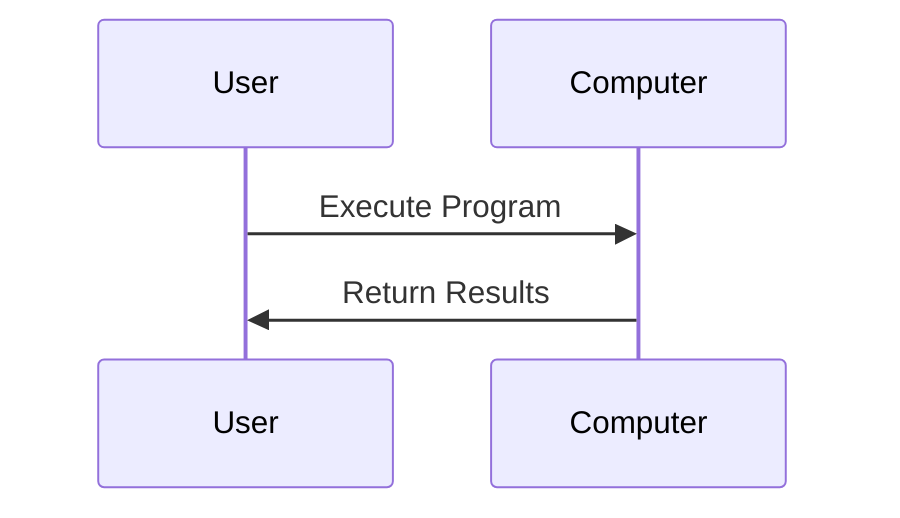
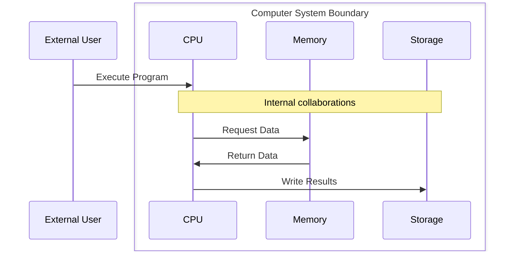

# Building Skills Iteration 2 - Hierarchical EDPS Implementation

## Quick Start

This project implements hierarchical process modeling with boundary concepts to align with EDPS (Evolutionary Development Process System) methodology. It extends Project 1's AI agent skills to support multi-level collaboration diagrams and process decomposition.

## Key Innovation: Process Boundaries

Transform single-level interactions into hierarchical process boundaries:

**Before (Project 1):**


**After (Project 3):**


## Project Structure

```
03 - Building Skills Iteration 2/
├── main.md                          # Project overview and goals
├── README.md                        # This file
├── project-plan.md                  # Implementation roadmap
├── artifacts/
│   ├── Requirements/
│   │   └── initial-requirements.md  # Hierarchical EDPS requirements
│   ├── Analysis/
│   │   ├── boundary-concepts.md     # Technical boundary analysis  
│   │   └── hierarchy-patterns.md    # Process decomposition patterns
│   ├── Sample Data/
│   │   └── hierarchy-examples.md    # Example decompositions
│   └── Testing/
│       └── boundary-validation.md   # Test cases for boundaries
└── tasks/
    ├── T1-enhance-collaboration-skill.md     # Add boundary support
    ├── T2-hierarchy-management-skill.md      # Sub-process organization
    ├── T3-boundary-validation-skill.md      # Ensure boundary compliance
    └── T4-migration-tools-skill.md          # Project 1 upgrade tools
```

## Core Concepts

### Boundary Rules
1. **Single Actor Interface**: Only one external actor interacts with a boundary
2. **Internal Collaboration**: Multiple participants can collaborate within a boundary  
3. **Encapsulation**: Boundaries hide internal complexity from external actors
4. **Decomposition**: Any interaction can become a sub-process with its own boundary

### Hierarchy Levels
- **Level 0**: External system interactions (user-facing)
- **Level 1**: Major system boundaries (components/services)
- **Level 2+**: Internal component collaborations (detailed implementations)

### Example: E-commerce System
```
Level 0: Customer → E-commerce Platform
Level 1: Within Platform boundary: UI ↔ OrderService ↔ PaymentService  
Level 2: Within OrderService boundary: Validation ↔ Inventory ↔ Database
```

## Getting Started

### Prerequisites
- Completed Project 1 (Building Skills) with working AI agent skills
- VS Code with GitHub Copilot integration
- Mermaid diagram preview capability

### Quick Setup
1. Review [initial requirements](artifacts/Requirements/initial-requirements.md)
2. Examine [boundary concepts](artifacts/Analysis/boundary-concepts.md) 
3. Study [hierarchy examples](artifacts/Sample%20Data/hierarchy-examples.md)
4. Start with Task 1: [Enhance Collaboration Skill](tasks/T1-enhance-collaboration-skill.md)

### Key Skills to Enhance
- **diagram-generatecollaboration**: Add boundary and box syntax support
- **process-decomposition**: New skill for hierarchy management
- **boundary-validation**: New skill for EDPS compliance checking
- **migration-tools**: Convert Project 1 artifacts to hierarchical format

## Benefits

### For Developers
- **Manageable Complexity**: Focus on one hierarchy level at a time
- **Clear Boundaries**: Understand system interfaces and responsibilities  
- **Iterative Refinement**: Gradually decompose complex processes
- **Consistent Modeling**: Standard patterns across all process levels

### For Organizations  
- **EDPS Compliance**: Align with evolutionary development methodology
- **Scalable Modeling**: Handle large system complexity effectively
- **Knowledge Management**: Organized process documentation and navigation
- **Change Management**: Impact analysis across process hierarchies

## Next Steps

1. **Phase 1**: Enhance existing collaboration diagram generation with boundary support
2. **Phase 2**: Implement hierarchy management and sub-process organization
3. **Phase 3**: Add boundary validation and EDPS compliance checking
4. **Phase 4**: Create migration tools for Project 1 artifacts

---

**Project Dependencies:**
- Project 1: Building Skills (foundational AI agent skills)
- EDPS Methodology standards and patterns
- GitHub Copilot integration framework