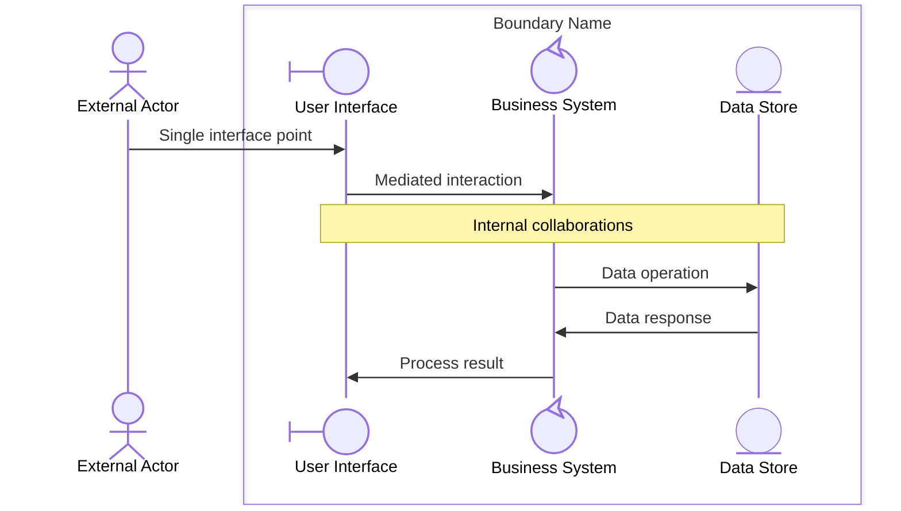
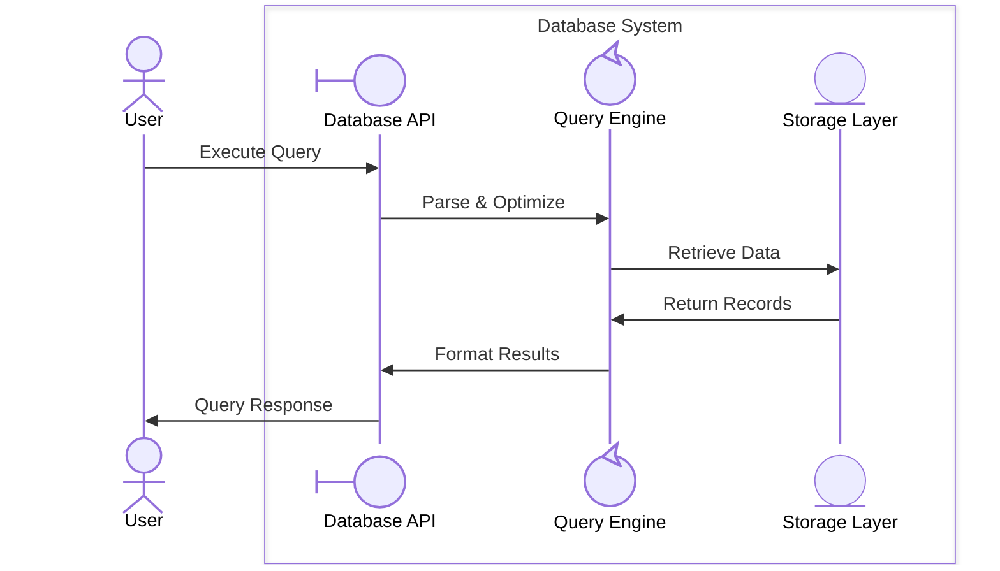
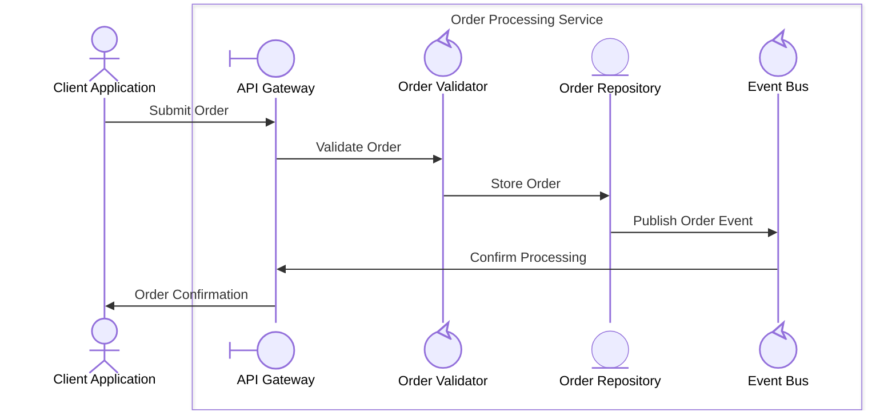
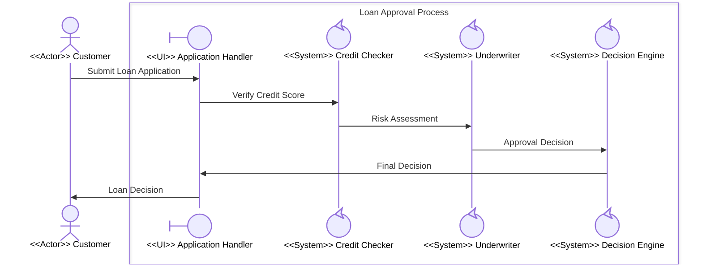
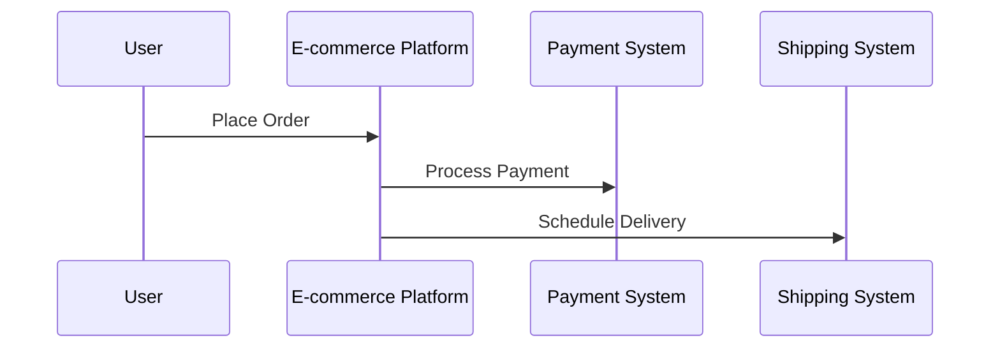
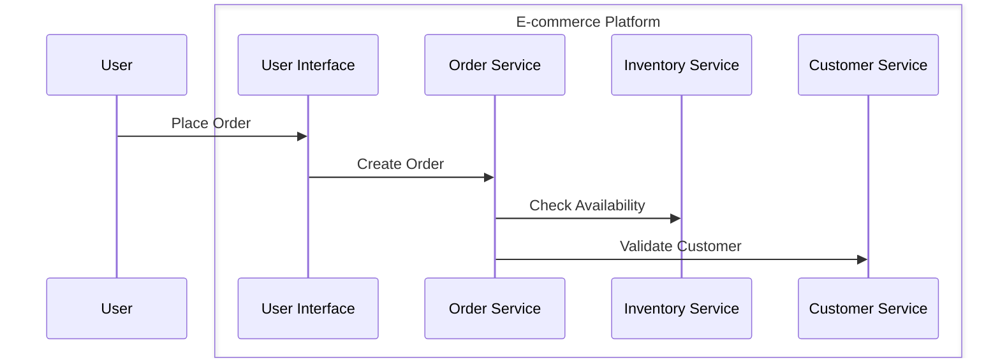
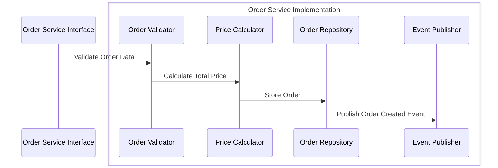
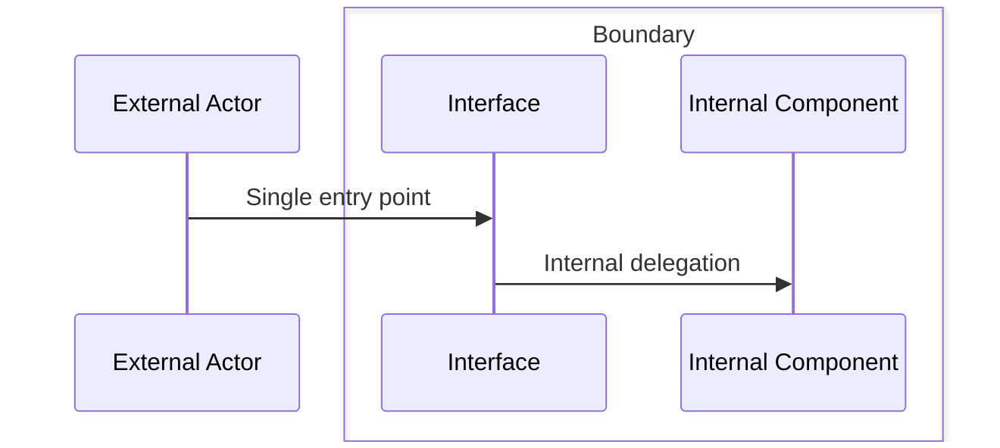
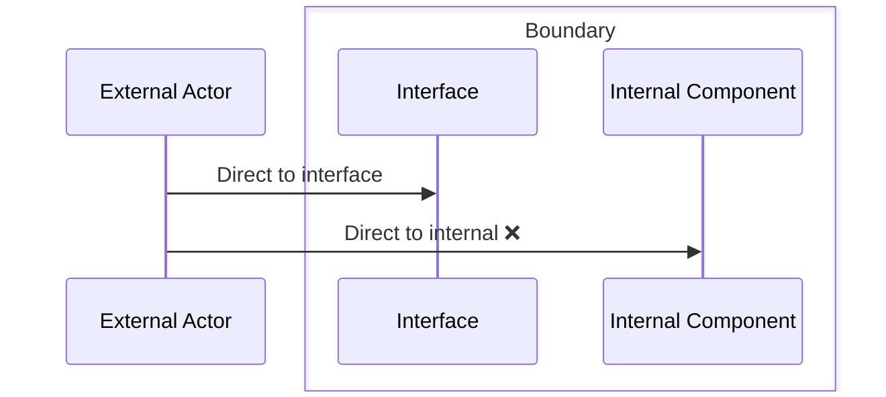

# Boundary Concepts Analysis

**Project**: 03-Building-Skills-Iteration-2  
**Created**: March 13, 2026  
**Purpose**: Technical analysis of boundary implementation for hierarchical EDPS modeling

## Boundary Definition

A **boundary** in EDPS methodology represents a cohesive unit of functionality with the following characteristics:

### Core Properties
1. **Single External Interface**: Only one external actor interacts directly with the boundary
2. **Internal Collaboration**: Multiple participants can collaborate within the boundary
3. **Encapsulation**: Internal complexity is hidden from external actors  
4. **Responsibility Cohesion**: Boundary encapsulates related functionality or capability
5. **Decomposable**: Can be further broken down into sub-boundaries

### Participant Stereotypes
Participants are classified using standardized stereotypes that determine their behavior and decomposition rules:

- **Actor (<<Actor>>)**: External entities that initiate interactions and remain outside system boundaries
  - **Participant Type**: `@{ "type" : "actor" }`
- **System (<<System>>)**: Complex components that encapsulate business logic and can be decomposed into sub-processes
  - **Participant Type**: `@{ "type" : "control" }`
- **Entity (<<Entity>>)**: Data storage, resources, or passive components that don't typically decompose  
  - **Participant Type**: `@{ "type" : "entity" }`
- **UI (<<UI>>)**: Interface components that mediate between actors and systems
  - **Participant Type**: `@{ "type" : "boundary" }`

### Decomposition Rules
1. **System-Only Decomposition**: Only <<System>> participants can be decomposed into sub-processes
2. **UI First Reception**: <<UI>> participants must be the first to receive messages from external actors within boundaries
3. **Actor Externality**: <<Actor>> participants remain external and cannot be decomposed
4. **Entity Stability**: <<Entity>> participants represent stable resources without internal process decomposition

### Mermaid Implementation

Since Mermaid sequence diagrams don't have a native "boundary" element, we use the `box` syntax with participant stereotypes and type definitions:



**Participant Type Usage:**
- **Actor**: External participants that initiate interactions (`@{ "type" : "actor" }`)
- **UI/Boundary**: First recipient within boundary, mediates actor-system communication (`@{ "type" : "boundary" }`)
- **System/Control**: Can be decomposed into sub-processes (`@{ "type" : "control" }`)
- **Entity**: Data/resource components, typically stable (`@{ "type" : "entity" }`)

## Boundary Patterns

### Pattern 1: System Component Boundary
**Use Case**: Modeling system components with external interfaces



**Characteristics:**
- **Database API (boundary)**: First recipient, mediates user-system communication
- **Query Engine (control)**: Can be decomposed into sub-processes (parsing, optimization, execution)
- **Storage Layer (entity)**: Data persistence, typically stable without decomposition
- Hidden complexity from user perspective

### Pattern 2: Service Layer Boundary  
**Use Case**: Modeling service architectures



**Characteristics:**
- **API Gateway (boundary)**: First recipient, handles client interface
- **Order Validator & Event Bus (control)**: Can be decomposed (validation rules, event routing)
- **Order Repository (entity)**: Data persistence layer
- Event-driven internal communication between systems

### Pattern 3: Process Boundary
**Use Case**: Modeling business processes



**Characteristics:**
- **Application Handler (boundary)**: Single customer touchpoint, first recipient
- **Credit Checker, Underwriter, Decision Engine (control)**: Each can be decomposed into detailed sub-processes
- Sequential workflow orchestration between systems
- Clear business process encapsulation

## Hierarchy Implementation

### Level Decomposition Rules

#### Level 0: External System View
- **Focus**: External actor interactions with major system boundaries
- **Participants**: 2-4 major system boundaries
- **Interactions**: High-level business operations



#### Level 1: Boundary Internal View
- **Focus**: Internal collaboration within each boundary
- **Participants**: 3-8 internal components per boundary  
- **Interactions**: Component-to-component operations

**E-commerce Platform Boundary (Level 1):**


#### Level 2+: Component Internal View
- **Focus**: Detailed implementation within components
- **Participants**: 2-6 internal modules per component
- **Interactions**: Method calls, data flows

**Order Service Boundary (Level 2):**


## Boundary Validation Rules

### Rule 1: Single External Interface
**Requirement**: Only one external actor should directly interact with boundary participants

**Valid:**


**Invalid:**


### Rule 2: Cohesive Responsibility
**Requirement**: All boundary participants should share related functionality

**Valid**: Database boundary with query, storage, and indexing
**Invalid**: Database boundary with query, email sending, and user authentication

### Rule 3: Appropriate Abstraction Level
**Requirement**: Boundary participants should be at similar abstraction levels

**Valid**: Service boundary with controllers, business logic, and repositories
**Invalid**: Service boundary mixing high-level services and low-level memory management

## Implementation Guidelines

### Automatic Boundary Detection
1. **Analyze Actor Interactions**: Identify groups of participants that collaborate frequently
2. **Detect Interface Points**: Find participants that primarily interact with external actors
3. **Group by Responsibility**: Cluster participants with related functionality
4. **Validate Cohesion**: Ensure boundary makes logical sense

### Box Syntax Generation
```javascript
// Pseudo-code for boundary generation
function generateBoundaryBox(participants, boundaryName) {
    const externalActors = identifyExternalActors(participants);
    const boundaryParticipants = identityBoundaryParticipants(participants);
    
    return `
    ${generateExternalParticipants(externalActors)}
    
    box ${boundaryName}
        ${generateBoundaryParticipants(boundaryParticipants)}
    end
    
    ${generateInteractions(externalActors, boundaryParticipants)}
    `;
}
```

### Folder Structure Generation
```
ProcessName/
├── main.md                    # Process overview
├── collaboration.md           # Level N collaboration diagram  
├── process.md                 # Process flow description
├── domain-model.md            # Relevant domain concepts
├── 01-SubProcess1/            # Level N+1 decompositions
│   ├── main.md
│   ├── collaboration.md
│   ├── 01-SubSubProcess1/
│   └── 02-SubSubProcess2/
└── 02-SubProcess2/
    ├── main.md
    └── collaboration.md
```

## Benefits and Trade-offs

### Benefits
- **Complexity Management**: Break large systems into manageable pieces
- **Clear Interfaces**: Understand system interaction points
- **Scalable Modeling**: Support unlimited decomposition depth
- **EDPS Compliance**: Align with evolutionary development methodology

### Trade-offs  
- **Additional Complexity**: More files and folders to manage
- **Navigation Overhead**: Requires jumping between hierarchy levels
- **Mermaid Limitations**: Box syntax has rendering constraints
- **Learning Curve**: Teams need to understand boundary concepts

---

**Next Steps:**
1. Implement boundary detection algorithms
2. Create Mermaid box syntax generation
3. Build hierarchy navigation tools
4. Validate with real-world examples