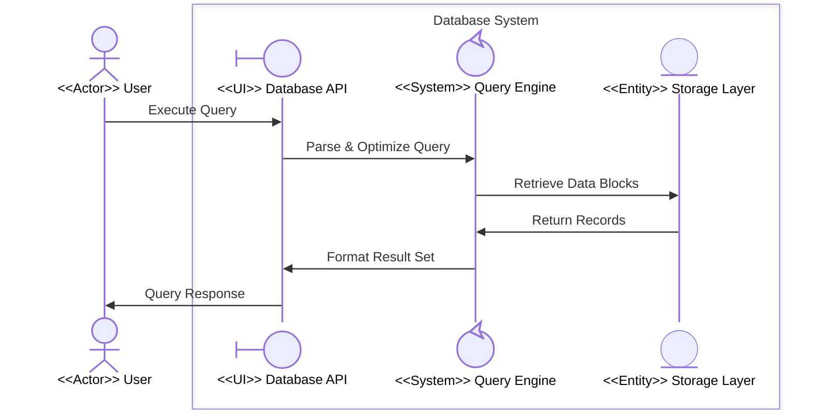
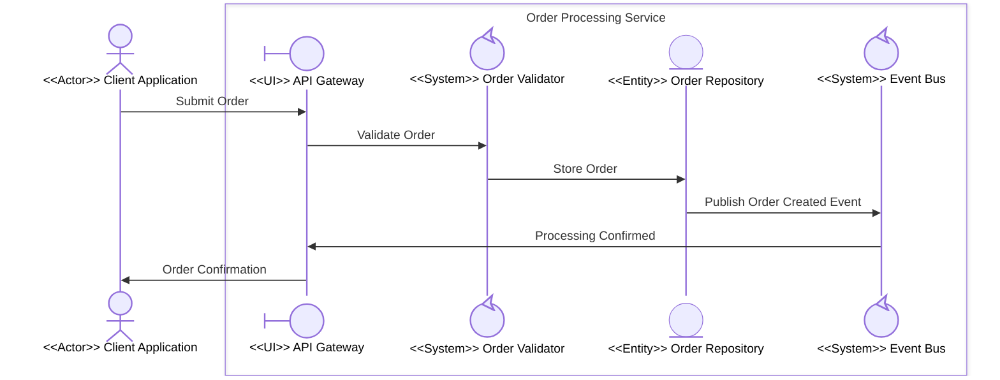
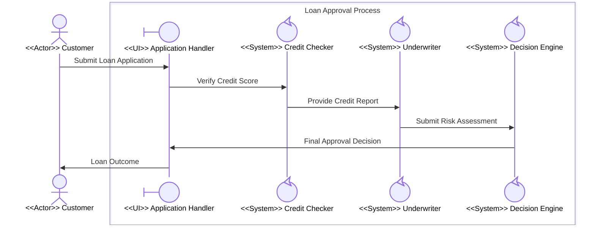

# Example Walkthroughs: Common Boundary Patterns

**Project**: 03-Building-Skills-Iteration-2  
**Version**: 1.0  
**Created**: March 15, 2026

---

## Overview

This document provides step-by-step, fully worked examples for the three canonical boundary patterns. Each example includes the rationale for participant classification, the complete Mermaid diagram, a folder structure, and notes on what could be decomposed next.

---

## Walkthrough 1: System Component Boundary (Database System)

**Scenario**: A user queries a database system. We model how the system's internal components collaborate to answer the query.

### 1.1 Identify Participants and Classify

| Participant | Role Description | Stereotype | Type |
|---|---|---|---|
| User | Runs queries from outside the system | External initiator | `actor` |
| Database API | Receives queries; translates client requests | First entry into the system | `boundary` |
| Query Engine | Parses, optimizes, and executes query plans | Business logic | `control` |
| Storage Layer | Physical data blocks and indices | Passive data resource | `entity` |

### 1.2 Assign the Boundary Name

> "Database System" — encapsulates all database component collaboration

### 1.3 Validate Boundary Rules

- **VR-1**: Only `User` is external ✓
- **VR-2**: First external message targets `Database API` (boundary type) ✓
- **VR-3**: Only `Query Engine` (control) eligible for decomposition ✓
- **VR-4**: No actor inside the box ✓

### 1.4 Level 1 Diagram



### 1.5 Sub-Process Opportunity

`Query Engine` can be decomposed at Level 2:

**Potential Level 2 Participants inside Query Engine Boundary:**
- Parser (`boundary`) — first recipient, translates SQL text
- Optimizer (`control`) — chooses execution plan
- Executor (`control`) — runs the plan
- Result Buffer (`entity`) — holds intermediate row data

### 1.6 Folder Structure

```
01-DatabaseSystem/
├── main.md
├── collaboration.md         ← Level 1 diagram (above)
├── process.md
├── domain-model.md
└── 01-QueryEngine/
    ├── main.md
    └── collaboration.md     ← Level 2 diagram (Query Engine internals)
```

---

## Walkthrough 2: Service Layer Boundary (Order Processing Service)

**Scenario**: A client application submits an order. We model the orchestration inside an order processing microservice.

### 2.1 Identify Participants and Classify

| Participant | Role Description | Stereotype | Type |
|---|---|---|---|
| Client Application | External system placing the order | External initiator | `actor` |
| API Gateway | Accepts requests; handles protocol translation | First entry into the service | `boundary` |
| Order Validator | Checks order validity (items, quantities, limits) | Business logic | `control` |
| Order Repository | Persists order records | Passive data resource | `entity` |
| Event Bus | Routes domain events to downstream consumers | Business logic / orchestration | `control` |

### 2.2 Validate Boundary Rules

- **VR-1**: Only `Client Application` is external ✓
- **VR-2**: First external message targets `API Gateway` (boundary type) ✓
- **VR-3**: `Order Validator` and `Event Bus` (both control) are decomposition candidates ✓
- **VR-4**: No actor inside the box ✓

### 2.3 Level 1 Diagram



### 2.4 Sub-Process Opportunities

Both `Order Validator` and `Event Bus` are candidates for Level 2 decomposition:

**Order Validator Level 2 (example):**
- Validation Handler (`boundary`) — entry point
- Items Checker (`control`) — validates product availability
- Limits Checker (`control`) — enforces business rules
- Rule Engine (`entity`) — reads stored rule definitions

**Event Bus Level 2 (example):**
- Event Receiver (`boundary`) — entry point
- Dispatcher (`control`) — routes events to topic queues
- Subscriber Registry (`entity`) — stores subscriber list

### 2.5 Folder Structure

```
02-OrderProcessingService/
├── main.md
├── collaboration.md             ← Level 1 diagram (above)
├── process.md
├── domain-model.md
├── 01-OrderValidator/
│   ├── main.md
│   └── collaboration.md         ← Level 2: validator internals
└── 02-EventBus/
    ├── main.md
    └── collaboration.md         ← Level 2: event bus internals
```

---

## Walkthrough 3: Process Boundary (Loan Approval Process)

**Scenario**: A customer submits a loan application. We model the multi-step approval workflow inside a financial institution's loan processing boundary.

### 3.1 Identify Participants and Classify

| Participant | Role Description | Stereotype | Type |
|---|---|---|---|
| Customer | Submits the loan application | External applicant | `actor` |
| Application Handler | Receives and tracks customer submissions | First entry into the process | `boundary` |
| Credit Checker | Retrieves and scores credit history | Verification logic | `control` |
| Underwriter | Assesses risk and sets terms | Risk assessment logic | `control` |
| Decision Engine | Makes final approve/deny determination | Approval logic | `control` |

### 3.2 Validate Boundary Rules

- **VR-1**: Only `Customer` is external ✓
- **VR-2**: First external message targets `Application Handler` (boundary type) ✓
- **VR-3**: `Credit Checker`, `Underwriter`, `Decision Engine` (all control) are decomposition candidates ✓
- **VR-4**: No actor inside the box ✓

### 3.3 Level 1 Diagram



### 3.4 Sub-Process Opportunities

All three `control` participants are strong candidates for Level 2 decomposition in a real implementation:

**Credit Checker Level 2 (example participants):**
- Bureau Interface (`boundary`) — calls external credit bureau
- Score Calculator (`control`) — computes internal credit score
- History Store (`entity`) — caches prior inquiry results

**Underwriter Level 2 (example participants):**
- Risk Intake (`boundary`) — receives credit report
- Risk Scorer (`control`) — computes risk rating
- Policy Engine (`control`) — applies lending policies
- Underwriting Rules (`entity`) — stores policy rules

**Decision Engine Level 2 (example participants):**
- Decision Receiver (`boundary`) — aggregates inputs
- Approval Service (`control`) — generates decision
- Audit Log (`entity`) — records decision trail

### 3.5 Folder Structure

```
03-LoanApprovalProcess/
├── main.md
├── collaboration.md               ← Level 1 diagram (above)
├── process.md
├── domain-model.md
├── 01-CreditChecker/
│   ├── main.md
│   └── collaboration.md           ← Level 2: credit checking internals
├── 02-Underwriter/
│   ├── main.md
│   └── collaboration.md           ← Level 2: underwriting internals
└── 03-DecisionEngine/
    ├── main.md
    └── collaboration.md           ← Level 2: decision engine internals
```

---

## Cross-Pattern Comparison

| Feature | System Component | Service Layer | Process Boundary |
|---|---|---|---|
| External Actor | End user | Client application | Customer/stakeholder |
| Boundary Entry (`boundary`) | API interface / gateway | API Gateway | Application Handler |
| Processing Core (`control`) | Query/compute engine | Validator, event bus | Checker, underwriter, decision |
| Data Resource (`entity`) | Storage layer | Repository | Audit log, rule store |
| Decomposition Depth | 1–2 levels | 1–2 levels | 2–3 levels |
| Primary Pattern | Request-response | Event-driven | Sequential workflow |

---

## See Also

- [User Guide](user-guide.md) — Full modeling methodology
- [Participant Type Reference](participant-type-reference.md) — Stereotype quick reference
- [Migration Guide](migration-guide.md) — Upgrade flat Project 1 diagrams
- [Hierarchy Examples (Sample Data)](../Sample%20Data/hierarchy-examples.md) — Extended multi-level examples
