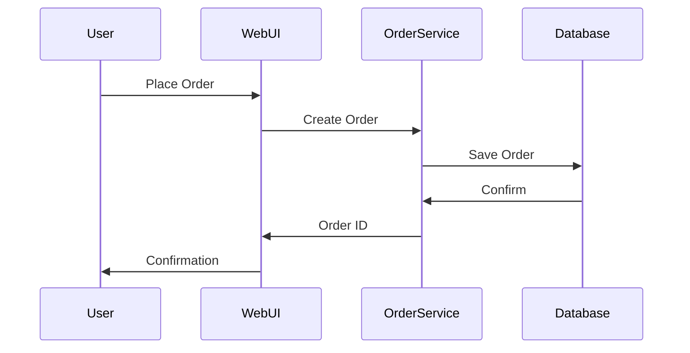
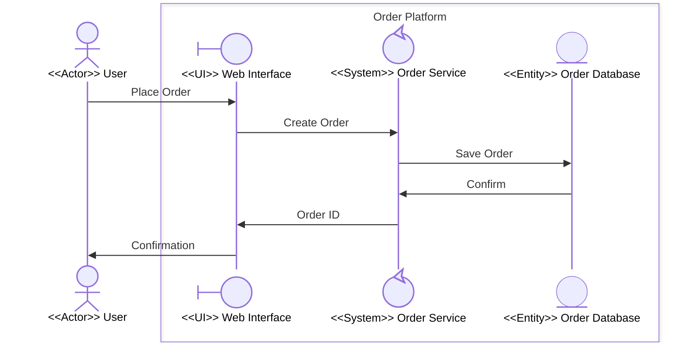
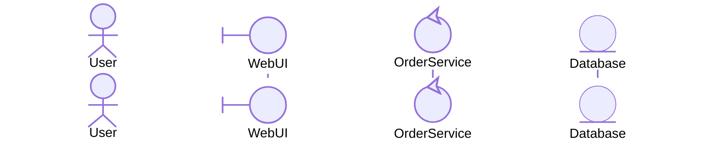

# Migration Guide: Upgrading Project 1 Diagrams to Hierarchical Style

**Project**: 03-Building-Skills-Iteration-2  
**Version**: 1.0  
**Created**: March 15, 2026  
**Audience**: Teams with existing Project 1 collaboration diagrams

---

## Overview

This guide walks you through upgrading flat, single-level collaboration diagrams (Project 1 style) to hierarchical, boundary-based diagrams (Project 3 style). The process is incremental — you do not need to rewrite everything at once.

---

## What Changed Between Project 1 and Project 3

| Aspect | Project 1 (Flat) | Project 3 (Hierarchical) |
|---|---|---|
| Diagram depth | Single level | Unlimited levels |
| Participant grouping | None | `box` blocks with named boundaries |
| Participant types | Plain names | Stereotype annotations (`actor`, `boundary`, `control`, `entity`) |
| External actor position | Mixed with internals | Always outside all `box` blocks |
| Decomposition | Manual ad-hoc | Systematic, governed by VR-1 through VR-4 |
| Folder structure | Flat `orgModel/` folder | Nested sub-folders per hierarchy level |
| Interface contract | Implicit | Explicit single-actor-per-boundary rule |

---

## Migration Strategy

There are three approaches. Choose based on your timeline and complexity:

| Strategy | When to Use | Effort |
|---|---|---|
| **Full Rewrite** | Small diagrams (< 8 participants) | Low |
| **Incremental — Annotate First** | Medium diagrams, active development | Medium |
| **Incremental — Slice by Boundary** | Large or complex diagrams | High |

---

## Step-by-Step: Full Rewrite

Best for small diagrams with already-identifiable roles.

### Step 1: Export the Existing Diagram

Open the existing `collaboration.md` file. Note each participant name and the interactions between them.

### Step 2: Classify Each Participant

For every participant, assign a stereotype:

| Existing Participant | Ask Yourself | Assign |
|---|---|---|
| External user, client, partner | Does it initiate from outside? | `<<Actor>>` |
| Web UI, API gateway, controller | Is it the first thing an actor talks to? | `<<UI>>` |
| Service, engine, processor | Does it contain business logic that could be a sub-process? | `<<System>>` |
| Database, cache, file store | Is it a passive data resource? | `<<Entity>>` |

### Step 3: Identify Boundaries

Groups of participants with a shared responsibility and a common external point form a **boundary**. Typically each major system component in the old diagram becomes one boundary.

### Step 4: Rewrite Using Box Syntax

**Before (Project 1):**


**After (Project 3):**


### Step 5: Validate

Run boundary validation (VR-1 through VR-4):
- [ ] Only `User` is outside the box — VR-4 passes
- [ ] `User` sends to `WebUI` (boundary type) — VR-2 passes
- [ ] Only one external interface (`User`) — VR-1 passes
- [ ] `OrderService` (control) is the only decomposition candidate — VR-3 passes

### Step 6: Update the Folder Structure

Create sub-folders for any `<<System>>` participant that warrants deeper modeling:

```
01-OrderPlatform/
├── main.md
├── collaboration.md      ← Updated Level 1 diagram (above)
├── process.md
├── domain-model.md
└── 01-OrderService/      ← New Level 2 sub-folder
    ├── main.md
    └── collaboration.md  ← Level 2 diagram (decompose OrderService)
```

---

## Step-by-Step: Incremental — Annotate First

Use this approach when you want to keep diagrams unchanged in appearance while adding metadata.

### Phase A: Add Type Annotations (Non-Breaking)

Add `@{ "type": "..." }` to each participant without changing the box structure:



This is backwards-compatible with Project 1 rendering.

### Phase B: Add Box Groupings

Group participants into their boundaries using `box ... end` blocks. Do this one boundary at a time.

### Phase C: Create Sub-Folders

For each `control` participant with known internal complexity, create the Level N+1 folder and diagram.

---

## Step-by-Step: Incremental — Slice by Boundary

Use for large diagrams where multiple teams work on different system areas.

1. **Identify boundaries** — list candidate groupings from the flat diagram
2. **Assign ownership** — one team per boundary
3. **Each team independently annotates and boxes their participant group**
4. **Merge** — combine boxes into a single top-level diagram (Level 0)
5. **Each team develops their Level 1 diagram** independently

---

## Common Migration Issues

### Issue: Multiple actors sending to the same participant

**Symptom**: More than one `<<Actor>>` sends to the same boundary-entry participant.

**Resolution**: Either (a) promote both actors to a Level 0 diagram where a single `<<System>>` aggregates them, or (b) split into two separate boundaries each with their own single-actor entry point.

---

### Issue: Flat diagram is too large to become a single boundary

**Symptom**: 10+ participants in one group.

**Resolution**: Identify natural sub-groupings. Each sub-grouping becomes its own boundary. Build a Level 0 diagram showing their inter-boundary collaboration, then model each one internally at Level 1.

---

### Issue: Circular messages between two participants

**Symptom**: `A->>B` and `B->>A` appear as separate messages in the same diagram without a clear single initiator.

**Resolution**: Use `Note` annotations to clarify the primary direction. Then represent the response as a return arrow (`A-->>B`), making the call-response pattern explicit.

---

### Issue: Entity participant needs to initiate messages

**Symptom**: A database or queue participant appears to send messages unprompted.

**Resolution**: Model the initiating behavior as a `<<System>>` component (e.g., an event listener or poller) that wraps the entity and relays its output. The entity remains passive.

---

## Migration Checklist

- [ ] All existing participants have been assigned a stereotype
- [ ] External actors are outside all `box` blocks
- [ ] Each boundary/box has exactly one external-actor entry point
- [ ] The entry point participant is `boundary` type
- [ ] Only `control` participants are marked for sub-process decomposition
- [ ] Sub-folders created for each decomposed participant
- [ ] `main.md` updated at each level to describe the boundary's purpose
- [ ] Cross-references updated between parent and child diagrams
- [ ] VR-1 through VR-4 validation passes for every diagram

---

## Backward Compatibility Notes

- Existing Mermaid diagrams without `@{ "type": "..." }` syntax will continue to render
- Participant names are preserved throughout migration
- No changes to `process.md` or `domain-model.md` are required until deeper levels are modeled
- The new folder structure is additive — existing files remain in place

---

## See Also

- [User Guide](user-guide.md) — Modeling methodology overview
- [Participant Type Reference](participant-type-reference.md) — Stereotype quick reference
- [Example Walkthroughs](example-walkthroughs.md) — Complete worked migration examples
