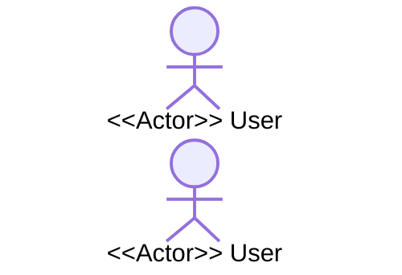
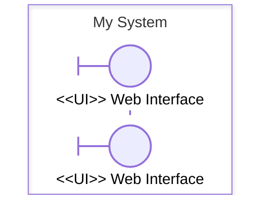
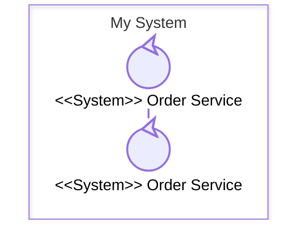
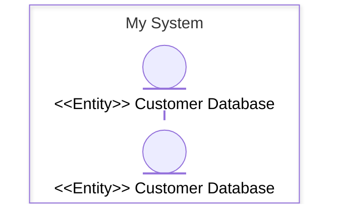
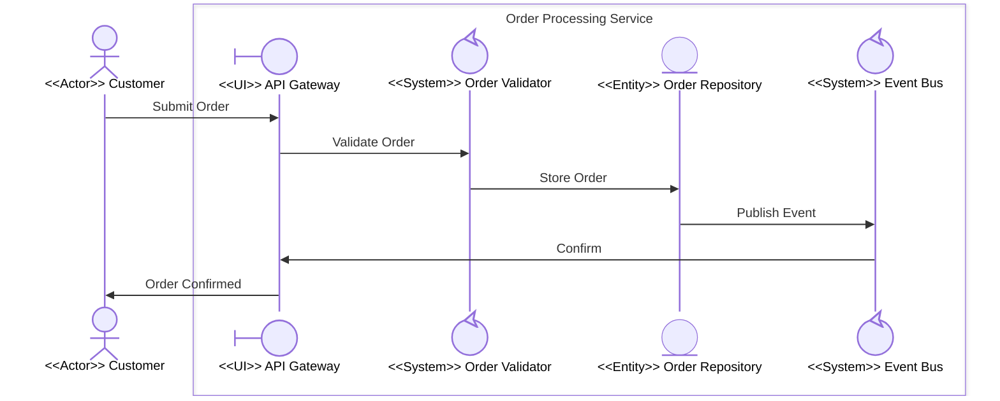

# Participant Type Quick-Reference Card

**Project**: 03-Building-Skills-Iteration-2  
**Version**: 1.0  
**Created**: March 15, 2026

---

## Stereotype Summary Table

| Stereotype | Mermaid Type Value | Symbol | External? | Decomposable? | First Recipient? |
|---|---|---|---|---|---|
| `<<Actor>>` | `"actor"` | 👤 Stick figure | Yes (outside box) | No | — |
| `<<UI>>` | `"boundary"` | 🖥️ Rectangle | No (inside box) | No | **Always** |
| `<<System>>` | `"control"` | ⚙️ Circle | Either level | **Yes** | Never first |
| `<<Entity>>` | `"entity"` | 🗄️ Database | No (inside box) | No | Never first |

---

## Participant Definitions

### <<Actor>> — External Entity

- **Purpose**: Represents a person, organization, or external system that initiates interactions
- **Mermaid type**: `"actor"`
- **Position**: Always **outside** all `box` blocks
- **Behavior**: Sends the first message into a boundary; never receives internal messages
- **Decomposition**: Not applicable — actors have no internal process model



**Common examples**: End user, external API client, partner system, admin

---

### <<UI>> — Boundary / Interface Layer

- **Purpose**: Mediates between the external actor and internal systems; the single entry point into a boundary
- **Mermaid type**: `"boundary"`
- **Position**: Inside a `box` block
- **Behavior**: **Must be the first participant inside a boundary to receive a message from the external actor**
- **Decomposition**: Typically not decomposed; represents a thin interface layer



**Common examples**: Web UI, API gateway, REST controller, event consumer endpoint, form handler

---

### <<System>> — Control / Business Logic

- **Purpose**: Complex component containing business rules, orchestration, or processing logic
- **Mermaid type**: `"control"`
- **Position**: Inside a `box` block (Level 1+) or as a top-level boundary stand-in (Level 0)
- **Behavior**: Processes requests forwarded by the `<<UI>>` participant; coordinates with `<<Entity>>` and other `<<System>>` components
- **Decomposition**: **Yes** — any `<<System>>` participant is eligible to become its own child boundary with a Level N+1 diagram



**Common examples**: Order service, payment processor, authentication engine, rule engine, workflow orchestrator

---

### <<Entity>> — Data / Resource Store

- **Purpose**: Represents passive data storage, resource registry, or external data dependency
- **Mermaid type**: `"entity"`
- **Position**: Inside a `box` block
- **Behavior**: Receives read/write requests; returns data; does not initiate interactions
- **Decomposition**: No — entities represent stable resources without internal process logic



**Common examples**: Database, file store, cache, message queue, external data feed, configuration registry

---

## Decomposition Decision Tree

```
Is this participant inside a boundary box?
│
├─ No  ─→  Must be <<Actor>>
│
└─ Yes ─→  What is its role?
           │
           ├─ First recipient of external messages ─→  <<UI>>   (not decomposable)
           │
           ├─ Business logic / orchestration      ─→  <<System>> (decomposable ✓)
           │
           └─ Data / resource / store             ─→  <<Entity>>  (not decomposable)
```

---

## Decomposition Rules (Summary)

| Rule ID | Rule |
|---|---|
| **DR-1** | Only `<<System>>` (`control`) participants may be decomposed into child boundaries |
| **DR-2** | `<<UI>>` (`boundary`) participants are always the first recipient of external actor messages within a boundary |
| **DR-3** | `<<Actor>>` participants remain external and are never placed inside a `box` |
| **DR-4** | `<<Entity>>` participants do not have internal sub-process decomposition |

---

## Validation Rules Quick Reference

| Rule ID | Check | Violation Symptom |
|---|---|---|
| **VR-1** | ≤ 1 external actor interface per boundary | Multiple actors sending directly into the same box |
| **VR-2** | First in-box message target is `boundary` type | `control` or `entity` receives first external message |
| **VR-3** | Only `control` types decomposed to children | `entity` or `boundary` has a sub-folder in the hierarchy |
| **VR-4** | No `actor` types inside a box | Actor participant declared within a `box` block |

---

## Complete Example



**Participant roles:**
- `Customer` — `<<Actor>>`: external, initiates the workflow
- `Gateway` — `<<UI>>`: first recipient in the boundary, interface mediator
- `Validator` — `<<System>>`: eligible to be decomposed (e.g., validation rules sub-process)
- `Repository` — `<<Entity>>`: stable data store, not decomposed
- `EventBus` — `<<System>>`: eligible to be decomposed (e.g., routing, subscriber management)

---

## See Also

- [User Guide](user-guide.md) — Full modeling methodology
- [Example Walkthroughs](example-walkthroughs.md) — Worked examples for each stereotype pattern
- [Boundary Concepts Analysis](../Analysis/boundary-concepts.md) — Technical reference
