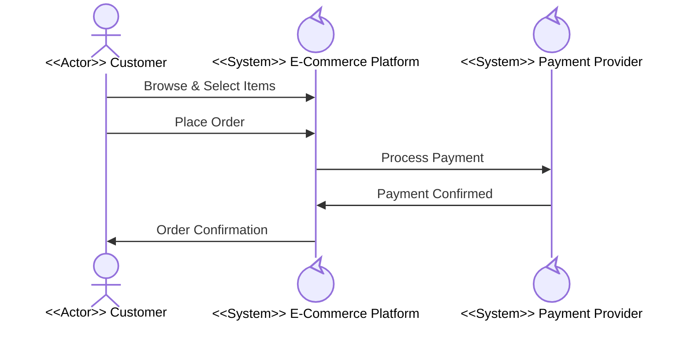
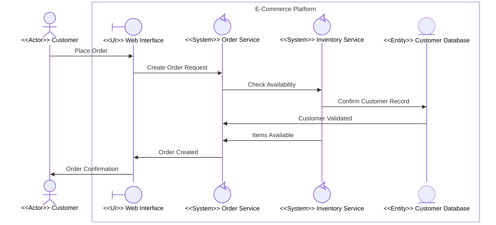

# Quick-Start Tutorial: Hierarchical Process Modeling

**Project**: 03-Building-Skills-Iteration-2  
**Version**: 1.0  
**Created**: March 15, 2026  
**Estimated Time**: 30 minutes  
**Audience**: New team members; engineers unfamiliar with EDPS hierarchical modeling

---

## Before You Begin

**What you will build**: A two-level hierarchical collaboration diagram for a simple e-commerce "Place Order" workflow.

**What you need**: 
- A text editor with Mermaid preview support (e.g., VS Code + Markdown Preview Mermaid Support)
- This tutorial

**Concepts you will practice**:
- Assigning participant stereotypes
- Using `box` syntax for boundaries
- Decomposing a `<<System>>` participant
- Setting up the folder hierarchy

---

## Part 1 — Model at Level 0 (5 minutes)

Level 0 shows the external actors and the major systems they interact with. No `box` syntax yet.

### Task 1.1: List the actors and systems

For "Place Order" on an e-commerce site, the participants are:

| Participant | Role | Stereotype |
|---|---|---|
| Customer | Places the order | `<<Actor>>` |
| E-Commerce Platform | Accepts and processes orders | `<<System>>` |
| Payment Provider | Processes payment | `<<System>>` |

### Task 1.2: Write the Level 0 diagram

Create a file `collaboration.md` in a new folder `01-PlaceOrder/`:



**Check**: Both `E-Commerce Platform` and `Payment Provider` are `control` type. This means either can be decomposed in the next level. We will decompose `E-Commerce Platform` in Part 2.

---

## Part 2 — Decompose the E-Commerce Platform (15 minutes)

Now zoom in to see how the E-Commerce Platform handles an order internally.

### Task 2.1: Identify internal participants

Ask: *"What components collaborate inside the E-Commerce Platform to fulfill an order?"*

| Internal Participant | Role | Stereotype |
|---|---|---|
| Web Interface | First recipient of customer requests; renders UI | `<<UI>>` |
| Order Service | Creates and manages orders | `<<System>>` |
| Inventory Service | Checks product availability | `<<System>>` |
| Customer Database | Stores customer and order records | `<<Entity>>` |

### Task 2.2: Apply boundary validation rules

Before writing the Mermaid code, verify:

- [ ] **VR-1**: How many external actors interact with this boundary?  
  → 1 — only `Customer` (coming in from the Level 0 diagram) ✓

- [ ] **VR-2**: Which participant is the first recipient of the customer message?  
  → `Web Interface` (assigned `boundary` type) ✓

- [ ] **VR-3**: Which participants are eligible for further decomposition?  
  → `Order Service` and `Inventory Service` (both `control` type) ✓

- [ ] **VR-4**: Are any `actor` participants inside the box?  
  → No — `Customer` remains external ✓

### Task 2.3: Write the Level 1 diagram

Create a new subfolder `01-PlaceOrder/01-ECommercePlatform/` and a new `collaboration.md`:



**Check**: The first message from `Customer` goes to `WebUI` (boundary type). ✓

### Task 2.4: Create supporting files

In `01-PlaceOrder/01-ECommercePlatform/`, create a `main.md`:

```markdown
# E-Commerce Platform Boundary

**Parent**: [Place Order (Level 0)](../../collaboration.md)

## Purpose
Handles customer order placement, including inventory checking and order record creation.

## Decomposable Participants
- **Order Service**: Can be further decomposed to show order lifecycle management
- **Inventory Service**: Can be further decomposed to show stock management

## Cross References
- Level 0: [Place Order Overview](../../collaboration.md)
```

---

## Part 3 — Review the Folder Structure (5 minutes)

After Parts 1 and 2, your folder structure should look like this:

```
01-PlaceOrder/
├── main.md                              ← Level 0 overview
├── collaboration.md                     ← Level 0 diagram
├── process.md                           ← Optional: process flow
├── domain-model.md                      ← Optional: domain entities
└── 01-ECommercePlatform/
    ├── main.md                          ← Level 1 boundary description
    └── collaboration.md                 ← Level 1 diagram
```

Key naming rules:
- Sub-folders use the format `{nn}-{BoundaryName}` (two-digit prefix, CamelCase name)
- Each level has its own `collaboration.md`
- Each level's `main.md` links back to its parent

---

## Part 4 — Optional: Go Deeper (5 minutes)

Practice decomposing `Order Service` to Level 2.

### Challenge: Identify the Level 2 participants for Order Service

Think about what an order service does:
- Receives order requests
- Validates order details
- Reserves items
- Persists the order

**Suggested participants and stereo types:**

| Participant | Stereotype | Reasoning |
|---|---|---|
| Order API | `boundary` | First recipient of requests from E-Commerce Platform |
| Order Processor | `control` | Core logic; eligible for further decomposition |
| Reservation Service | `control` | Reserves inventory; eligible for further decomposition |
| Order Store | `entity` | Persists order records; not decomposable |

Create `01-PlaceOrder/01-ECommercePlatform/01-OrderService/collaboration.md` with these participants.

---

## Summary

In 30 minutes you have:

1. **Built a Level 0 diagram** — identified actors and top-level system boundaries
2. **Decomposed one boundary to Level 1** — added `box` syntax, applied stereotypes, enforced VR-1 through VR-4
3. **Set up the folder hierarchy** — parent folder → child sub-folder with `main.md` and `collaboration.md`
4. **Identified further decomposition candidates** — `control` participants at Level 1

### Key Rules to Remember

| Rule | Quick Phrase |
|---|---|
| First recipient = `boundary` type | *"UI always answers the door"* |
| Only `control` decomposes | *"Systems have sub-systems, data does not"* |
| Actors stay outside boxes | *"Actors never live inside boundaries"* |
| One actor per boundary | *"One front door per building"* |

---

## Next Steps

- Read the [User Guide](user-guide.md) for the full methodology
- Study the [Example Walkthroughs](example-walkthroughs.md) for the three canonical patterns
- Use the [Migration Guide](migration-guide.md) to upgrade your existing Project 1 diagrams
- Check the [FAQ & Troubleshooting](faq-troubleshooting.md) if something doesn't render as expected
