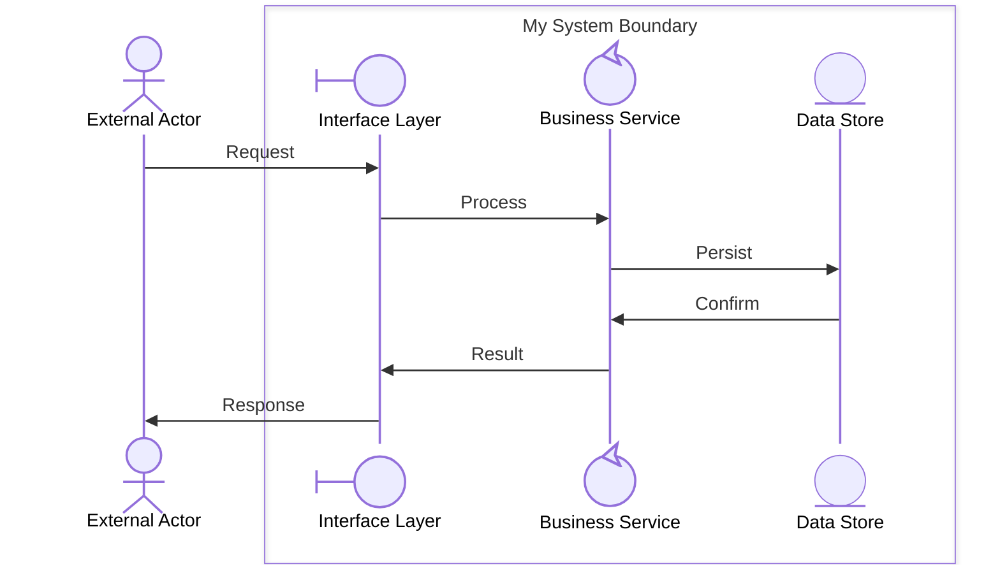

# User Guide: Hierarchical Process Modeling with Boundaries

**Project**: 03-Building-Skills-Iteration-2  
**Version**: 1.0  
**Created**: March 15, 2026  
**Audience**: Engineers, Architects, Process Modelers

---

## Table of Contents

1. [Introduction](#introduction)
2. [Core Concepts](#core-concepts)
3. [Boundary Concepts](#boundary-concepts)
4. [Hierarchy Levels](#hierarchy-levels)
5. [Decomposition Workflow](#decomposition-workflow)
6. [Mermaid Syntax Reference](#mermaid-syntax-reference)
7. [Modeling Checklist](#modeling-checklist)
8. [Related Resources](#related-resources)

---

## Introduction

Hierarchical Process Modeling with Boundaries is the EDPS (Evolutionary Development Process System) approach for managing complexity in large-scale systems. Instead of single flat diagrams, processes are organized into levels — each level revealing the next layer of detail through **boundary decomposition**.

### Why Hierarchical Modeling?

| Flat Diagrams (Project 1) | Hierarchical Diagrams (Project 3) |
|---|---|
| Single collaboration level | Unlimited depth levels |
| All participants visible at once | Participants scoped to their level |
| Complex diagrams become cluttered | Each level remains focused |
| No enforcement of interface contracts | Single-actor boundary rule enforced |
| No automatic folder organization | Sub-folders generated per level |

### Key Innovation

> A complex system can always be divided into boundaries. Each boundary has **exactly one external interface**. Within that boundary, internal participants collaborate. Any `control` participant inside a boundary can itself be decomposed into a deeper boundary level.

---

## Core Concepts

### Boundary

A **boundary** is a cohesive unit of functionality with these properties:

- **Single External Interface**: Exactly one external actor may interact with the boundary
- **Internal Collaboration**: Multiple participants collaborate inside
- **Encapsulation**: External actors cannot see internal complexity
- **Responsibility Cohesion**: All internals serve a related purpose
- **Decomposable**: Any `control` participant inside can become a sub-boundary

### Participant Stereotypes

Every participant is assigned a **stereotype** that governs its behavior:

| Stereotype | Mermaid Type | Role | Decomposable? |
|---|---|---|---|
| `<<Actor>>` | `"type": "actor"` | External entity, initiates interactions | No |
| `<<UI>>` | `"type": "boundary"` | Interface layer, first message recipient in a boundary | No |
| `<<System>>` | `"type": "control"` | Business logic, can spawn sub-processes | **Yes** |
| `<<Entity>>` | `"type": "entity"` | Data/resource store, stable resource | No |

### Validation Rules

Four boundary validation rules (VR-1 through VR-4) are enforced automatically:

| Rule | Description |
|---|---|
| **VR-1** | Each boundary has at most one external actor interface |
| **VR-2** | The first message inside a boundary from an external actor must target a `boundary`-type participant |
| **VR-3** | Only `control`-type participants may be decomposed into child boundaries |
| **VR-4** | `actor`-type participants may not appear inside a boundary box |

---

## Boundary Concepts

### How Boundaries Are Represented

EDPS uses Mermaid sequence diagram `box` syntax to represent boundaries:



### Three Canonical Boundary Patterns

#### Pattern 1 — System Component Boundary
Use when modeling a technical system (e.g., database, microservice).

- External actor sends a request to the `boundary` (API/gateway)
- A `control` component processes internally
- An `entity` component stores/retrieves data

#### Pattern 2 — Service Layer Boundary
Use when modeling an event-driven or orchestration service.

- API gateway (`boundary`) accepts client requests
- Multiple `control` services collaborate (validation, routing, processing)
- `entity` repositories persist state

#### Pattern 3 — Process Boundary
Use when modeling a multi-step business process (e.g., loan approval, order fulfillment).

- A handler (`boundary`) receives the workflow trigger
- Multiple `control` components run sequential or parallel steps
- Each step is a candidate for further decomposition

See [Example Walkthroughs](example-walkthroughs.md) for complete diagrams of each pattern.

---

## Hierarchy Levels

### Level 0 — External System View

- **Scope**: The entire system from an outside perspective
- **Participants**: External actors + 2–4 top-level system boundaries
- **Purpose**: Establish high-level contracts between systems
- **Rule**: No `box` syntax at this level; systems appear as flat `control` participants

```
User ─── E-Commerce Platform (control)
               └── Payment Provider (control)
               └── Fulfillment Center (control)
```

### Level 1 — Boundary Internal View

- **Scope**: Interior of one top-level boundary
- **Participants**: 3–8 components (boundary, control, entity)
- **Purpose**: Show how internal components collaborate to fulfill the outer contract
- **Rule**: Box syntax required; one `boundary`-type participant must be first recipient

### Level N — Component Internal View

- **Scope**: Interior of any `control` participant from the parent level
- **Participants**: 2–6 internal modules
- **Purpose**: Drill into implementation details without polluting the parent view
- **Rule**: Each level follows the same rules as Level 1

### Folder Structure

Each hierarchy level has its own sub-folder within the parent:

```
01-ProcessName/
├── main.md
├── collaboration.md        ← Level 0 diagram
├── process.md
├── domain-model.md
└── 01-ChildBoundaryA/
    ├── main.md
    ├── collaboration.md    ← Level 1 diagram
    └── 01-SubBoundaryX/
        ├── main.md
        └── collaboration.md  ← Level 2 diagram
```

Sub-folders are named `{nn}-{BoundaryName}` where `nn` is a two-digit sequence number. The name is derived from the boundary's label with sanitization (spaces → hyphens, special characters removed).

---

## Decomposition Workflow

### Step 1: Model at Level 0

Identify all external actors and the major system boundaries they interact with. Use `control` type for each system. No `box` syntax yet.

### Step 2: Select a Boundary to Decompose

Choose a `control` participant. Ask: *"What internal components collaborate to fulfill this participant's responsibility?"*

### Step 3: Build the Level N+1 Diagram

1. Create a new sub-folder under the current level folder
2. Create `collaboration.md` with a `box` block named after the decomposed participant
3. Populate with `boundary`, `control`, and `entity` participants
4. Ensure the first message from the parent system arrives at the `boundary`-type participant
5. Map out internal collaborations

### Step 4: Validate

Run the boundary validation rules (VR-1 through VR-4). Check:
- [ ] Only one external interface enters the box
- [ ] First message target is a `boundary` type
- [ ] No `actor` types inside the box
- [ ] Only `control` types are marked for further decomposition

### Step 5: Repeat

Continue decomposing `control` participants until each level is small enough to understand at a glance (typically 3–8 participants per diagram).

---

## Mermaid Syntax Reference

### Participant Declaration

```mermaid
sequenceDiagram
    participant ID@{ "type": "<stereotype>", "label": "<<Stereotype>> Display Name" }
```

Where `<stereotype>` is one of: `actor`, `boundary`, `control`, `entity`.

### Box Block

```mermaid
    box Boundary Label
        participant A@{ "type": "boundary" } as Interface
        participant B@{ "type": "control" } as Service
        participant C@{ "type": "entity" } as Data
    end
```

### Message Types

| Syntax | Meaning |
|---|---|
| `A->>B: Message` | Synchronous call |
| `A-->>B: Message` | Return / async response |
| `A-)B: Message` | Async fire-and-forget |
| `Note over A,B: text` | Annotation spanning participants |

---

## Modeling Checklist

Before finalizing any diagram, verify:

- [ ] The diagram level is clear (Level 0, 1, N)
- [ ] All external actors are `actor` type and outside all boxes
- [ ] Every box has exactly one participant that first receives external messages
- [ ] That first participant is `boundary` type
- [ ] Only `control` participants are candidates for sub-process decomposition
- [ ] The folder structure reflects the hierarchy
- [ ] `main.md` at each level summarizes the boundary's purpose
- [ ] Cross-references to parent and child levels are in place

---

## Related Resources

| Resource | Description |
|---|---|
| [Participant Type Reference](participant-type-reference.md) | Quick-reference card for stereotypes and rules |
| [Migration Guide](migration-guide.md) | Upgrade flat Project 1 diagrams to hierarchical style |
| [Example Walkthroughs](example-walkthroughs.md) | Step-by-step worked examples |
| [Quick-Start Tutorial](quick-start-tutorial.md) | 30-minute hands-on introduction |
| [FAQ & Troubleshooting](faq-troubleshooting.md) | Common questions and error resolution |
| [Boundary Concepts Analysis](../Analysis/boundary-concepts.md) | Technical deep-dive |
| [Hierarchy Examples](../Sample%20Data/hierarchy-examples.md) | Reference sample data |
