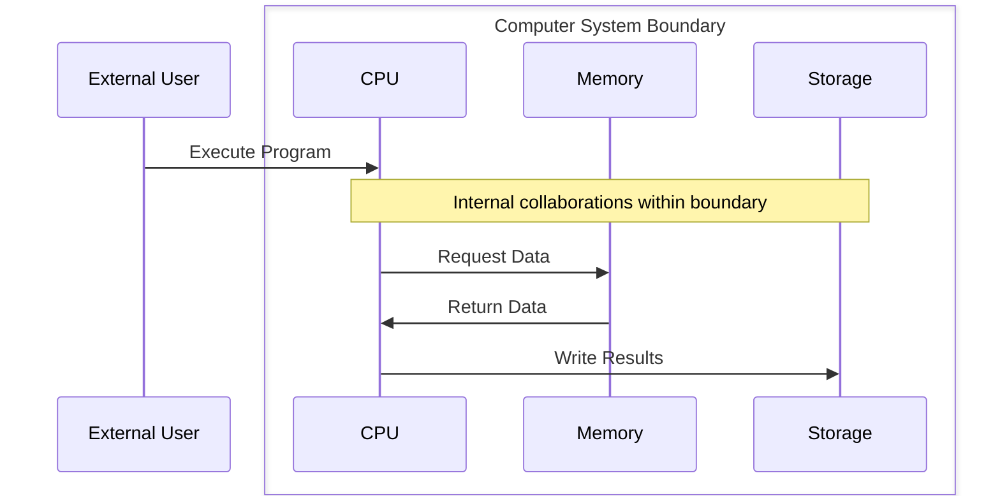

# Initial Requirements - Building Skills Iteration 2

**Project**: 03-Building-Skills-Iteration-2  
**Created**: March 13, 2026  
**Source**: EDPS Methodology Analysis and Project 1 Lessons Learned

## Problem Statement

The current AI agent skills from Project 1 generate single-level collaboration diagrams and process models. This approach doesn't align with EDPS (Evolutionary Development Process System) methodology, which requires hierarchical process decomposition for managing complexity and scale.

**Current Limitations:**
- Flat collaboration diagrams without process hierarchy
- No boundary concept implementation
- Unable to decompose complex interactions into sub-processes
- Lack of structured sub-folder organization for process levels
- Limited scalability for large-system modeling

## High-Level Requirements

### R-301: Hierarchical Process Modeling
**Priority**: High  
**Type**: Functional  

The system must support hierarchical process modeling where:
- Each interaction in a collaboration diagram can be decomposed into a sub-process
- Sub-processes have their own collaboration diagrams and process models
- Each hierarchy level maintains appropriate abstraction without excessive detail
- Process decomposition supports unlimited depth levels

**Acceptance Criteria:**
- Generate Level 0 (high-level) collaboration diagrams
- Support decomposition of any interaction into Level N+1 sub-process
- Maintain consistent modeling patterns across hierarchy levels
- Automatic folder structure generation for each process level

### R-302: Boundary Concept Implementation  
**Priority**: High  
**Type**: Functional

The system must implement boundary concepts where:
- Only one external actor interacts with a target participant (boundary)
- Sub-level collaborations occur within the boundary using Mermaid `box` syntax
- Boundaries encapsulate specific responsibilities or capabilities
- Clear separation between external interactions and internal collaborations

**Acceptance Criteria:**
- Use Mermaid sequence diagram `box` syntax for boundary representation
- Enforce single-actor-to-boundary interaction patterns
- Generate sub-process diagrams within appropriate boxes
- Validate boundary consistency across hierarchy levels

**Example Implementation:**


### R-303: Enhanced Collaboration Diagram Generation
**Priority**: High  
**Type**: Enhancement

Enhance the existing diagram-generatecollaboration skill to support:
- Automatic boundary detection and box generation
- Hierarchical diagram creation with proper nesting
- Integration with sub-process folder management
- Backward compatibility with Project 1 diagram formats

**Acceptance Criteria:**
- Extend existing collaboration diagram skill with boundary capabilities
- Generate both flat and hierarchical diagram formats
- Support migration from Project 1 diagrams to hierarchical format
- Maintain all existing diagram generation features

### R-304: Sub-Process Folder Management
**Priority**: Medium  
**Type**: Functional

The system must automatically manage folder structures for process hierarchies:
- Create sub-folders for each decomposed process
- Organize models, diagrams, and documentation by hierarchy level
- Maintain consistent naming conventions across levels
- Support navigation between hierarchy levels

**Acceptance Criteria:**
- Automatic sub-folder creation for decomposed processes
- Consistent folder structure: `Level-N-ProcessName/`
- Include standard files: `main.md`, `collaboration.md`, `process.md`, `domain-model.md`
- Cross-reference links between hierarchy levels

**Folder Structure Example:**
```
01-UserComputerInteraction/
├── main.md
├── collaboration.md
├── process.md
├── domain-model.md
├── 01-ComputerSystemBoundary/
│   ├── main.md
│   ├── collaboration.md
│   ├── 01-CPUOperations/
│   ├── 02-MemoryManagement/
│   └── 03-StorageOperations/
```

### R-305: Scale Management
**Priority**: Medium  
**Type**: Non-Functional

Each hierarchy level must maintain appropriate focus:
- Level 0: High-level process overview (3-7 main interactions)
- Level N: Detailed sub-process interactions (5-12 steps maximum)
- Automatic complexity detection and decomposition suggestions
- Focus on key problems at each level without excessive detail

**Acceptance Criteria:**
- Complexity metrics for determining decomposition need
- Guidelines for appropriate detail level at each hierarchy
- Automatic warnings for overly complex single-level diagrams
- Decomposition suggestions based on interaction patterns

### R-306: EDPS Methodology Compliance
**Priority**: High  
**Type**: Compliance

All generated artifacts must comply with EDPS methodology:
- Evolutionary development principles support
- Incremental model refinement capabilities
- Change impact analysis across hierarchy levels
- Traceability between requirements and process levels

**Acceptance Criteria:**
- EDPS-compliant process modeling patterns
- Support for iterative refinement of process hierarchies
- Change propagation across hierarchy levels
- Requirements traceability to appropriate process levels

### R-309: Organizational Model Automation
**Priority**: Medium  
**Type**: Functional

The enhanced skills must be capable of automatically updating OrgModel documents:
- Detect when organizational processes need hierarchical decomposition
- Generate boundary-enhanced collaboration diagrams for organizational processes
- Update organizational domain models with new boundary concepts
- Maintain traceability between enhanced skills and organizational model updates

**Acceptance Criteria:**
- Skills can identify OrgModel documents requiring hierarchical enhancement
- Automatic generation of boundary-enhanced organizational diagrams
- Preservation of organizational model consistency and traceability
- Integration with existing orgmodel-update skill from Project 1

### R-308: OrgModel Evolution and Integration
**Priority**: High  
**Type**: Enhancement

The system must update and evolve the organizational model (OrgModel) to reflect the enhanced hierarchical EDPS capabilities:
- Update existing OrgModel process documents with boundary concepts
- Enhance organizational collaboration diagrams with hierarchical decomposition
- Integrate boundary patterns into organizational domain models
- Maintain consistency between skills capabilities and organizational methodology

**Acceptance Criteria:**
- Update OrgModel skill development process with hierarchical boundary concepts
- Enhance existing organizational collaboration diagrams with box syntax
- Create organizational templates for hierarchical process modeling
- Ensure organizational methodology reflects Project 3 capabilities
- Document organizational boundary patterns and best practices

### R-309: Organizational Model Automation
**Priority**: Medium  
**Type**: Compatibility

Maintain compatibility with Project 1 outputs:
- Ability to import and enhance Project 1 collaboration diagrams
- Migration tools for converting flat diagrams to hierarchical format
- Preservation of existing requirements and domain model links
- Seamless integration with existing skills framework

**Acceptance Criteria:**
- Import Project 1 collaboration diagrams without modification
- Optional enhancement to hierarchical format
- Preserve all existing requirement links and metadata
- No breaking changes to existing skill interfaces

## Technical Constraints

### TC-301: Mermaid Syntax Limitations
- Use `box` syntax for boundary representation (no native boundary element)
- Maintain valid Mermaid sequence diagram syntax
- Support for nested structure representation within Mermaid limitations

### TC-302: VS Code Integration  
- Maintain seamless GitHub Copilot integration
- Preserve markdown-based workflow
- Support for large diagram rendering in VS Code preview

### TC-303: Performance Requirements
- Efficient generation of multi-level diagrams
- Reasonable file structure organization (avoid excessive nesting)
- Fast navigation between hierarchy levels

## Success Metrics

1. **Hierarchy Depth**: Support 5+ levels of process decomposition
2. **Boundary Accuracy**: 100% correct boundary identification in test cases  
3. **Migration Success**: Convert 100% of Project 1 diagrams to hierarchical format
4. **Performance**: Generate hierarchical diagrams within 30 seconds
5. **Usability**: Developer adoption rate >90% for hierarchical modeling

---

**Dependencies:**
- Project 1 skills: requirements-ingest, goals-extract, domain-extractconcepts, diagram-generatecollaboration
- EDPS methodology documentation and standards
- Mermaid diagram rendering capabilities in VS Code