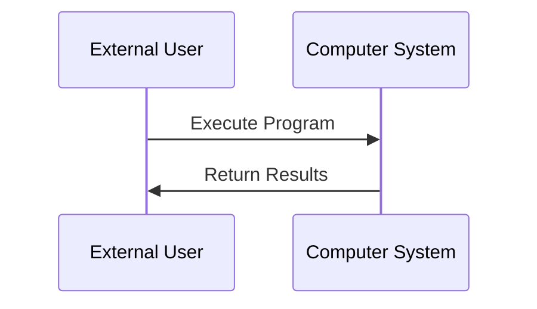
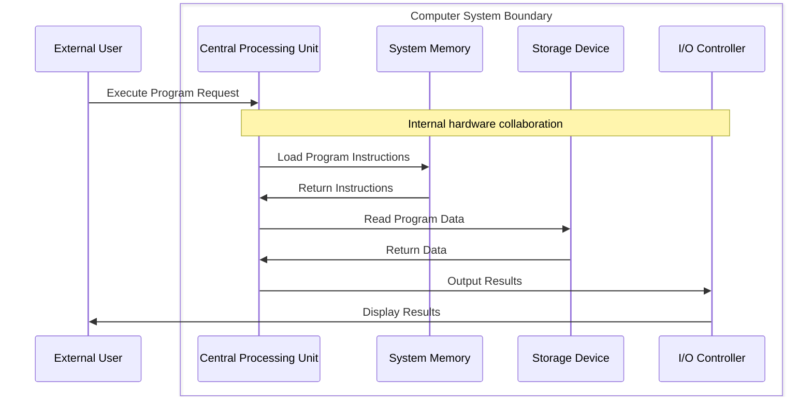
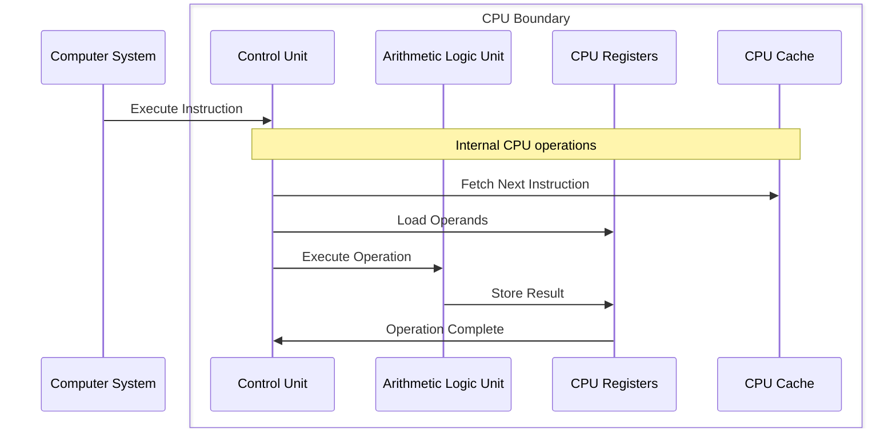
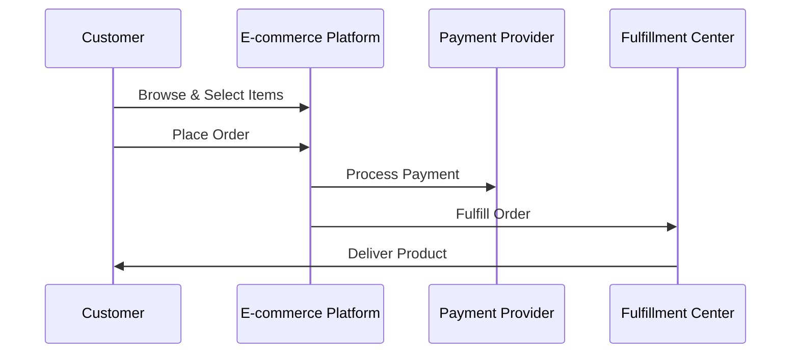
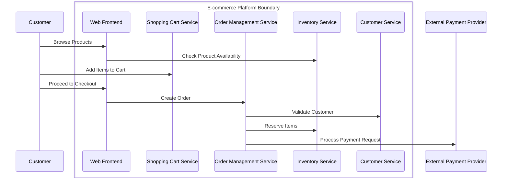
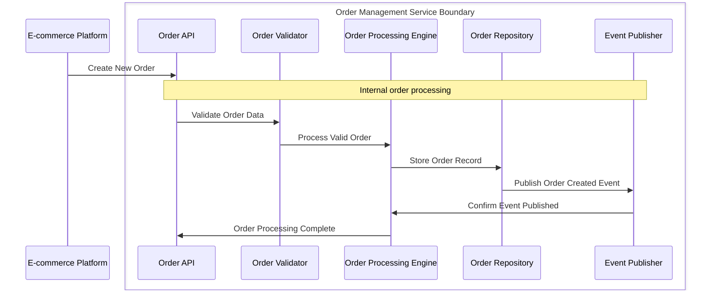
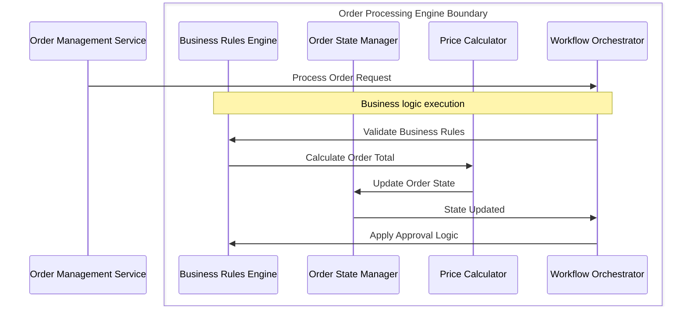
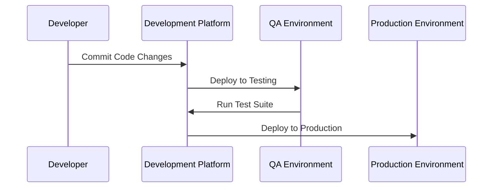
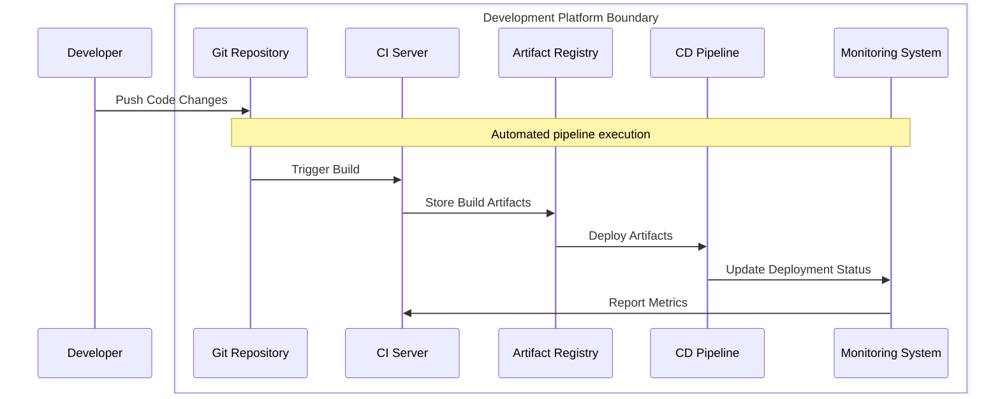
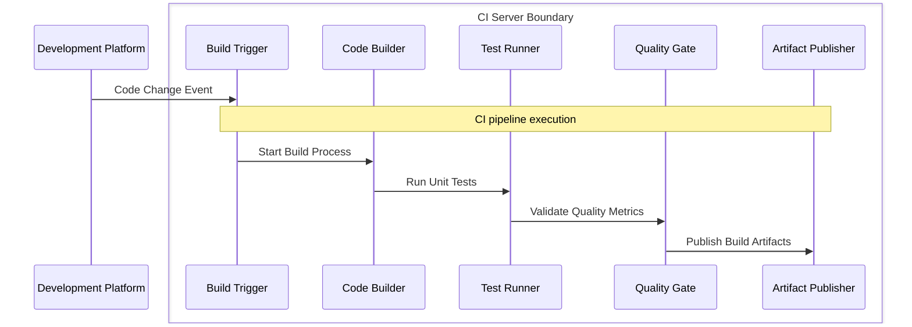

# Hierarchical Process Examples

**Project**: 03-Building-Skills-Iteration-2  
**Created**: March 13, 2026  
**Purpose**: Concrete examples demonstrating hierarchical EDPS modeling with boundaries

## Example 1: User-Computer Interaction

### Level 0: External System View
**Scope**: User interaction with computer system
**Focus**: High-level operation request



**Boundary Analysis**: Computer System is a single boundary containing all internal components.

### Level 1: Computer System Boundary
**Scope**: Internal computer system components  
**Focus**: Hardware component collaboration



**Boundary Rules Applied:**
- Single external interface: User → CPU
- Internal collaboration: CPU ↔ Memory ↔ Storage
- Encapsulated complexity: User doesn't interact with Memory directly

### Level 2: CPU Boundary (Sub-process)
**Scope**: Internal CPU operations  
**Focus**: Processing unit components



**Sub-Folder Structure:**
```
01-UserComputerInteraction/
├── main.md
├── collaboration.md          # Level 0 diagram
├── process.md
└── 01-ComputerSystemBoundary/
    ├── main.md
    ├── collaboration.md      # Level 1 diagram
    ├── 01-CPUBoundary/
    │   ├── main.md
    │   └── collaboration.md  # Level 2 diagram
    ├── 02-MemoryBoundary/
    └── 03-StorageBoundary/
```

## Example 2: E-commerce Order Processing

### Level 0: Customer Journey
**Scope**: Customer interaction with e-commerce system
**Focus**: End-to-end order placement



### Level 1: E-commerce Platform Boundary
**Scope**: Internal platform services
**Focus**: Service orchestration and workflow



### Level 2: Order Management Service Boundary
**Scope**: Internal order processing logic
**Focus**: Order lifecycle management



### Level 3: Order Processing Engine Boundary
**Scope**: Core business logic implementation
**Focus**: Decision making and state management



## Example 3: Software Development Workflow

### Level 0: Development Team Process
**Scope**: Team interaction with development tools
**Focus**: Software delivery pipeline



### Level 1: Development Platform Boundary
**Scope**: CI/CD platform components
**Focus**: Automated build and deployment pipeline



### Level 2: CI Server Boundary
**Scope**: Continuous integration process
**Focus**: Build, test, and validation steps



## Boundary Detection Patterns

### Pattern 1: Interface Responsibility
**Identification**: Components that primarily handle external interactions
**Examples**: API Gateway, Web Frontend, Database Interface

**Characteristics:**
- High external interaction frequency
- Low internal processing complexity
- Clear input/output transformation

### Pattern 2: Processing Responsibility  
**Identification**: Components that handle core business logic
**Examples**: Order Processing Engine, Payment Processor, Business Rules Engine

**Characteristics:**
- Complex internal state management
- Multiple internal collaborations
- Business rule enforcement

### Pattern 3: Storage Responsibility
**Identification**: Components that manage data persistence
**Examples**: Database System, File Storage, Cache Manager

**Characteristics:**
- Data CRUD operations
- Internal query optimization
- Transaction management

### Pattern 4: Communication Responsibility
**Identification**: Components that handle inter-system communication
**Examples**: Message Queue, Event Bus, API Client

**Characteristics:**
- External system integration
- Message routing and transformation
- Protocol handling

## Hierarchy Navigation Examples

### Folder Structure for E-commerce Example
```
01-CustomerOrderJourney/
├── main.md                                 # Level 0 overview
├── collaboration.md                        # Customer → Platform → Payment
├── process.md
├── 01-EcommercePlatformBoundary/
│   ├── main.md                             # Level 1 overview  
│   ├── collaboration.md                    # Platform internal services
│   ├── 01-OrderManagementBoundary/
│   │   ├── main.md                         # Level 2 overview
│   │   ├── collaboration.md                # Order service internals
│   │   └── 01-OrderProcessingEngineBoundary/
│   │       ├── main.md                     # Level 3 overview
│   │       └── collaboration.md           # Engine internals
│   ├── 02-InventoryServiceBoundary/
│   └── 03-CustomerServiceBoundary/
├── 02-PaymentProviderBoundary/
└── 03-FulfillmentCenterBoundary/
```

### Cross-Reference Links
Each level includes navigation links:

**Level 0 (main.md):**
```markdown
# Customer Order Journey

## Sub-Processes
- [E-commerce Platform](01-EcommercePlatformBoundary/main.md)
- [Payment Provider](02-PaymentProviderBoundary/main.md)
- [Fulfillment Center](03-FulfillmentCenterBoundary/main.md)
```

**Level 1 (E-commerce Platform main.md):**
```markdown
# E-commerce Platform Boundary

## Parent Process
- [Customer Order Journey](../main.md)

## Sub-Processes  
- [Order Management](01-OrderManagementBoundary/main.md)
- [Inventory Service](02-InventoryServiceBoundary/main.md)
- [Customer Service](03-CustomerServiceBoundary/main.md)
```

## Benefits Demonstration

### Complexity Management
- **Level 0**: Focus on customer journey without technical details
- **Level 1**: Understand service architecture without implementation details  
- **Level 2**: Examine service internals without low-level code concerns

### Change Impact Analysis
- **Order API Change**: Affects Level 2 (Order Management) and below
- **Payment Provider Change**: Affects Level 0 and Payment Provider boundary
- **Database Schema Change**: Affects Level 3 (Repository) and related components

### Team Collaboration
- **Business Analysts**: Work with Level 0-1 diagrams
- **Solution Architects**: Focus on Level 1-2 service boundaries
- **Developers**: Implement Level 2-3 component interactions

---

**Next Steps:**
1. Use these examples to validate boundary detection algorithms
2. Test hierarchy generation with real project data
3. Implement cross-reference link automation  
4. Create migration tools for Project 1 diagrams