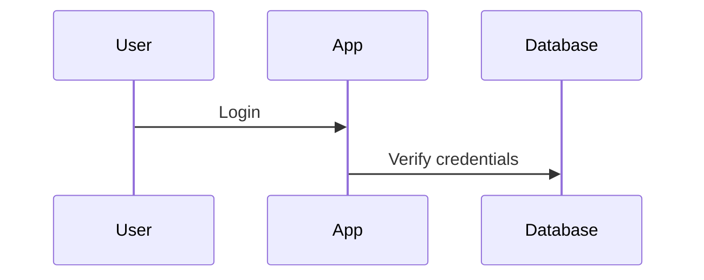
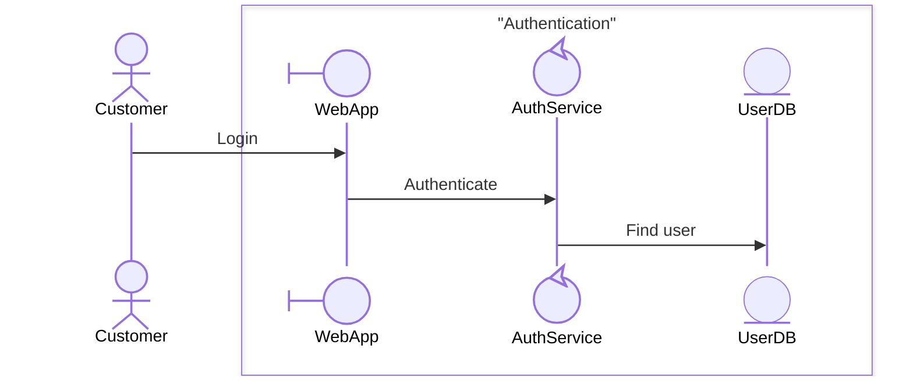
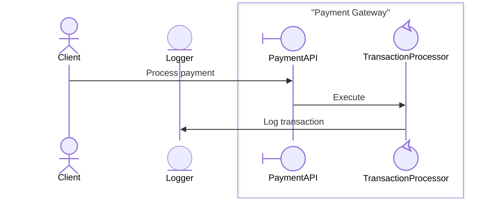

# T1: Test Cases for Enhanced Collaboration Diagram Skill

**Task ID**: T1  
**Test Case Author**: GitHub Copilot
**Test Date**: March 14, 2026

## 1. Backward Compatibility Tests

### Test Case 1.1: Simple Project 1 Diagram
- **Given**: A simple sequence diagram input from Project 1 without any boundary information.
- **When**: The enhanced `diagram-generatecollaboration` skill is invoked.
- **Then**: The output Mermaid diagram should be identical to the one generated by the original Project 1 skill. No `box` syntax should be present.

**Input (Example):**
```json
{
  "diagram_type": "sequence",
  "participants": ["User", "App", "Database"],
  "interactions": [
    { "from": "User", "to": "App", "message": "Login" },
    { "from": "App", "to": "Database", "message": "Verify credentials" }
  ]
}
```

**Expected Output (Mermaid):**


## 2. Boundary Detection Tests

### Test Case 2.1: Simple Automatic Boundary Detection
- **Given**: A sequence of interactions where a `System` participant is clearly interacting with external actors.
- **When**: The skill is invoked with `hierarchical_decomposition: true` and `auto_boundary_detection: true`.
- **Then**: A `box` should be generated around the internal components of the system, with a single external interface.

**Input (Example):**
```json
{
  "diagram_type": "sequence",
  "participants": [
    { "name": "Customer", "stereotype": "actor" },
    { "name": "WebApp", "stereotype": "boundary" },
    { "name": "AuthService", "stereotype": "control" },
    { "name": "UserDB", "stereotype": "entity" }
  ],
  "interactions": [
    { "from": "Customer", "to": "WebApp", "message": "Login" },
    { "from": "WebApp", "to": "AuthService", "message": "Authenticate" },
    { "from": "AuthService", "to": "UserDB", "message": "Find user" }
  ]
}
```

**Expected Output (Mermaid):**


### Test Case 2.2: Complex Multi-Boundary Detection
- **Given**: A complex e-commerce workflow with multiple systems (Platform, Payment, Fulfillment).
- **When**: The skill is invoked with automatic boundary detection.
- **Then**: Three distinct boundaries should be created for the Platform, Payment, and Fulfillment systems.

## 3. Manual Boundary Configuration Tests

### Test Case 3.1: Manual Override
- **Given**: A set of participants and a manual boundary configuration.
- **When**: The skill is invoked with the manual configuration.
- **Then**: The generated diagram should respect the manual boundary groupings, ignoring any automatic detection.

**Input (Example):**
```json
{
  "hierarchical_decomposition": true,
  "auto_boundary_detection": false,
  "manual_boundaries": [
    {
      "name": "Payment Gateway",
      "participants": ["PaymentAPI", "TransactionProcessor"]
    }
  ],
  "participants": ["Client", "PaymentAPI", "TransactionProcessor", "Logger"],
  "interactions": [
    { "from": "Client", "to": "PaymentAPI", "message": "Process payment" },
    { "from": "PaymentAPI", "to": "TransactionProcessor", "message": "Execute" },
    { "from": "TransactionProcessor", "to": "Logger", "message": "Log transaction" }
  ]
}
```

**Expected Output (Mermaid):**


## 4. Boundary Validation Tests

### Test Case 4.1: Invalid Boundary - Multiple External Interfaces
- **Given**: A boundary configuration where more than one external actor interacts directly with participants inside the boundary.
- **When**: The skill processes the configuration.
- **Then**: The skill should generate a warning and suggest a valid boundary organization, or default to a flat diagram.

## 5. Documentation and Test Case Generation

### Test Case 5.1: Update Skill Documentation
- **Given**: The enhanced skill with new boundary features.
- **When**: The task is nearing completion.
- **Then**: The `diagram-generatecollaboration/SKILL.md` file should be updated to include documentation for the new hierarchical parameters, `box` syntax, and usage patterns.

### Test Case 5.2: Create Test Cases for Task Deliverable
- **Given**: The completed implementation of Task T1.
- **When**: Preparing the final deliverables.
- **Then**: This file (`T1-test-cases.md`) should be created and populated with relevant test cases.
