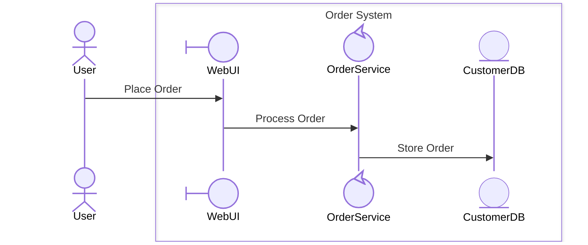
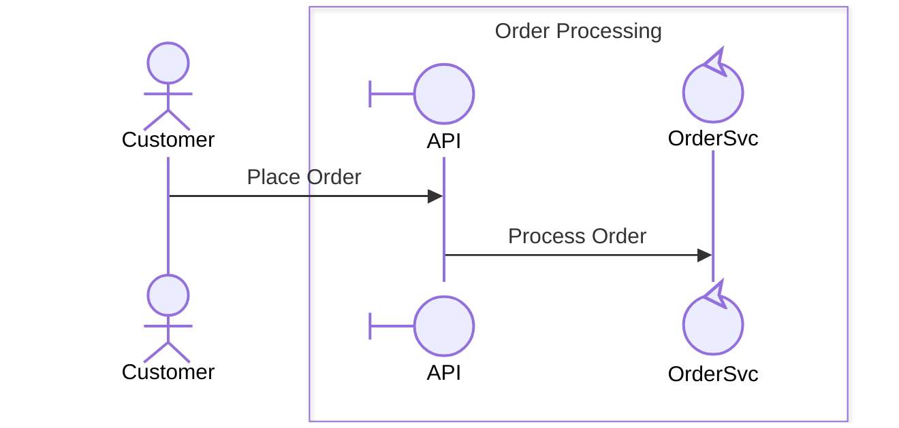
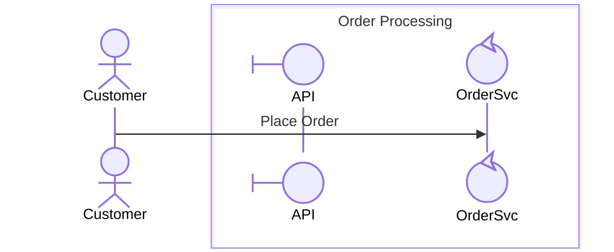
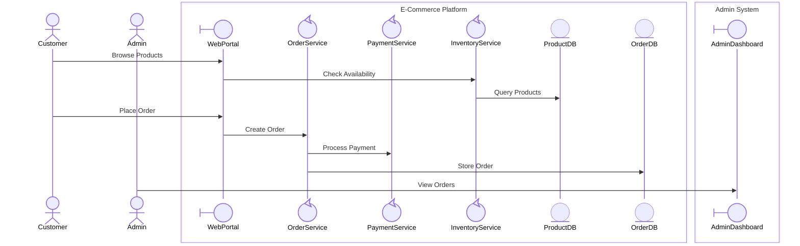

# T2: Test Cases for Participant Stereotype Classification

**Task ID**: T2  
**Test Case Author**: GitHub Copilot  
**Test Date**: March 14, 2026  
**Source Requirement**: R-310

---

## 1. Automatic Type Inference Tests

### Test Case 1.1: Basic Four-Type Classification
- **Given**: A collaboration diagram with participants: User, WebUI, OrderService, CustomerDB
- **When**: Stereotype classification is applied with `auto_inference: true`
- **Then**: User = actor, WebUI = boundary, OrderService = control, CustomerDB = entity

**Input:**
```json
{
  "stereotype_classification": true,
  "auto_inference": true,
  "participants": [
    { "name": "User" },
    { "name": "WebUI" },
    { "name": "OrderService" },
    { "name": "CustomerDB" }
  ],
  "interactions": [
    { "from": "User", "to": "WebUI", "message": "Place Order" },
    { "from": "WebUI", "to": "OrderService", "message": "Process Order" },
    { "from": "OrderService", "to": "CustomerDB", "message": "Store Order" }
  ]
}
```

**Expected Output (Mermaid):**


**Expected Type Summary:**
```json
{
  "participant_type_summary": {
    "total_participants": 4,
    "by_type": {
      "actor": { "count": 1, "participants": ["User"] },
      "boundary": { "count": 1, "participants": ["WebUI"] },
      "control": { "count": 1, "participants": ["OrderService"] },
      "entity": { "count": 1, "participants": ["CustomerDB"] }
    },
    "decomposable": ["OrderService"]
  }
}
```

### Test Case 1.2: Actor Inference from Name Patterns
- **Given**: Participants named "Customer", "Admin", "ExternalPartner"
- **When**: They appear outside all `box` boundaries and only initiate messages
- **Then**: All three are classified as `actor`

### Test Case 1.3: Boundary Inference from Position and Name
- **Given**: A participant named "APIGateway" that is the first inside a `box` to receive an external actor message
- **When**: Stereotype classification is applied
- **Then**: APIGateway is classified as `boundary`

### Test Case 1.4: Entity Inference from Data Patterns
- **Given**: Participants named "UserRepository", "OrderCache", "AuditStorage"
- **When**: They primarily receive CRUD-type messages (store, retrieve, query, update)
- **Then**: All three are classified as `entity`

### Test Case 1.5: Control as Default Fallback
- **Given**: A participant named "WorkflowCoordinator" that orchestrates multiple interactions
- **When**: It does not match actor, boundary, or entity patterns
- **Then**: It is classified as `control`

---

## 2. Manual Override Tests

### Test Case 2.1: Manual Override Wins Over Inference
- **Given**: A participant "AuditLog" that would be inferred as `control` (performs logging logic)
- **When**: Manual override specifies `"stereotype": "entity"`
- **Then**: AuditLog is classified as `entity` with override metadata recorded

**Input:**
```json
{
  "stereotype_classification": true,
  "auto_inference": true,
  "manual_overrides": [
    { "participant": "AuditLog", "type": "entity" }
  ],
  "participants": [
    { "name": "User" },
    { "name": "Dashboard" },
    { "name": "AuditLog" }
  ]
}
```

**Expected Override Metadata:**
```json
{
  "type_overrides": [
    { "participant": "AuditLog", "inferred": "control", "override": "entity", "reason": "manual" }
  ]
}
```

### Test Case 2.2: Inline Annotation Override
- **Given**: A participant with inline annotation `participant OrderService@{ "type": "entity", "label": "Order Service" }`
- **When**: Auto-inference would classify it as `control`
- **Then**: The inline annotation takes precedence; OrderService is `entity`

---

## 3. Decomposition Rule Enforcement Tests

### Test Case 3.1: Valid Control Decomposition
- **Given**: Participant "PaymentService" classified as `control`
- **When**: Decomposition into sub-process is requested
- **Then**: Decomposition is **allowed**; sub-process diagram is generated

### Test Case 3.2: Blocked Entity Decomposition
- **Given**: Participant "CustomerDB" classified as `entity`
- **When**: Decomposition into sub-process is attempted
- **Then**: Decomposition is **blocked** with validation error

**Expected Validation Error:**
```json
{
  "validation_errors": [
    {
      "rule": "control-only-decomposition",
      "participant": "CustomerDB",
      "type": "entity",
      "message": "Cannot decompose participant 'CustomerDB' (type: entity). Only control-type participants can be decomposed into sub-processes.",
      "suggestion": "If this participant requires internal detail, consider reclassifying it as 'control' or modeling its internals as a separate entity-focused diagram."
    }
  ]
}
```

### Test Case 3.3: Blocked Actor Decomposition
- **Given**: Participant "Customer" classified as `actor`
- **When**: Decomposition into sub-process is attempted
- **Then**: Decomposition is **blocked** with validation error referencing actor externality rule

### Test Case 3.4: Blocked Boundary Decomposition
- **Given**: Participant "WebUI" classified as `boundary`
- **When**: Decomposition into sub-process is attempted
- **Then**: Decomposition is **blocked** with validation error

---

## 4. Boundary-First Reception Tests

### Test Case 4.1: Valid Boundary-First Pattern
- **Given**: Actor "Customer" sends to boundary-type "API" inside a box
- **When**: Validation is applied
- **Then**: No validation errors



### Test Case 4.2: Invalid Direct-to-Control Pattern
- **Given**: Actor "Customer" sends directly to control-type "OrderService" inside a box
- **When**: Boundary-first reception validation is applied
- **Then**: Validation error is generated

**Invalid Diagram:**


**Expected Validation Error:**
```json
{
  "validation_errors": [
    {
      "rule": "boundary-first-reception",
      "boundary": "Order Processing",
      "actor": "Customer",
      "received_by": "OrderSvc",
      "received_by_type": "control",
      "message": "Actor 'Customer' sends directly to 'OrderSvc' (type: control) inside boundary 'Order Processing'. Messages from actors must be received by a boundary-type participant first.",
      "suggestion": "Add or designate a boundary-type participant (e.g., API Gateway) as the entry point for this boundary."
    }
  ]
}
```

### Test Case 4.3: Missing Boundary Participant Warning
- **Given**: A box with only control and entity participants, no boundary participant
- **When**: An actor sends a message to a participant inside the box
- **Then**: A validation **warning** is produced (not a hard error)

---

## 5. Annotation Generation Tests

### Test Case 5.1: All Participants Annotated
- **Given**: A diagram with 5 participants of mixed types
- **When**: Mermaid output is generated
- **Then**: Every participant line includes `@{ "type": "...", "label": "..." }` annotation

### Test Case 5.2: Annotation Syntax Validity
- **Given**: Generated Mermaid diagram with annotations
- **When**: Rendered in VS Code Mermaid preview
- **Then**: Diagram renders correctly with no syntax errors

---

## 6. Actor Externality Tests

### Test Case 6.1: Actor Inside Box Produces Error
- **Given**: An actor-type participant placed inside a `box` boundary
- **When**: Validation is applied
- **Then**: Validation error: actor must be declared outside all box boundaries

---

## 7. Type Consistency Across Levels

### Test Case 7.1: Consistent Type in Decomposition
- **Given**: "PaymentService" is `control` at Level 0
- **When**: It is decomposed into Level 1 diagram
- **Then**: The entry-point participant in Level 1 is `boundary` type, and the parent remains `control` at Level 0

### Test Case 7.2: Type Conflict Detection
- **Given**: "PaymentService" is `control` at Level 0 but appears as `entity` in a Level 1 diagram
- **When**: Cross-level validation is applied
- **Then**: A consistency warning is generated

---

## 8. End-to-End Integration Test

### Test Case 8.1: Full Classification Pipeline
- **Given**: E-commerce domain with participants: Customer, Admin, WebPortal, AdminDashboard, OrderService, PaymentService, InventoryService, ProductDB, OrderDB
- **When**: Full classification pipeline runs with `auto_inference: true`, `enforce_decomposition_rules: true`, `enforce_boundary_first_reception: true`
- **Then**:
  - **Actors**: Customer, Admin (external, outside boxes)
  - **Boundaries**: WebPortal, AdminDashboard (first recipients in their respective boxes)
  - **Control**: OrderService, PaymentService, InventoryService (business logic, decomposable)
  - **Entity**: ProductDB, OrderDB (data stores)
  - Decomposition allowed only for OrderService, PaymentService, InventoryService
  - All actor→box messages route through boundary participants first
  - Type summary generated with correct counts

**Expected Mermaid Output:**


---

## Test Summary

| # | Test Case | Category | Priority | Pass Criteria |
|---|-----------|----------|----------|---------------|
| 1.1 | Basic Four-Type Classification | Inference | Must Have | All 4 types correctly assigned |
| 1.2 | Actor Inference from Name | Inference | Must Have | Name pattern matching works |
| 1.3 | Boundary Inference from Position | Inference | Must Have | Position + name detection works |
| 1.4 | Entity Inference from Data Patterns | Inference | Must Have | Data store patterns detected |
| 1.5 | Control as Default | Inference | Must Have | Fallback classification works |
| 2.1 | Manual Override Wins | Override | Should Have | Override metadata recorded |
| 2.2 | Inline Annotation Override | Override | Should Have | Inline takes precedence |
| 3.1 | Valid Control Decomposition | Decomposition | Must Have | Decomposition allowed |
| 3.2 | Blocked Entity Decomposition | Decomposition | Must Have | Error with clear message |
| 3.3 | Blocked Actor Decomposition | Decomposition | Must Have | Error with clear message |
| 3.4 | Blocked Boundary Decomposition | Decomposition | Must Have | Error with clear message |
| 4.1 | Valid Boundary-First Pattern | Boundary Rule | Must Have | No errors |
| 4.2 | Invalid Direct-to-Control | Boundary Rule | Must Have | Error with suggestion |
| 4.3 | Missing Boundary Warning | Boundary Rule | Should Have | Warning generated |
| 5.1 | All Participants Annotated | Annotation | Must Have | Every participant has @{} |
| 5.2 | Annotation Syntax Valid | Annotation | Must Have | Renders in VS Code |
| 6.1 | Actor Inside Box Error | Externality | Must Have | Validation error |
| 7.1 | Consistent Type in Decomp | Consistency | Should Have | Entry point is boundary |
| 7.2 | Type Conflict Detection | Consistency | Should Have | Warning generated |
| 8.1 | Full Classification Pipeline | Integration | Must Have | End-to-end pass |
