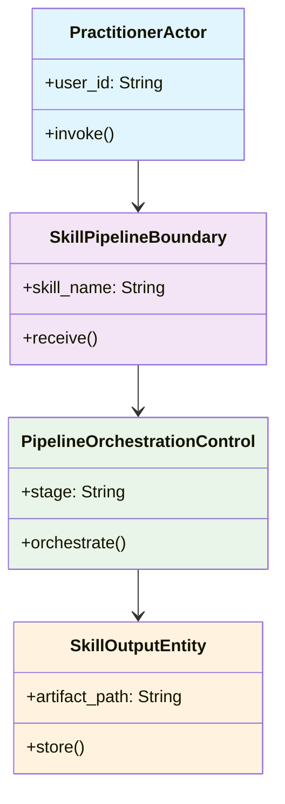

<!-- Identifier: DM-01-01 -->

# Skill Pipeline Execution — Domain Model

**Parent Process**: [01 - Skill Development Process Domain Model](../domain-model.md)
**Hierarchy Level**: 1

## Domain Class Diagram

