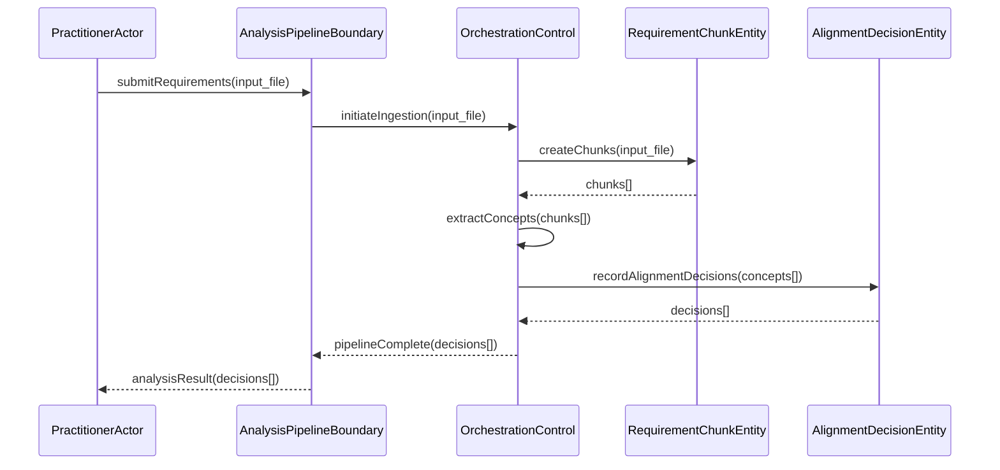

<!-- Identifier: C-02 -->

# 02 - Analysis Process — Collaboration

## Entity Interactions

## Interaction Patterns

- All external requests enter through `AnalysisPipelineBoundary`.
- `OrchestrationControl` drives the ingestion → extraction → alignment sequence.
- `RequirementChunkEntity` and `AlignmentDecisionEntity` are passive stores updated by the control.

## Communication Channels

- Synchronous request-response between practitioner and boundary.
- Internal control-to-entity calls are synchronous.

## Data Flow

- `input_file` → `RequirementChunk[]` → extracted concepts → `AlignmentDecision[]` → `analysisResult`
