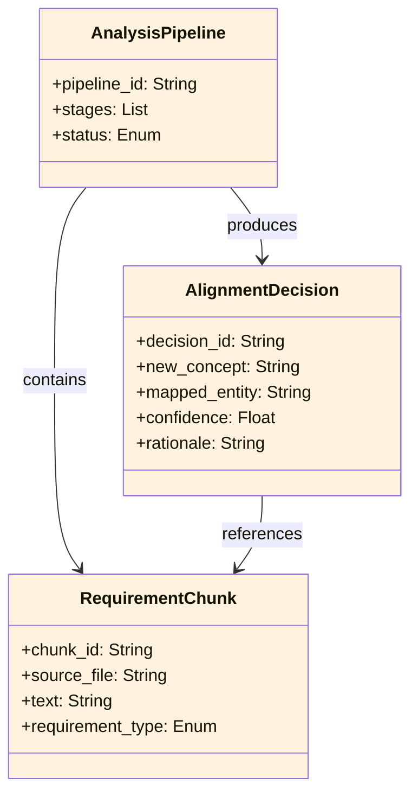

<!-- Identifier: DM-02 -->

# 02 - Analysis Process — Domain Model

## Domain Class Diagram

## Actors

_No human actors identified at the process level; pipeline is triggered by practitioner from project analysis workflow._

## Core Entities

### RequirementChunk
- **Definition**: A normalized, uniquely-identified segment of a requirement document after ingestion and tokenization.
- **Attributes**: `chunk_id`, `source_file`, `text`, `requirement_type` (functional | non-functional | constraint)
- **Relationships**: originates from RequirementDocument; analyzed into DomainConcept
- **Domain Area**: Requirements Analysis

### AlignmentDecision
- **Definition**: A recorded mapping verdict that links a new domain concept to an existing organizational entity, noting confidence and rationale.
- **Attributes**: `decision_id`, `new_concept`, `mapped_entity`, `confidence`, `rationale`
- **Relationships**: produced by domain-alignentities; references RequirementChunk
- **Domain Area**: Domain Alignment

### AnalysisPipeline
- **Definition**: Ordered sequence of analysis skills (ingest → extract → align) that transforms requirements into domain-aligned concepts.
- **Attributes**: `pipeline_id`, `stages`, `status` (pending | running | complete)
- **Relationships**: contains RequirementChunk; produces AlignmentDecision
- **Domain Area**: Pipeline Orchestration

## Key Relationships

- `AnalysisPipeline` orchestrates the full lifecycle of `RequirementChunk` ingestion and `AlignmentDecision` production.
- `AlignmentDecision.mapped_entity` references entries in the organizational domain model.
