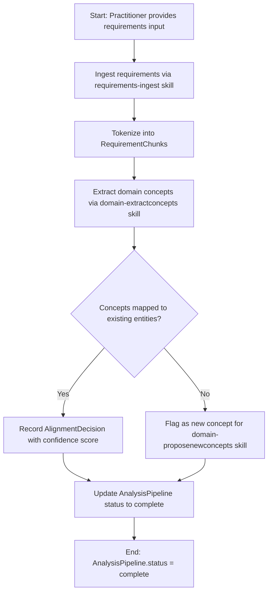

<!-- Identifier: P-02 -->

# 02 - Analysis Process — Process Flow

## Overview

The Analysis Process ingests raw requirements, extracts domain concepts, and aligns them to the organizational domain model. It produces structured `RequirementChunk` records, `AlignmentDecision` mappings, and a fully populated `AnalysisPipeline` status record.

## Process Flow

## Activities

### 1. Requirements Ingestion
- **Input**: Raw requirements documents (any format)
- **Process**: Normalize format; tokenize into uniquely-identified `RequirementChunk` records
- **Output**: List of `RequirementChunk` objects with `chunk_id`, `source_file`, `text`, `requirement_type`
- **Responsible**: `requirements-ingest` skill

### 2. Domain Concept Extraction
- **Input**: `RequirementChunk` list
- **Process**: Identify named entities, relationships, and domain terms
- **Output**: Candidate domain concepts for alignment
- **Responsible**: `domain-extractconcepts` skill

### 3. Entity Alignment
- **Input**: Candidate domain concepts + existing organizational domain model
- **Process**: For each concept, find closest existing entity; assign confidence; record `AlignmentDecision`
- **Output**: `domain-alignment.json` with `AlignmentDecision` records
- **Responsible**: `domain-alignentities` skill

## Exception Handling

- **Unresolved concept**: Forwarded to `domain-proposenewconcepts` skill for gap analysis.
- **Duplicate chunk**: Deduplicated on `(source_file, text)` hash before alignment.
