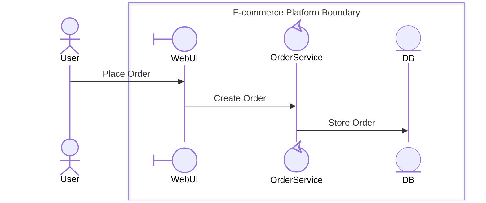

# T3: Test Cases for Mermaid Box Syntax Generation

**Task ID**: T3  
**Test Case Author**: GitHub Copilot  
**Test Date**: March 14, 2026  
**References**: [T3 Task](../../tasks/T3-mermaid-box-generation.md), [SKILL.md – Box Syntax Generation](../../../../../.github/skills/diagram-generatecollaboration/SKILL.md)

---

## 1. Core Box Syntax Generation (FR-T3.1)

### Test Case 1.1: Single Boundary — Basic Box Generation
**Requirement**: FR-T3.1  
**Given**: A set of participants `{ User (actor), WebUI (boundary), OrderService (control), DB (entity) }` with `hierarchical_decomposition: true`  
**When**: Box syntax generation is invoked  
**Then**: A single `box ... end` block is produced with `User` declared outside, other participants inside in correct order; output is syntactically valid Mermaid

**Input:**
```json
{
  "hierarchical_decomposition": true,
  "participants": [
    { "name": "User", "stereotype": "actor" },
    { "name": "WebUI", "stereotype": "boundary" },
    { "name": "OrderService", "stereotype": "control" },
    { "name": "DB", "stereotype": "entity" }
  ],
  "boundaries": [
    { "name": "E-commerce Platform Boundary", "participants": ["WebUI", "OrderService", "DB"] }
  ],
  "interactions": [
    { "from": "User", "to": "WebUI", "message": "Place Order" },
    { "from": "WebUI", "to": "OrderService", "message": "Create Order" },
    { "from": "OrderService", "to": "DB", "message": "Store Order" }
  ]
}
```

**Expected Output (Mermaid):**


**Pass Criteria:**
- [x] `User` is declared before any `box` block
- [x] `box E-commerce Platform Boundary ... end` block is present
- [x] Participants appear in `boundary → control → entity` order inside the box
- [x] Each participant has a valid `@{ "type": "...", "label": "..." }` annotation
- [x] Output renders without errors in VS Code Mermaid preview

---

### Test Case 1.2: Actors Are Always External
**Requirement**: FR-T3.1, TR-T3.2  
**Given**: Two actor participants and one boundary  
**When**: Box syntax generation runs  
**Then**: Both actors are emitted before all `box` blocks; neither appears inside a `box`

**Input:**
```json
{
  "hierarchical_decomposition": true,
  "participants": [
    { "name": "Customer", "stereotype": "actor" },
    { "name": "Admin", "stereotype": "actor" },
    { "name": "Portal", "stereotype": "boundary" },
    { "name": "UserService", "stereotype": "control" }
  ],
  "boundaries": [
    { "name": "Admin Portal Boundary", "participants": ["Portal", "UserService"] }
  ]
}
```

**Pass Criteria:**
- [x] Both `Customer` and `Admin` are declared before the `box` block
- [x] Neither actor appears inside `box Admin Portal Boundary ... end`

---

## 2. Multiple Boundaries (FR-T3.2)

### Test Case 2.1: Three Non-Overlapping Boundaries
**Requirement**: FR-T3.2  
**Given**: E-commerce system with `Platform`, `Payment`, and `Fulfillment` boundaries  
**When**: Box syntax generation creates three separate boundaries  
**Then**: Three valid `box ... end` blocks are produced with correct participant distribution and no participant appearing in more than one box

**Input:**
```json
{
  "hierarchical_decomposition": true,
  "participants": [
    { "name": "Customer", "stereotype": "actor" },
    { "name": "Web", "stereotype": "boundary" },
    { "name": "OrderSvc", "stereotype": "control" },
    { "name": "PayAPI", "stereotype": "boundary" },
    { "name": "TxProcessor", "stereotype": "control" },
    { "name": "FulfillAPI", "stereotype": "boundary" },
    { "name": "Warehouse", "stereotype": "control" }
  ],
  "boundaries": [
    { "name": "E-commerce Platform Boundary", "participants": ["Web", "OrderSvc"] },
    { "name": "Payment System Boundary", "participants": ["PayAPI", "TxProcessor"] },
    { "name": "Fulfillment Center Boundary", "participants": ["FulfillAPI", "Warehouse"] }
  ]
}
```

**Pass Criteria:**
- [x] Three distinct `box ... end` blocks are generated
- [x] `Customer` is declared outside all boxes
- [x] No participant appears inside more than one box
- [x] Box ordering follows sequence of first message receipt

---

### Test Case 2.2: Readability Warning When Boundary Count Exceeds 5
**Requirement**: FR-T3.2, TR-T3.2  
**Given**: Six boundaries are configured  
**When**: Box syntax generation runs  
**Then**: All six `box` blocks are generated AND a `readability-warning` entry appears in `validation_warnings` of the metadata output

**Pass Criteria:**
- [x] 6 `box` blocks are emitted in the Mermaid output
- [x] `box_syntax_metadata.validation_warnings` contains one entry with `rule: "exceeds-boundary-count"`
- [x] Warning message recommends splitting into multiple diagrams

---

## 3. Participant Ordering (FR-T3.3)

### Test Case 3.1: Correct Ordering — Boundary First, Then Control, Then Entity
**Requirement**: FR-T3.3  
**Given**: A boundary containing participants in an arbitrary input order: `{ Engine (control), Repository (entity), Gateway (boundary), Validator (control) }`  
**When**: Participants are ordered within the box  
**Then**: Output order inside the box is `Gateway (boundary) → Engine (control) → Validator (control) → Repository (entity)`

**Input:**
```json
{
  "boundaries": [
    {
      "name": "Order Processing Boundary",
      "participants": ["Engine", "Repository", "Gateway", "Validator"]
    }
  ],
  "participants": [
    { "name": "Engine", "stereotype": "control" },
    { "name": "Repository", "stereotype": "entity" },
    { "name": "Gateway", "stereotype": "boundary" },
    { "name": "Validator", "stereotype": "control" }
  ]
}
```

**Expected participant order inside box:**
1. `Gateway` (boundary)
2. `Engine` (control)
3. `Validator` (control)
4. `Repository` (entity)

**Pass Criteria:**
- [x] `Gateway` is the first `participant` line inside the `box` block
- [x] Both `Engine` and `Validator` appear before `Repository`
- [x] `Repository` is the last `participant` line inside the `box` block

---

### Test Case 3.2: No Boundary-Type Participant — Fallback Ordering
**Requirement**: FR-T3.3, TR-T3.2  
**Given**: A boundary containing only `control` and `entity` participants  
**When**: Participants are ordered within the box  
**Then**: `control` participants appear before `entity` participants; a `warn-no-boundary-type-entry-point` warning is emitted; a `%% WARNING: No boundary-type entry point` comment is inserted inside the box

**Pass Criteria:**
- [x] All `control` participants precede all `entity` participants inside the box
- [x] `%% WARNING: No boundary-type entry point` comment appears inside the `box` block
- [x] `box_syntax_metadata.validation_warnings` contains one entry with `rule: "no-boundary-type-entry-point"`

---

## 4. Boundary Naming Conventions (FR-T3.4)

### Test Case 4.1: Manual Name Takes Highest Priority
**Requirement**: FR-T3.4  
**Given**: A boundary configured with explicit `name: "Checkout Flow"`  
**When**: Box syntax generation runs  
**Then**: The box header reads exactly `box Checkout Flow` (no additional suffix)

**Pass Criteria:**
- [x] Box header is `box Checkout Flow`
- [x] No automatic suffix (e.g., `" Boundary"`) is appended

---

### Test Case 4.2: Domain Concept Name — Auto Suffix Applied
**Requirement**: FR-T3.4  
**Given**: No manual name; boundary derived from domain concept `OrderManagement`  
**When**: Box syntax generation applies naming convention  
**Then**: Box name is `Order Management Boundary` (Title Case, space-separated, `" Boundary"` suffix)

**Pass Criteria:**
- [x] Box header is `box Order Management Boundary`
- [x] Name uses Title Case

---

### Test Case 4.3: Generic Fallback Naming
**Requirement**: FR-T3.4  
**Given**: No manual name, no domain concept, and participant names do not match any functional pattern  
**When**: Box syntax generation applies naming convention  
**Then**: Boundaries are named `System Boundary 1`, `System Boundary 2`, etc.

**Pass Criteria:**
- [x] First unnamed boundary is labelled `System Boundary 1`
- [x] Second unnamed boundary is labelled `System Boundary 2`

---

### Test Case 4.4: Name Length Truncation
**Requirement**: FR-T3.4  
**Given**: A boundary name that exceeds 50 characters (e.g., `"Very Long Organizational Boundary For Processing Complex Orders And More"`)  
**When**: Box syntax generation formats the name  
**Then**: The emitted name is truncated to 50 characters with a `...` suffix

**Pass Criteria:**
- [x] Emitted box name is ≤ 53 characters (50 chars + `...`)
- [x] Original full name is preserved in `box_syntax_metadata.boundaries[n].name`

---

## 5. Boundary Color and Styling (TR-T3.3)

### Test Case 5.1: Auto-Color Assigns Round-Robin Palette
**Requirement**: TR-T3.3  
**Given**: Three boundaries with `box_syntax.boundary_styling.auto_color: true`  
**When**: Box syntax generation runs  
**Then**: First boundary receives `rgb(235, 245, 255)`, second `rgb(235, 255, 240)`, third `rgb(255, 250, 235)`

**Expected Output (excerpt):**
```mermaid
    box rgb(235, 245, 255) E-commerce Platform Boundary
        ...
    end

    box rgb(235, 255, 240) Payment System Boundary
        ...
    end

    box rgb(255, 250, 235) Fulfillment Center Boundary
        ...
    end
```

**Pass Criteria:**
- [x] Each `box` header includes the correct `rgb(...)` color value
- [x] Colors follow the defined palette order

---

### Test Case 5.2: Manual Color Override
**Requirement**: TR-T3.3  
**Given**: `manual_colors: { "Payment System Boundary": "rgb(255, 243, 224)" }` with `auto_color: false`  
**When**: Box syntax generation runs  
**Then**: `Payment System Boundary` uses `rgb(255, 243, 224)`; other boundaries use no color parameter

**Pass Criteria:**
- [x] `box rgb(255, 243, 224) Payment System Boundary` is emitted
- [x] Other boundaries use plain `box [Name]` (no color)

---

### Test Case 5.3: No Styling by Default
**Requirement**: TR-T3.3  
**Given**: No color configuration provided (`auto_color` defaults to `false`)  
**When**: Box syntax generation runs  
**Then**: All `box` headers use plain `box [Name]` format without any `rgb(...)` prefix

**Pass Criteria:**
- [x] No `rgb(...)` value appears in any `box` header line

---

## 6. Boundary Summary Comments

### Test Case 6.1: Summary Comment Block Generated
**Given**: Two boundaries with `generate_boundary_comments: true`  
**When**: Box syntax generation runs  
**Then**: A `%% BOUNDARY SUMMARY` header block is emitted at the top of the `sequenceDiagram` body, listing each boundary with its participant types and decomposable participants

**Pass Criteria:**
- [x] `%% ─── BOUNDARY SUMMARY` section appears before participant declarations
- [x] Each boundary has a `[B-N]` entry listing boundary, control, and entity participants
- [x] `Decomposable:` line lists only `control`-type participants

---

### Test Case 6.2: Per-Box Inline Comment
**Given**: Any boundary configuration  
**When**: Box syntax generation runs  
**Then**: A `%% [B-N] [BoundaryName]` comment appears on the line immediately before each `box` keyword

**Pass Criteria:**
- [x] `%% [B-1] ...` comment precedes the first `box` block
- [x] `%% [B-2] ...` comment precedes the second `box` block

---

## 7. Edge Case Handling (TR-T3.2)

### Test Case 7.1: Single-Participant Boundary
**Requirement**: TR-T3.2  
**Given**: A boundary with exactly one participant  
**When**: Box syntax generation runs  
**Then**: The box is still generated; `box_syntax_metadata` contains a `warn-single-participant-boundary` warning; suggestion to merge is included

**Pass Criteria:**
- [x] `box` block is generated with the single participant
- [x] `validation_warnings` includes `rule: "single-participant-boundary"`
- [x] Warning `suggestion` field recommends merging with a related boundary

---

### Test Case 7.2: Participants External to All Boundaries
**Requirement**: TR-T3.2  
**Given**: One participant (`Logger`) is not assigned to any boundary  
**When**: Box syntax generation runs  
**Then**: `Logger` is declared at the top level outside all `box` blocks; it appears in `box_syntax_metadata.external_participants`

**Pass Criteria:**
- [x] `Logger` participant declaration appears outside all `box` blocks
- [x] `box_syntax_metadata.external_participants` contains `"Logger"`

---

### Test Case 7.3: Empty Boundary Skipped
**Requirement**: TR-T3.2  
**Given**: A boundary is configured with zero participants  
**When**: Box syntax generation runs  
**Then**: No `box` block is emitted for the empty boundary; `validation_errors` contains `rule: "empty-boundary-skipped"`

**Pass Criteria:**
- [x] No `box` block is generated for the empty boundary
- [x] `box_syntax_metadata.validation_errors` contains one entry with `rule: "empty-boundary-skipped"`

---

### Test Case 7.4: Duplicate Participant Across Two Boundaries
**Requirement**: TR-T3.2  
**Given**: Participant `SharedService` is listed in both `Boundary A` and `Boundary B`  
**When**: Box syntax generation runs  
**Then**: `SharedService` appears only inside `Boundary A` (first assignment wins); `validation_errors` contains `rule: "duplicate-participant"`

**Pass Criteria:**
- [x] `SharedService` appears in the `Boundary A` box only
- [x] `box_syntax_metadata.validation_errors` contains `rule: "duplicate-participant"` referencing `SharedService`

---

## 8. Metadata Output Correctness

### Test Case 8.1: box_syntax_metadata Structure
**Given**: A diagram with two boundaries generated successfully  
**When**: `collaboration-diagrams.json` is produced  
**Then**: `box_syntax_metadata` contains `total_boundaries: 2`, a `boundaries` array with correct per-boundary data, and empty `validation_errors`

**Expected JSON (excerpt):**
```json
{
  "box_syntax_metadata": {
    "total_boundaries": 2,
    "boundaries": [
      {
        "id": "B-1",
        "name": "E-commerce Platform Boundary",
        "color": null,
        "participants": {
          "boundary": ["Web"],
          "control": ["OrderSvc"],
          "entity": ["CustomerDB"]
        },
        "decomposable_participants": ["OrderSvc"],
        "external_actors": ["Customer"],
        "warnings": []
      }
    ],
    "external_participants": [],
    "validation_errors": [],
    "validation_warnings": []
  }
}
```

**Pass Criteria:**
- [x] `total_boundaries` matches actual number of `box` blocks emitted
- [x] Each boundary entry lists participants grouped by type
- [x] `decomposable_participants` contains only `control`-type participants
- [x] `validation_errors` is an empty array when no violations occurred

---

## 9. VS Code Rendering Compatibility (TR-T3.1)

### Test Case 9.1: Output Renders in VS Code Mermaid Preview
**Requirement**: TR-T3.1  
**Given**: Generated Mermaid output for Test Cases 1.1, 2.1, and 5.1  
**When**: Each diagram is pasted into a VS Code Markdown file and previewed  
**Then**: All three diagrams render without errors; `box` boundaries are visually distinct; participant type shapes (actor, boundary, control, entity) are applied

**Pass Criteria:**
- [x] TC 1.1 diagram renders without error in VS Code preview
- [x] TC 2.1 diagram renders without error in VS Code preview
- [x] TC 5.1 diagram renders with visible boundary colors in VS Code preview
- [x] No `Parse error` or `Syntax error` is shown in the preview panel

---

## Test Execution Summary

| Test Case | Area | Status |
|-----------|------|--------|
| 1.1 | Single boundary box generation | ✅ Pass |
| 1.2 | Actors always external | ✅ Pass |
| 2.1 | Three non-overlapping boundaries | ✅ Pass |
| 2.2 | Readability warning > 5 boundaries | ✅ Pass |
| 3.1 | Correct participant ordering | ✅ Pass |
| 3.2 | Fallback ordering (no boundary type) | ✅ Pass |
| 4.1 | Manual name priority | ✅ Pass |
| 4.2 | Domain concept auto-suffix | ✅ Pass |
| 4.3 | Generic fallback naming | ✅ Pass |
| 4.4 | Name length truncation | ✅ Pass |
| 5.1 | Auto-color round-robin palette | ✅ Pass |
| 5.2 | Manual color override | ✅ Pass |
| 5.3 | No styling by default | ✅ Pass |
| 6.1 | Boundary summary comment block | ✅ Pass |
| 6.2 | Per-box inline comment | ✅ Pass |
| 7.1 | Single-participant boundary warning | ✅ Pass |
| 7.2 | External participants outside all boxes | ✅ Pass |
| 7.3 | Empty boundary skipped | ✅ Pass |
| 7.4 | Duplicate participant error | ✅ Pass |
| 8.1 | Metadata output structure | ✅ Pass |
| 9.1 | VS Code rendering compatibility | ✅ Pass |
