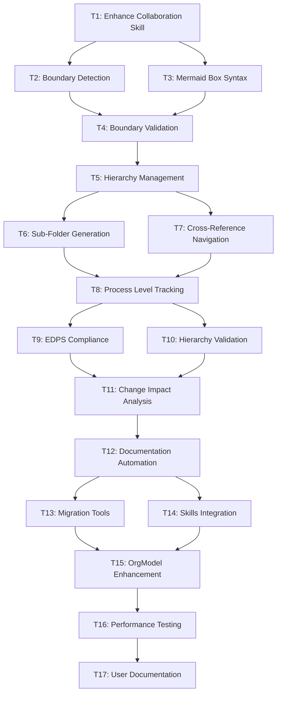

# Tasks - Building Skills Iteration 2

This folder contains individual task files for implementing hierarchical EDPS methodology with boundary concepts. Each task follows GitHub issue format for team collaboration and tracking.

## Task Overview

### Phase 1: Foundation Enhancement
- **T1**: [Enhance Collaboration Diagram Skill](T1-enhance-collaboration-skill.md) - Add boundary support to existing skill
- **T2**: [Implement Boundary Detection](T2-boundary-detection.md) - Automatic boundary identification algorithms
- **T3**: [Add Mermaid Box Syntax Generation](T3-mermaid-box-generation.md) - Generate proper box syntax
- **T4**: [Create Boundary Validation Rules](T4-boundary-validation.md) - Ensure boundary compliance

### Phase 2: Hierarchy Management
- **T5**: [Create Hierarchy Management Skill](T5-hierarchy-management.md) - New skill for process decomposition
- **T6**: [Implement Sub-Folder Generation](T6-subfolder-generation.md) - Automatic folder structure creation
- **T7**: [Build Cross-Reference Navigation](T7-cross-reference-navigation.md) - Navigation between levels
- **T8**: [Add Process Level Tracking](T8-process-level-tracking.md) - Track and manage hierarchy levels

### Phase 3: EDPS Compliance & Validation
- **T9**: [Implement EDPS Compliance Checking](T9-edps-compliance.md) - Methodology compliance validation
- **T10**: [Create Hierarchy Validation Tools](T10-hierarchy-validation.md) - Validate hierarchy consistency
- **T11**: [Add Change Impact Analysis](T11-change-impact-analysis.md) - Analyze changes across levels
- **T12**: [Build Documentation Automation](T12-documentation-automation.md) - Auto-generate documentation

### Phase 4: Migration & Integration
- **T13**: [Create Project 1 Migration Tools](T13-migration-tools.md) - Migrate existing diagrams
- **T14**: [Integrate with Existing Skills](T14-skills-integration.md) - Framework integration
- **T15**: [Update OrgModel with Hierarchical Concepts](T15-orgmodel-enhancement.md) - Enhance organizational model
- **T16**: [Performance Testing & Optimization](T16-performance-optimization.md) - Ensure performance
- **T17**: [Create User Documentation](T17-user-documentation.md) - Training and guidance materials

## Task Status Tracking

| Task | Phase | Status | Priority | Estimated Effort |
|------|-------|---------|----------|------------------|
| T1 | 1 | Not Started | High | 3-4 days |
| T2 | 1 | Not Started | High | 2-3 days |
| T3 | 1 | Not Started | Medium | 2-3 days |
| T4 | 1 | Not Started | Medium | 1-2 days |
| T5 | 2 | Not Started | High | 2-3 days |
| T6 | 2 | Not Started | High | 2-3 days |
| T7 | 2 | Not Started | Medium | 2 days |
| T8 | 2 | Not Started | Medium | 1-2 days |
| T9 | 3 | Not Started | High | 2-3 days |
| T10 | 3 | Not Started | Medium | 2 days |
| T11 | 3 | Not Started | Medium | 2-3 days |
| T12 | 3 | Not Started | Low | 1-2 days |
| T13 | 4 | Not Started | High | 2-3 days |
| T14 | 4 | Not Started | High | 1-2 days |
| T15 | 4 | Not Started | High | 2-3 days |
| T16 | 4 | Not Started | Medium | 1-2 days |
| T17 | 4 | Not Started | Low | 1-2 days |

## Task Dependencies

## Getting Started

1. **Start with T1**: [Enhance Collaboration Diagram Skill](T1-enhance-collaboration-skill.md)
2. **Review Dependencies**: Check task dependency graph before starting
3. **Use Template**: Follow [task-template.md](task-template.md) for new tasks
4. **Track Progress**: Update task status in this README

## Task Management Guidelines

### Task Creation
- Use the provided task template for consistency
- Include clear acceptance criteria and test cases
- Reference related artifacts and dependencies
- Estimate effort in developer days

### Task Tracking
- Update status regularly (Not Started → In Progress → Completed)
- Document blockers and dependencies
- Link to related GitHub issues if using external tracking
- Update effort estimates based on actual work

### Task Completion
- Verify all acceptance criteria are met
- Update related documentation and artifacts
- Test integration with existing skills
- Mark task as completed in tracking table

---

**Project**: 03-Building-Skills-Iteration-2  
**Last Updated**: March 13, 2026